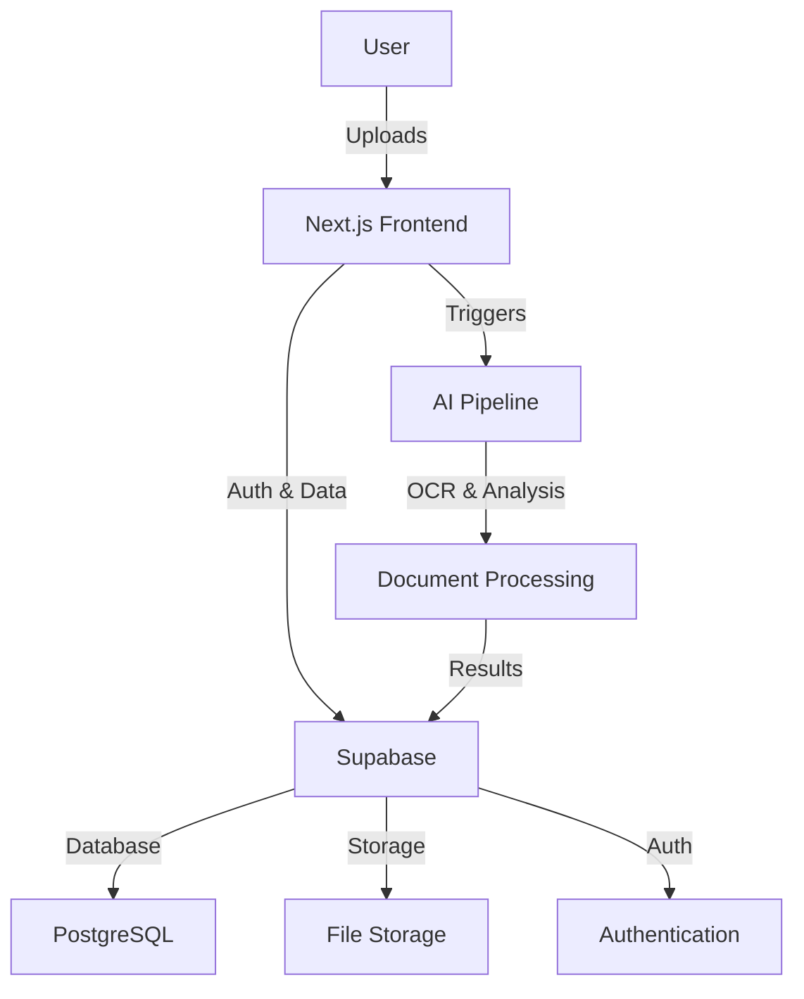

# Guardian Documentation

> **Patient-owned healthcare data platform** - Secure, portable, and accessible medical records management

[](./project/roadmap.md)
[](#)
[](#)

---

## 🚀 Quick Start

**New to Guardian?** Start here:

1. **[Project Overview](getting-started/overview.md)** - Vision, mission, and goals
2. **[Developer Setup](guides/developer-setup.md)** - Get up and running in 5 minutes
3. **[Architecture Overview](architecture/system-design.md)** - Technical foundation

---

## 📖 Documentation Navigation

### For Developers

| Document | Purpose | Time to Read |
|----------|---------|--------------|
| **[Developer Setup](guides/developer-setup.md)** | Local development environment | 5 min |
| **[Supabase Setup](guides/supabase-setup.md)** | Database and auth configuration | 15 min |
| **[API Documentation](api/endpoints.md)** | Complete API reference guide | 15 min |
| **[Deployment Guide](guides/deployment.md)** | Production deployment procedures | 20 min |
| **[Troubleshooting Guide](guides/troubleshooting.md)** | Common issues and solutions | 10 min |
| **[Architecture Overview](architecture/system-design.md)** | System design and components | 10 min |
| **[Document Pipeline](architecture/data-pipeline.md)** | AI processing architecture | 15 min |
| **[Security & Compliance](architecture/security-compliance.md)** | HIPAA, GDPR requirements | 10 min |

### For Product/Business

| Document | Purpose | Time to Read |
|----------|---------|--------------|
| **[Project Overview](getting-started/overview.md)** | Vision, mission, market opportunity | 5 min |
| **[Roadmap](project/roadmap.md)** | Development timeline and milestones | 10 min |
| **[Business Model](business/model.md)** | Revenue streams and partnerships | 5 min |
| **[Brand Strategy](business/brand.md)** | Positioning and marketing approach | 5 min |

### For Contributors

| Document | Purpose | Time to Read |
|----------|---------|--------------|
| **[Protocol System](protocols/README.md)** | AI-driven session management | 5 min |
| **[Current Tasks](management/TASKS.md)** | Active development priorities | 3 min |
| **[Progress Log](PROGRESS_LOG.md)** | Recent developments and decisions | 5 min |
| **[Decision Records](architecture/adr/)** | Technical decision rationale | 10 min |

---

## 🏗️ Architecture at a Glance



**Core Stack:** Next.js • Supabase • Vercel • TypeScript • Tailwind CSS

---

## 🎯 Current Status

**Phase:** MVP Prototype Development
**Progress:** Authentication ✅ | File Upload ✅ | AI Pipeline 🚧 | Dashboard 🚧

See [Progress Log](PROGRESS_LOG.md) for detailed updates.

---

## 📋 Common Tasks

### Development
```bash
# Start development server
npm run dev

# Run tests
npm test

# Deploy to staging
vercel --prod
```

### Documentation
```bash
# Update progress log
# Edit docs/PROGRESS_LOG.md after each session

# Review architecture decisions
# See docs/architecture/adr/ for ADRs
```

---

## 🔍 Find What You Need

**Looking for...**
- **Setup instructions?** → [Developer Setup](guides/developer-setup.md)
- **API documentation?** → [API Documentation](api/endpoints.md)
- **Deployment help?** → [Deployment Guide](guides/deployment.md)
- **Troubleshooting?** → [Troubleshooting Guide](guides/troubleshooting.md)
- **Business information?** → [Project Overview](getting-started/overview.md)
- **Current priorities?** → [Tasks](management/TASKS.md)
- **Technical decisions?** → [Decision Records](architecture/adr/)

---

## 🤝 Contributing

1. Check [current tasks](management/TASKS.md) for priorities
2. Review [progress log](PROGRESS_LOG.md) for context
3. Follow [setup guide](guides/developer-setup.md) for environment
4. Update [AI context](context/AI_context.md) after sessions

---

## 📞 Support

- **Issues:** Check [troubleshooting section](guides/supabase-setup.md#troubleshooting)
- **Questions:** Review [decision records](architecture/adr/) for rationale
- **Updates:** See [progress log](PROGRESS_LOG.md) for latest changes

---

## 📈 Project Health

| Metric | Status | Target |
|--------|--------|--------|
| Documentation Coverage | 90% ✅ | 90% |
| Setup Time (new dev) | 15 min | 10 min |
| Broken Links | 0 ✅ | 0 |
| Outdated Content | <5% ✅ | <5% |
| Critical Gaps | 0 ✅ | 0 |

Last updated: July 2025