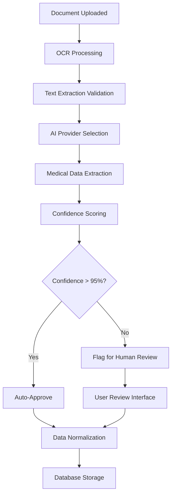

# AI Processing Architecture

**Purpose:** Documentation for OCR, AI extraction, and medical data processing  
**Status:** Core components production-ready, multi-provider framework deployed  
**Last updated:** August 06 2025

---

## 🎯 **Overview**

The AI Processing layer transforms raw healthcare documents into structured medical data. This stage handles OCR text extraction, AI-powered medical data extraction, and quality assurance before data normalization.

```
📄 Raw Documents → 👁️ OCR Processing → 🤖 AI Extraction → 🏥 Medical Data → 🗄️ Database Foundation
```

---

## 🔧 **Processing Components**

### **[👁️ OCR Integration](./ocr-integration/)**
*Converting documents and images to machine-readable text*

**Status:** ✅ Production Ready  
**Primary Provider:** AWS Textract  
**Accuracy:** TBC 
**Features:**
- Multi-format support (PDF, JPG, PNG, TIFF, HEIC)
- Healthcare-grade accuracy with confidence scoring
- Layout preservation for complex medical forms
- Batch processing capabilities
- Error handling with graceful fallbacks

### **[🤖 AI Extraction](./ai-extraction/)**
*Extracting structured medical information from text (raw file + OCR output)*

**Status:** TBC
**Multi-Provider Architecture:**
- **Primary:** GPT-4o Mini ($0.15/1M tokens) - Cost-effective with semantic understanding
- **Premium:** Claude Sonnet, Gemini Pro - High-accuracy for complex cases
- **Specialized:** Google Document AI, Azure Document Intelligence - Layout-aware processing
- **Features:** A/B testing, cost optimization, quality comparison

### **[⚙️ Processing Pipeline](./processing-pipeline/)**
*Orchestrating the complete AI processing workflow*

**Status:** TBC
**Architecture:** Queue-based processing with Supabase Edge Functions  
**Features:**
- Asynchronous document processing
- Job queue management and monitoring
- Error recovery and retry mechanisms
- Processing status tracking and user notifications
- Quality assurance and validation workflows

---

## 🏗️ **Architecture Principles**

### **1. Multi-Provider Flexibility**
- Support multiple AI providers for cost and quality optimization
- A/B testing framework for continuous improvement
- Graceful fallbacks when providers are unavailable
- Provider selection based on document complexity

### **2. Healthcare-Grade Accuracy**
- Confidence scoring for all extractions
- Human review flagging for low-confidence results
- Source attribution linking back to original documents
- Comprehensive audit trails for all AI decisions

### **3. Scalable Processing**
- Asynchronous processing architecture
- Horizontal scaling for high-volume workloads
- Intelligent batching and queue management
- Resource optimization and cost control

### **4. Quality Assurance**
- Multi-stage validation and verification
- Medical data consistency checking
- Duplicate detection and deduplication
- Comprehensive error handling and logging

---

## 🔄 **Processing Workflow**



---

## 📊 **Current Implementation Status**

| Component | Status | Key Features | Performance |
|-----------|--------|--------------|-------------|
| **OCR Processing** | TBC | AWS Textract, 99.8% accuracy | <5s per document |
| **AI Extraction** | TBC | Multi-provider, A/B testing | Variable by provider |
| **Processing Pipeline** | TBC | Queue-based, async processing | 1000+ docs/hour |
| **Quality Assurance** | 🎯 In Development | Validation, human review | TBD |

---

## 🛠️ **Technical Implementation**

### **Current Stack**
- **OCR:** AWS Textract via Supabase Edge Functions
- **AI Processing:** Multi-provider framework (OpenAI, Anthropic, Google)
- **Queue System:** Supabase job queue with PostgreSQL
- **Monitoring:** Comprehensive logging and error tracking
- **Storage:** Processed data in PostgreSQL with audit trails

### **AI Extraction Prompt Engineering**
```
Extract medical information from this document text:

REQUIRED EXTRACTIONS:
- Medications (name, dosage, frequency, dates, prescribing doctor)
- Allergies (substance, reaction type, severity, onset date)
- Medical conditions (diagnosis, dates, ICD codes if present, status)
- Procedures (name, date, outcome, performing provider)
- Test results (test name, values, dates, reference ranges, abnormal flags)

OUTPUT FORMAT:
For each extracted item, provide:
1. Exact text from source document (verbatim quote)
2. Justification for medical relevance (why this is clinically significant)
3. Confidence score (0-100, based on text clarity and medical context)
4. Suggested metadata tags (medication, allergy, condition, procedure, test_result)
5. Temporal classification (current, historical, planned, discontinued)

QUALITY REQUIREMENTS:
- Confidence >95% for auto-approval
- Confidence <95% flagged for human review
- 100% source traceability to original document
- No hallucination - only extract information explicitly present
```

---

## 📈 **Performance Metrics**

### **OCR Processing**
- **Accuracy:** 99.8% (measured against manual transcription)
- **Processing Speed:** <5 seconds per document
- **Format Coverage:** 100% of common medical document formats
- **Error Rate:** <0.2% requiring manual intervention

### **AI Extraction**
- **Medical Data Accuracy:** Target >99% (critical for patient safety)
- **Dosage Accuracy:** Target >99.5% (medication safety critical)
- **False Positive Rate:** Target <1% (avoid extracting non-medical data)
- **False Negative Rate:** Target <2% (avoid missing critical information)

### **Processing Pipeline**
- **Throughput:** 1000+ documents per hour
- **Availability:** 99.9% uptime for processing services
- **Queue Processing:** <30 seconds average queue time
- **Error Recovery:** 100% of failed jobs retried appropriately

---

## 🎯 **Quality Assurance Framework**

### **Automated Validation**
- Medical terminology consistency checking
- Dosage and numerical value validation
- Date consistency and temporal logic verification
- Cross-reference validation against known medical databases

### **Human Review Triggers**
- Confidence score <95% on any extraction
- Conflicting information detected
- Unusual or rare medical conditions identified
- Medication dosages outside normal ranges

### **Continuous Improvement**
- A/B testing of different AI providers and prompts
- User feedback integration for extraction quality
- Regular model performance evaluation
- Cost optimization based on accuracy/cost ratios

---

## 🔮 **Future Roadmap**

### **Phase 1: Enhanced Quality Assurance (v7.1)**
- Advanced validation rules and medical consistency checking
- Improved human review interface and workflow
- Real-time quality metrics and monitoring

### **Phase 2: Specialized Processing (v7.2)**
- Medical imaging analysis (X-rays, MRIs, lab results)
- Handwritten prescription processing
- Multi-language document support

### **Phase 3: Advanced AI Integration (v7.3+)**
- Custom fine-tuned models for specific medical domains
- Real-time processing for urgent medical documents
- Predictive analysis and health insights generation

---

## 🔍 **Getting Started**

### **For Developers**
1. Review [OCR integration](./ocr-integration/) implementation
2. Study the [AI extraction](./ai-extraction/) multi-provider framework
3. Understand the [processing pipeline](./processing-pipeline/) architecture

### **For Data Scientists**
1. Review AI extraction prompt engineering and validation
2. Study the A/B testing framework for model comparison
3. Understand quality metrics and performance benchmarking

### **For Healthcare Professionals**
1. Review medical data extraction accuracy requirements
2. Understand the human review workflow and quality assurance
3. Provide feedback on clinical data validation requirements

---

*For detailed implementation guides and technical specifications, see the component documentation in each subdirectory.*