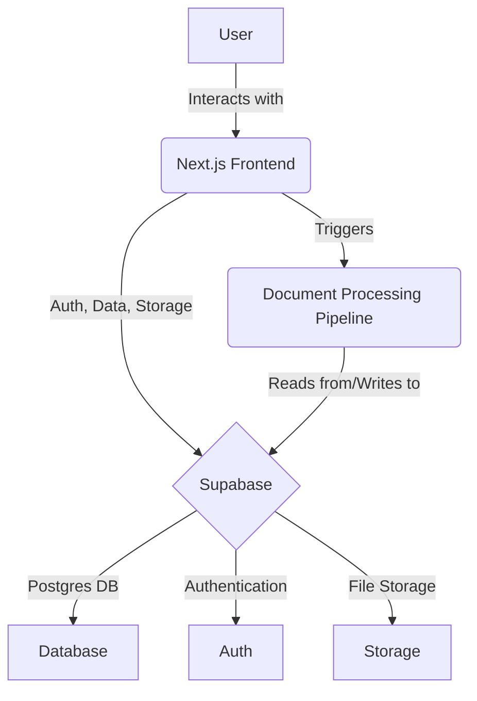

# Architecture Overview

**Purpose:** High-level overview of the Guardian technical architecture, stack, and modular design.
**Last updated:** July 2025
**Audience:** Developers, architects, contributors
**Prerequisites:** Familiarity with web application architecture

---

## Tech Stack
- Frontend: Next.js (TypeScript), Tailwind CSS, shadcn/ui
- Backend: Supabase (Postgres), Supabase Auth, Supabase Storage (S3-compatible)
- AI Orchestration: LangGraph / LlamaIndex (planned for GCP Functions)
- Deployment: Vercel

## System Diagram

## Modularity & Scalability
- Stateless microservices, pluggable endpoints, vendor-agnostic data layer
- Designed for solo-dev velocity, minimal DevOps

## Security & Compliance
- RLS policies, HIPAA/GDPR considerations, see [Security & Compliance](./security-compliance.md)

## Further Details
- [MVP Prototype](./prototype.md)
- [Long-Term Vision](./vision.md) 