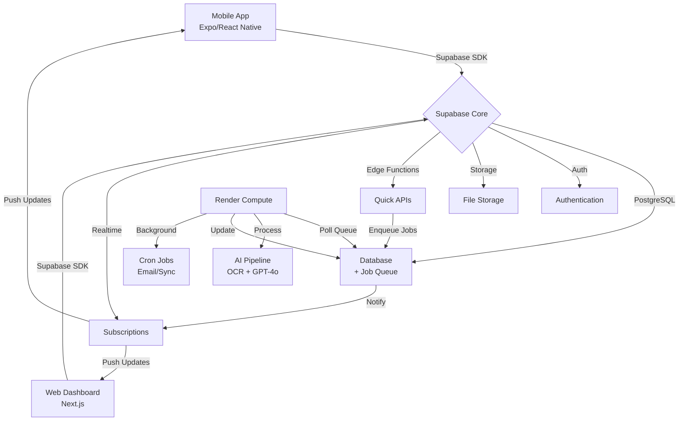

# Architecture Overview

**Purpose:** High-level overview of the Guardian technical architecture, stack, and modular design.
**Last updated:** January 2025
**Audience:** Developers, architects, contributors
**Prerequisites:** Familiarity with web application architecture

---

## Tech Stack

### Frontend
- **Mobile**: Expo/React Native (TypeScript) - Primary platform
- **Web**: Next.js (TypeScript), Tailwind CSS, shadcn/ui - Secondary platform
- **Deployment**: Expo EAS (mobile), Vercel (web)

### Backend (Hybrid Architecture)
- **Core Infrastructure**: Supabase
  - PostgreSQL database with RLS
  - Authentication (magic links, OAuth)
  - File storage (medical documents)
  - Edge Functions (quick APIs, webhooks)
  - Real-time subscriptions
- **Compute Layer**: Render
  - Complex API endpoints (Node.js/TypeScript)
  - Background job processing
  - AI document processing pipeline
  - Scheduled tasks (cron jobs)
  - Long-running operations (no time limits)

### AI & Processing
- **OCR**: Google Cloud Vision API
- **Medical AI**: GPT-4o Mini (vision + analysis)
- **Queue**: PostgreSQL-based job queue
- **Cost**: ~$16-31/1K documents (85% reduction from previous)

## System Diagram

## Modularity & Scalability
- Hybrid architecture separates concerns: Supabase for core, Render for compute
- PostgreSQL-based queue enables flexible job distribution
- Can scale Supabase and Render independently based on load
- Designed for solo-dev velocity, minimal DevOps overhead

## Security & Compliance
- Row Level Security (RLS) policies on all tables
- Profile-aware access control for family healthcare data
- HIPAA/GDPR considerations built into architecture
- All inter-service communication through secure database
- See [Security & Compliance](./data-pipeline/v7/security-compliance.md) for details

## Architecture Decisions
- [ADR-0001: Database Choice](./adr/0001-database-choice.md) - Why Supabase
- [ADR-0002: Hybrid Infrastructure](./adr/0002-hybrid-infrastructure-supabase-render.md) - Why Supabase + Render

## Implementation Guides
- [v7 Architecture](./data-pipeline/v7/README.md) - Complete modular architecture
- [Infrastructure Integration](./data-pipeline/v7/infrastructure-integration.md) - How v7 maps to hybrid infrastructure
- [Implementation Guide](./data-pipeline/implementation-guides/v7-implementation.md) - Step-by-step deployment

## Further Details
- [Frontend Design](./frontend/frontend-design.md) - Patient-centric UI/UX
- [Long-Term Vision](./vision.md) - Product roadmap and future 