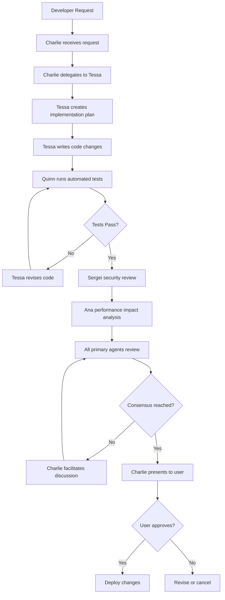

# RoundTable AI: Strategic Implementation Plan for Multi-Agent Company Operations Platform

## Executive Summary

RoundTable AI represents a paradigm shift in company operations, transforming from traditional IDE-centric development to an AI-powered multi-agent orchestration platform. This system places Charlie (Chief of Staff Agent) at the center of a collaborative ecosystem where specialized AI agents work together to manage all aspects of company operations—from code development to compliance, from growth strategies to security monitoring.

The platform fundamentally reimagines how startups scale through their critical growth phases (0-1, 1-10, 10-100) by providing an intelligent, always-on team of specialized agents that can autonomously handle routine operations while escalating critical decisions to human leadership.

## 1. Core Architecture & Technical Foundation

### 1.1 Platform Architecture Overview

**Central Hub Design:**
- **Primary Interface**: Charlie-centric dashboard replacing traditional code editor views
- **Agent Visualization**: Interactive circular/roundtable layout showing all agents and their current states
- **Communication Flows**: Real-time visualization of inter-agent messaging and task delegation
- **Context Windows**: Each agent maintains its own knowledge base viewer showing:
  - Current data sources
  - Recent decisions made
  - Pending actions requiring review
  - Historical context relevant to current tasks

### 1.2 Technical Stack Recommendations

**Core Infrastructure:**
```yaml
Orchestration Layer:
  - Framework: LangGraph or AutoGen for multi-agent coordination
  - Message Queue: Apache Kafka for inter-agent communication
  - State Management: Redis for real-time agent state tracking
  - Workflow Engine: Temporal or Apache Airflow for complex multi-step processes

Agent Development:
  - Primary Framework: LangChain with custom agent templates
  - LLM Integration: Multi-model approach (Claude, GPT-4, specialized models)
  - Memory System: Vector database (Pinecone/Weaviate) + Graph DB (Neo4j)
  - Tool Integration: Function calling with comprehensive tool library

Security & Compliance:
  - Authentication: Zero-trust architecture with agent-specific permissions
  - Audit Trail: Immutable event log using blockchain or append-only database
  - Encryption: End-to-end encryption for all agent communications
  - HIPAA Compliance: Dedicated security layer for healthcare data handling
```

### 1.3 Agent Communication Protocol

**Hierarchical Message System:**
1. **Direct Agent-to-Agent**: For routine collaborations
2. **Broadcast to Table**: For major decisions requiring multiple perspectives
3. **Escalation to Charlie**: For conflicts or user-facing decisions
4. **Human Override Channel**: Emergency stop and manual intervention

**Message Structure:**
```json
{
  "id": "uuid",
  "from_agent": "agent_id",
  "to_agents": ["agent_ids"],
  "priority": "routine|important|critical",
  "type": "query|proposal|review_request|alert",
  "content": {
    "summary": "brief description",
    "details": "full content",
    "supporting_data": {},
    "required_actions": []
  },
  "requires_human_approval": boolean,
  "deadline": "timestamp"
}
```

## 2. Agent Ecosystem Design

### 2.1 Primary Agents (Always Active)

**Charlie (Chief of Staff)**
- **Role**: Master orchestrator and human interface
- **Capabilities**:
  - Natural language understanding of user commands
  - Strategic task decomposition and delegation
  - Conflict resolution between agents
  - Executive summary generation
  - Priority queue management
- **Special Powers**: Only agent with direct user communication rights

**Sergei (Security Infrastructure)**
- **Role**: Continuous security monitoring and infrastructure protection
- **Real-time Monitoring**:
  - Code vulnerability scanning
  - Access control management
  - Threat detection and response
  - Compliance verification
- **Integration Points**: Direct access to all code commits, infrastructure changes

**Ana (Analytics)**
- **Role**: Data-driven insights and metric tracking
- **Continuous Analysis**:
  - Product usage patterns
  - Business metric tracking
  - Predictive analytics
  - Anomaly detection
- **Data Sources**: Application databases, user events, external APIs

### 2.2 Secondary Agents (Context-Activated)

**Development Agents:**
- **Dušan (Data)**: Database architecture, optimization, data pipeline management
- **Tessa (AI/Tech Ops)**: Model selection, API optimization, technical architecture
- **Quinn (QA)**: Automated testing, quality assurance, bug detection

**Business Operations:**
- **Groot (Growth)**: Marketing campaigns, user acquisition, growth experiments
- **Fin (Finance)**: Revenue tracking, burn rate monitoring, financial projections
- **Stefan (Strategy)**: Market analysis, competitive intelligence, strategic planning

**Compliance & Legal:**
- **Priya (Privacy & Compliance)**: HIPAA compliance, data governance, regulatory monitoring
- **Lex (Legal & Contracts)**: Contract review, terms of service, legal documentation

### 2.3 Agent Capability Matrix

| Agent | Code Write Access | External Data Sources | Review Authority | Activation Schedule |
|-------|-------------------|----------------------|------------------|-------------------|
| Charlie | No | All agent reports | Ultimate | Always active |
| Sergei | Emergency only | Security feeds, logs | High | Always active |
| Ana | No | Analytics platforms | Medium | Always active |
| Dušan | Yes (DB only) | Database metrics | High | On-demand |
| Tessa | Yes | Performance metrics | High | On-demand |
| Quinn | No | Test results | High | Scheduled + triggered |
| Groot | No | Marketing platforms | Low | Daily activation |
| Others | Varies | Specific to role | Varies | As needed |

## 3. Workflow Implementation

### 3.1 Code Change Workflow



### 3.2 Strategic Decision Workflow

**Example: New Feature Prioritization**
1. **Prue** identifies user pain point from feedback analysis
2. **Prue** raises proposal to roundtable
3. **Ana** provides data on potential impact
4. **Fin** analyzes resource requirements
5. **Stefan** evaluates competitive advantage
6. **Tessa** assesses technical feasibility
7. **Charlie** synthesizes perspectives and presents options to user

### 3.3 Autonomous Operations

**Daily Automated Routines:**
- **Morning Standup**: Charlie collects overnight activities from all agents
- **Security Scan**: Sergei performs comprehensive security audit
- **Metric Review**: Ana compiles key performance indicators
- **Market Intelligence**: Stefan scans for relevant industry news
- **Quality Check**: Quinn runs regression test suite

## 4. User Interface Design

### 4.1 Main Dashboard Layout

```
+----------------------------------------------------------+
|                    RoundTable AI                         |
+----------------------------------------------------------+
|  Charlie's Executive Summary                             |
|  [Current priorities] [Pending decisions] [Alerts]       |
+----------------------------------------------------------+
|                                                          |
|              [Stefan]    [Groot]    [Prue]               |
|                  \        |        /                     |
|     [Lex] -------- ROUNDTABLE -------- [Ana]             |
|                  /        |        \                     |
|              [Sergei]  [Charlie]   [Fin]                 |
|                                                          |
|  Active Agents: ● Online ● Working ○ Standby             |
+----------------------------------------------------------+
| Current Conversations:         | Agent Knowledge Base:   |
| - Groot → Ana: Campaign ROI    | [Selected Agent View]   |
| - Tessa → Quinn: Test failure  | - Data sources          |
| - Stefan → Charlie: Alert      | - Recent decisions      |
|                                | - Current context       |
+----------------------------------------------------------+
| Command Line: "Charlie, what's our runway with current burn?" |
+----------------------------------------------------------+
```

### 4.2 Agent Detail View

When clicking on any agent:
- **Status Panel**: Current task, queue, performance metrics
- **Knowledge Base**: Agent-specific data sources and context
- **Communication Log**: Recent interactions with other agents
- **Decision History**: Past decisions and their outcomes
- **Manual Override**: Direct command interface for that agent

### 4.3 Code Integration View

**Not a traditional code editor, but:**
- **Change Visualization**: See proposed code modifications in context
- **Impact Analysis**: Understand how changes affect the system
- **Dependency Mapping**: Visual representation of affected components
- **Review Interface**: Side-by-side comparison of current vs. proposed

## 5. Implementation Phases

### Phase 1: Foundation (Months 1-3)
**Goal**: Build core infrastructure and primary agents

**Deliverables:**
- Charlie agent with basic orchestration capabilities
- Inter-agent communication protocol
- Basic UI with roundtable visualization
- Integration with existing Guardian codebase
- Sergei (Security) and Ana (Analytics) agents operational

**Key Milestones:**
- Week 4: Charlie can receive commands and delegate to mock agents
- Week 8: Real-time agent communication working
- Week 12: First automated code review via agent collaboration

### Phase 2: Code Operations (Months 3-6)
**Goal**: Enable autonomous code management

**Deliverables:**
- Tessa (Tech Ops) with code writing capabilities
- Quinn (QA) with automated testing integration
- Dušan (Data) for database operations
- Full code change workflow implementation
- Git integration with approval workflows

**Key Milestones:**
- Month 4: First successful autonomous bug fix
- Month 5: Automated dependency updates working
- Month 6: Complex feature implementation with agent collaboration

### Phase 3: Business Operations (Months 6-9)
**Goal**: Expand to full business oversight

**Deliverables:**
- All remaining agents operational
- External data source integrations
- Comprehensive monitoring dashboards
- Automated report generation
- Predictive analytics capabilities

**Key Milestones:**
- Month 7: Automated financial reporting
- Month 8: Marketing campaign optimization via agents
- Month 9: Full strategic planning capability

### Phase 4: Scale & Optimize (Months 9-12)
**Goal**: Production-ready platform

**Deliverables:**
- Performance optimization
- Advanced AI capabilities (custom models)
- Third-party integrations
- Open API for extensibility
- Enterprise security features

## 6. Critical Success Factors

### 6.1 Technical Excellence

**Reliability Requirements:**
- 99.9% uptime for critical agents (Charlie, Sergei, Ana)
- <100ms inter-agent communication latency
- Automatic failover and redundancy
- Comprehensive error handling and recovery

**Security Standards:**
- SOC 2 Type II compliance
- HIPAA compliance for healthcare data
- End-to-end encryption
- Regular security audits
- Penetration testing

### 6.2 User Experience

**Key Principles:**
- **Transparency**: Always show agent reasoning
- **Control**: Human can override any decision
- **Simplicity**: Complex operations appear simple
- **Trust**: Build confidence through consistent performance

### 6.3 Scalability Design

**Horizontal Scaling:**
- Agents can be distributed across multiple servers
- Load balancing for high-traffic agents
- Microservice architecture for modularity

**Vertical Scaling:**
- More sophisticated models as needed
- Expanded context windows
- Deeper analysis capabilities

## 7. Risk Mitigation

### 7.1 Technical Risks

**Risk: Agent Hallucination**
- Mitigation: Multi-agent verification, human review gates
- Monitoring: Confidence scoring, anomaly detection

**Risk: Cascade Failures**
- Mitigation: Circuit breakers, isolated agent domains
- Recovery: Automatic rollback capabilities

**Risk: Data Breaches**
- Mitigation: Zero-trust architecture, encryption everywhere
- Response: Automated incident response, audit trails

### 7.2 Business Risks

**Risk: Over-reliance on Automation**
- Mitigation: Regular human oversight, manual override capabilities
- Balance: Clear boundaries on agent authority

**Risk: Regulatory Compliance**
- Mitigation: Dedicated compliance agents, regular audits
- Updates: Automatic regulatory tracking and updates

## 8. Measurement & Success Metrics

### 8.1 Operational Metrics

**Efficiency Gains:**
- Time saved on routine tasks: Target 80% reduction
- Decision-making speed: Target 10x improvement
- Error rates: Target 90% reduction
- Code deployment frequency: Target 5x increase

### 8.2 Business Metrics

**Growth Indicators:**
- Revenue per employee equivalent
- Time to market for new features
- Customer satisfaction scores
- Operational cost reduction

### 8.3 Quality Metrics

**System Health:**
- Agent consensus rates
- Human override frequency
- False positive rates
- System learning improvements

## 9. Future Vision & Extensibility

### 9.1 Advanced Capabilities (Year 2+)

**Predictive Operations:**
- Agents anticipating problems before they occur
- Proactive optimization suggestions
- Market trend prediction and response

**Advanced Collaboration:**
- Multi-company agent networks
- Industry-specific agent templates
- Shared learning across deployments

### 9.2 Platform Ecosystem

**Developer Community:**
- Open source agent templates
- Third-party agent marketplace
- Integration frameworks
- Training and certification programs

**Enterprise Features:**
- Multi-tenant architecture
- Custom agent development tools
- Advanced analytics and reporting
- White-label capabilities

## 10. Conclusion

RoundTable AI represents a fundamental shift in how companies operate, moving from human-driven processes with AI assistance to AI-driven operations with human oversight. By creating a collaborative ecosystem of specialized agents, startups can achieve operational excellence previously only available to large enterprises with extensive teams.

The key to success lies in thoughtful implementation, starting with core capabilities and gradually expanding to encompass all aspects of company operations. With proper execution, RoundTable AI can become the nervous system of the modern startup, enabling founders to focus on vision and strategy while their AI team handles execution.

This platform doesn't replace human creativity and judgment—it amplifies it, allowing small teams to operate with the efficiency and sophistication of much larger organizations. As the system learns and improves, it becomes an increasingly valuable asset, embodying the institutional knowledge and operational excellence that typically takes years to develop.

The future of company operations is not about choosing between humans or AI, but creating a seamless collaboration where each contributes their unique strengths. RoundTable AI is the platform that makes this future possible today.