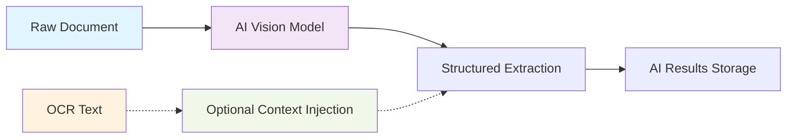

# AI-First Multimodal Extraction

**Status:** Framework Ready - Preparing for implementation  
**Architecture:** AI-first multimodal with always-on OCR (optional AI context injection)  
**Last updated:** August 18, 2025

---

## **Overview**

Guardian's AI extraction system uses an **AI-first multimodal approach** where AI models process raw documents (images, PDFs) directly, with **always-on OCR text available** for multiple use cases and **optional AI context injection**. This provides superior accuracy for medical document understanding while maintaining cost efficiency.

## **AI-First Architecture**

### **Primary Processing Path**


### **Core Principles**
1. **AI Vision Primary**: Models process raw visual content directly
2. **Always-On OCR**: Text is extracted for every document; AI context injection is optional and A/B testable
3. **Independent Storage**: Both AI and OCR outputs preserved separately
4. **Provider Flexibility**: Multi-provider routing with cost optimization and A/B testing an inherent component

---

## **Multi-Provider Framework**

### **Primary Providers**
| Provider | Role | Notes |
|----------|------|-------|
| **GPT-4o mini** | Cost-optimized default | Fast, low-cost multimodal; ideal for Tier 0 |
| **GPT-4o** | Elevated accuracy | Step-up when confidence is low or doc is critical |
| **GPT-5** | Premium accuracy | Use for critical x low-confidence or SLA-bound cases |
| **Claude 3.5 Sonnet / Sonnet 4** | Premium reasoning | Strong at complex reasoning and ambiguity |
| **Gemini 1.5 Pro / 2.5 Pro** | Premium multimodal | Large context, strong on complex docs |
| **Google Document AI** | Specialty document understanding | Strong on medical form-like docs; BAA available |
| **Azure OpenAI (GPT-4 family/4o/5)** | HIPAA pathway | Use when BAA is required (PHI) |

### **Provider Selection Logic**
```typescript
interface ProviderRouting {
  // Default routing rules
  primary: 'gpt4o-mini';           // Cost-effective primary
  hipaaRequired: 'azure-openai';   // For PHI processing
  highAccuracy: 'gpt4o';           // First step-up for low confidence
  premium: 'gpt5' | 'claude-sonnet-4' | 'gemini-2.5-pro'; // Highest tier
  specialty: 'document-ai';        // Complex medical forms
  
  // Fallback policy
  // Availability fallback: lateral swap within the same tier when a provider is degraded/unavailable
  availabilityFallback: {
    tier0: 'gpt4o-mini' | 'gemini-flash';
    tier1: 'gpt4o' | 'claude-sonnet-3.5' | 'gemini-1.5-pro';
    tier2: 'gpt5' | 'claude-sonnet-4' | 'gemini-2.5-pro';
  };
  
  // Quality escalation: move up a tier when confidence is below thresholds
  qualityEscalation: {
    enabled: boolean;
    thresholds: { toTier1: number; toTier2: number }; // e.g., { toTier1: 0.90, toTier2: 0.85 }
    maxEscalationTier: 2;
  };
  
  // Safety fallback: last-resort provider if all others are unavailable (keeps pipeline flowing)
  safetyFallback: 'gpt4o-mini';
  
  // Cost controls
  maxCostPerDoc: number;           // Hard limit in cents
  budgetThreshold: number;         // Switch to cheaper when exceeded
  
  // Quality routing
  confidenceThreshold: number;     // Switch to premium if low confidence
  retryWithPremium: boolean;       // Retry failed extractions
}
```

---

## **Multimodal Processing Features**

### **Vision Understanding**
- **Layout Analysis**: Understand document structure and formatting
- **Handwriting Recognition**: Process handwritten prescriptions and notes
- **Medical Form Recognition**: Specialized understanding of medical form layouts
- **Image Quality Assessment**: Detect poor quality scans requiring enhancement

### **Medical Context Awareness**
- **Terminology Recognition**: Medical terms, drug names, procedures
- **Dosage Understanding**: Complex medication instructions and timing
- **Temporal Relationships**: Timeline of treatments and conditions
- **Clinical Significance**: Prioritize critical vs. routine information

### **Always-On OCR Integration**

Guardian implements **always-available text extraction** for multiple use cases while maintaining AI-first multimodal processing as the primary approach. OCR text can optionally be injected into AI processing based on strategic decisions and A/B testing.

#### **Architecture Paradigm**
```
OLD: OCR → AI Text Analysis → Storage
NEW: Always-On OCR Text → Multiple Use Cases (Intake, Search, AI Context, Validation) → Storage
```

#### **Primary Provider: Google Cloud Vision API**
- **Cost**: $1.50 per 1,000 documents (83% reduction from AWS Textract)
- **Performance**: <2 seconds per document  
- **Accuracy**: 99.5% for medical documents
- **HIPAA**: Available under Google Cloud BAA
- **Role**: Always-on text extraction with optional AI context injection

#### **OCR Use Cases**
1. **Intake Screening**: Fast identity verification and health/non-health classification
2. **Search Indexing**: Enable full-text search across all documents  
3. **AI Context Injection**: Optional enhancement for AI processing (A/B testable)
4. **Validation**: Cross-validate AI extractions against OCR text for accuracy
5. **Fallback**: Reliable text extraction when AI vision fails

#### **Configuration**
```typescript
interface OcrIntegrationConfig {
  alwaysExtractOCR: true;             // Always-on OCR extraction
  enableAIContextInjection: boolean;  // A/B: include OCR text in AI prompt
  enableValidation: boolean;          // Cross-validate AI extractions with OCR
  qualityThreshold?: number;          // Optional: use quality signal downstream
}
```

---

## **Feature Flag System**

### **Core Processing Flags**
```typescript
interface AiExtractionFlags {
  // Core AI processing
  enableAiProcessing: boolean;         // Default: true
  enableMultimodalVision: boolean;     // Default: true
  alwaysExtractOCR: boolean;           // Default: true (always-on)
  enableAIContextInjection: boolean;   // Default: false (A/B testable)
  
  // Provider selection
  primaryProvider: ProviderId;         // Default: 'gpt4o-mini'
  enableProviderFallback: boolean;     // Default: true
  enableCostOptimization: boolean;     // Default: true
  enableQualityRouting: boolean;       // Default: true
  
  // HIPAA compliance
  requireHipaaProvider: boolean;       // Default: false
  enablePhiRedaction: boolean;         // Default: true
  enableAuditLogging: boolean;         // Default: true
}
```

### **A/B Testing Framework**
- **Cohort Assignment**: Deterministic user-based splitting
- **Provider Comparison**: Side-by-side quality metrics
- **Cost Analysis**: Real-time cost per accuracy measurement
- **Rollback Capability**: Instant revert to known-good configuration

---

## **Extraction Capabilities**

### **Medical Information Types**
```typescript
interface MedicalExtraction {
  medications: {
    name: string;
    dosage: string;
    frequency: string;
    duration?: string;
    prescriber?: string;
    startDate?: string;
    endDate?: string;
    instructions?: string;
    confidence: number;
  }[];
  
  conditions: {
    diagnosis: string;
    icdCode?: string;
    severity?: string;
    status: 'active' | 'resolved' | 'chronic' | 'suspected';
    diagnosisDate?: string;
    diagnosedBy?: string;
    confidence: number;
  }[];
  
  procedures: {
    name: string;
    date?: string;
    provider?: string;
    location?: string;
    outcome?: string;
    complications?: string;
    confidence: number;
  }[];
  
  labResults: {
    testName: string;
    value: string;
    unit?: string;
    referenceRange?: string;
    abnormalFlag?: boolean;
    testDate?: string;
    orderingProvider?: string;
    confidence: number;
  }[];
  
  allergies: {
    allergen: string;
    reaction: string;
    severity?: 'mild' | 'moderate' | 'severe';
    onsetDate?: string;
    confidence: number;
  }[];
  
  vitals: {
    type: 'blood_pressure' | 'heart_rate' | 'temperature' | 'weight' | 'height';
    value: string;
    unit: string;
    measuredDate?: string;
    confidence: number;
  }[];
}
```

### **Quality Assurance**
```typescript
interface ExtractionQuality {
  overallConfidence: number;           // 0-1 aggregate confidence
  sourceAttribution: {                // Traceability to source
    pageNumber?: number;
    textRegion?: string;
    imageCoordinates?: { x: number; y: number; width: number; height: number };
  };
  validationFlags: {
    dosageReasonable: boolean;         // Medication dosages within normal ranges
    datesConsistent: boolean;          // Temporal logic makes sense
    terminologyValid: boolean;         // Medical terms properly recognized
    duplicatesDetected: boolean;       // Same information extracted multiple times
  };
  reviewRecommendation: 'auto_approve' | 'human_review' | 'specialist_review';
}
```

---

## **Prompt Engineering Strategy**

### **Multimodal Prompt Template**
```typescript
const MEDICAL_EXTRACTION_PROMPT = `
You are a medical AI assistant analyzing healthcare documents. Extract structured medical information with high accuracy and confidence scoring.

DOCUMENT TYPE: {documentType}
PROCESSING MODE: AI Vision + {ocrContext ? 'OCR Context' : 'Vision Only'}

EXTRACTION REQUIREMENTS:
1. Extract ONLY information explicitly present in the document
2. Provide confidence scores (0-100) for each extracted item
3. Include source attribution (page numbers, sections)
4. Flag any uncertain or unclear information
5. Preserve original terminology and formatting when possible

MEDICAL CATEGORIES TO EXTRACT:
- Medications (name, dosage, frequency, prescriber, dates)
- Medical conditions (diagnosis, ICD codes, status, dates)
- Procedures (name, date, provider, outcome)
- Lab results (test name, values, ranges, dates, abnormal flags)
- Allergies (allergen, reaction type, severity)
- Vital signs (type, value, unit, date)

QUALITY REQUIREMENTS:
- Confidence >95%: Auto-approve
- Confidence 80-95%: Flag for review
- Confidence <80%: Require human validation
- Always provide reasoning for confidence scores

OUTPUT FORMAT: JSON with strict schema validation

{ocrContext ? 'OCR TEXT CONTEXT:\n' + ocrText + '\n' : ''}

Now analyze the document image and extract medical information:
`;
```

### **Provider-Specific Adaptations**
- **GPT-4o mini**: Optimized for speed and cost efficiency
- **GPT-4o**: Balanced accuracy/cost for elevated routing
- **GPT-5**: Premium accuracy for critical x low-confidence
- **Claude 3.5 Sonnet / Sonnet 4**: Complex reasoning for ambiguous medical content
- **Gemini 1.5 Pro / 2.5 Pro**: Large context, strong for long/complex docs
- **Google Document AI**: Leverages specialized medical document understanding
- **Azure OpenAI (GPT-4 family/4o/5)**: HIPAA-compliant processing instructions
---

## **Tiered Model Routing and Pricing**

### **Recommended routing policy (concise)**
- Tier 0 (default, batch): GPT-4o mini or Gemini Flash + always-on OCR.
- Tier 1 (elevated): GPT-4o, Claude 3.5 Sonnet, or Gemini 1.5 Pro when confidence < threshold or doc type = critical.
- Tier 2 (premium): GPT-5, Claude Sonnet 4, or Gemini 2.5 Pro on critical x low-confidence or payer/provider SLAs.
- A/B: OCR context injection ON/OFF per tier; log accuracy and cost deltas.

### **General pricing ranges (per 1M tokens, indicative)**
- Tier 0: ~$0.10–$0.60 input, ~$0.40–$2.00 output
- Tier 1: ~$1.50–$6.00 input, ~$6.00–$15.00 output
- Tier 2: ~$2.50–$8.00 input, ~$10.00–$30.00 output

Notes:
- Exact rates vary by provider/region and contract; confirm on provider pricing pages.
- Use Azure OpenAI or covered Google services under BAA for PHI.
- The OCR extraction cost (~$1.50 per 1,000 pages) is incurred once and reused across tiers (intake, search, validation, AI context).

### **Routing triggers**
- Confidence-based: escalate tiers when overallConfidence < threshold (e.g., 0.85/0.90).
- Document-type: prescriptions, abnormal labs, discharge summaries escalate sooner.
- Compliance: force HIPAA/BAA pathways (Azure OpenAI or covered Google services) when PHI present.
- Budget: cap Tier 2 usage per day; backoff to Tier 1 or Tier 0 when budgets are reached.


---

## **Performance Targets**

### **Quality Metrics**
- **Medical Data Accuracy**: >99% (critical for patient safety)
- **Dosage Accuracy**: >99.5% (medication safety critical)  
- **False Positive Rate**: <1% (avoid extracting non-medical data)
- **False Negative Rate**: <2% (avoid missing critical information)
- **Auto-Approval Rate**: >95% (high-confidence extractions)

### **Performance Benchmarks**
- **Processing Latency**: <90 seconds end-to-end per document
- **Multimodal Analysis**: <60 seconds for vision processing
- **OCR Adjunct**: <5 seconds additional when enabled
- **Provider Failover**: <30 seconds automatic retry

### **Cost Efficiency**
- Costs depend on tier mix and token volumes. Use the tier ranges above for planning, and measure effective $/document via observability.

---

## **Security & Compliance**

### **HIPAA Compliance**
- **BAA Providers**: Azure OpenAI, Google Document AI prioritized for PHI
- **Data Minimization**: Extract only clinically necessary information
- **Audit Logging**: Complete provenance tracking via audit events
- **PHI Redaction**: Automatic removal of PHI from logs and debug data

### **Data Protection**
```typescript
interface SecurityControls {
  phiHandling: {
    enableRedaction: boolean;          // Remove PHI from logs
    requireHipaaProvider: boolean;     // Force BAA providers for PHI
    enableFieldEncryption: boolean;    // Encrypt sensitive fields
    auditAllAccess: boolean;          // Log all data access
  };
  
  qualityControl: {
    enableSourceValidation: boolean;   // Verify extraction sources
    enableConfidenceScoring: boolean;  // Require confidence metrics
    enableHumanReview: boolean;       // Trigger review for low confidence
    enableSpecialistReview: boolean;   // Escalate complex cases
  };
}
```

---

## **Implementation Roadmap**

### **Phase 2A: Core AI Pipeline (Week 2.1-2.2)**
- Implement GPT-4o Mini multimodal processing
- Build provider adapter framework
- Integrate with existing job queue system
- Basic feature flag implementation

### **Phase 2B: Advanced Features (Week 2.3-2.4)**
- Azure OpenAI HIPAA integration
- OCR adjunct fusion logic
- Quality scoring and validation
- A/B testing framework

### **Phase 3: Optimization (Week 3)**
- Cost optimization and provider routing
- Performance tuning and caching
- Advanced quality assurance
- Production monitoring integration

---

## **Monitoring & Analytics**

### **Real-time Metrics**
- Provider latency and availability
- Extraction confidence distributions
- Cost per document by provider
- Auto-approval vs. human review rates

### **Quality Dashboards**
- Medical accuracy trending
- Provider performance comparison
- User feedback and correction tracking
- Cost efficiency analysis

---

*For detailed implementation specifications, see [Phase 2: AI-First Pipeline](../implementation/phase-2-ai-pipeline.md)*