# Intake Screening Architecture

**Purpose:** Intelligent upfront validation before expensive AI processing  
**Status:** 🚧 Design Phase - Preparing for implementation  
**Last updated:** August 18, 2025

---

## 🎯 **Overview**

The Intake Screening system provides cost-effective upfront validation to ensure only valid, health-related documents from authorized users enter the full AI processing pipeline. This prevents wasted compute, storage costs, and security risks.

## 🛡️ **Core Functions**

### **1. Identity Verification**
Ensure uploaded documents belong to the correct user or their authorized profiles:
- **Account Owner Match**: Document references the primary account holder
- **Child Profile Match**: Document belongs to a child under the account
- **Profile Disambiguation**: Smart suggestions when multiple profiles possible
- **Manual Attestation**: Fallback for documents without clear identity markers

### **2. Content Classification**  
Filter health-relevant content before expensive processing:
- **Health Content Detection**: Medical records, prescriptions, lab results, imaging
- **Non-Health Rejection**: Financial documents, general correspondence, spam
- **Uncertainty Handling**: Borderline cases flagged for user confirmation
- **Virus/Malware Scanning**: Security screening before storage

### **3. Cost Protection**
Prevent expensive AI processing on invalid content:
- **Early Rejection**: Block non-relevant documents immediately
- **Cheap Models**: Use lightweight AI for screening decisions
- **Budget Controls**: Hard limits on screening costs per document
- **Metrics Tracking**: Monitor cost savings from avoided processing

---

## 🔄 **Decision Flow**

```mermaid
graph TD
    A[📄 Document Upload] --> B[🔍 Quick Scan]
    B --> C[🛡️ Malware Check]
    C --> D{Security Clean?}
    
    D -->|❌ Malware| E[🔒 Quarantine]
    D -->|✅ Clean| F[🏥 Health Content Check]
    
    F --> G{Health Related?}
    G -->|❌ Non-Health| H[🚫 Reject + Notify]
    G -->|❓ Uncertain| I[❓ User Confirm]
    G -->|✅ Health| J[👤 Identity Check]
    
    I --> K{User Confirms?}
    K -->|❌ No| H
    K -->|✅ Yes| J
    
    J --> L{Identity Match?}
    L -->|✅ Clear Match| M[✅ Accept + Queue]
    L -->|🔀 Multiple Profiles| N[🎯 Profile Selection]
    L -->|❌ No Match| O[❓ Manual Verify]
    L -->|❓ Uncertain| P[✋ User Attestation]
    
    N --> Q[👤 User Selects Profile]
    Q --> M
    
    O --> R{User Provides ID?}
    R -->|✅ Valid| M
    R -->|❌ Invalid| H
    
    P --> S{User Attests Ownership?}
    S -->|✅ Attests| M
    S -->|❌ Denies| H
    
    E --> T[📧 Security Alert]
    H --> U[📧 Rejection Notice]
    M --> V[🚀 Full AI Processing]
```



---

## 🧠 **AI Models & Logic**

### **Cheap Screening Models**
- **Content Classification**: Lightweight text classifier (<$0.01/doc)
- **Basic OCR**: First page/header extraction only for identity
- **Vision Labels**: Simple image classification for content type
- **Heuristic Checks**: File metadata, size, type, entropy analysis

### **Identity Extraction Strategy**
```typescript
// Pseudocode for identity extraction
interface IdentityExtraction {
  names: string[];           // Extracted names from document
  dateOfBirth?: string;      // DOB if present
  addresses?: string[];      // Address information
  identifiers?: {           // Medical identifiers
    medicare?: string;
    patientId?: string;
    memberNumber?: string;
  };
  confidence: number;        // 0-1 confidence score
  extractionMethod: 'ocr' | 'vision' | 'metadata';
}
```

### **Profile Matching Algorithm**
1. **Exact Match**: Full name + DOB exact match → auto-accept
2. **Fuzzy Match**: Name similarity + partial DOB → high confidence  
3. **Family Match**: Child name + parent account → profile suggestion
4. **Weak Signals**: Partial name only → manual verification required

---

## 📊 **Data Models**

### **Intake Screening Record**
```sql
CREATE TABLE intake_screening (
  id UUID PRIMARY KEY DEFAULT gen_random_uuid(),
  document_id UUID REFERENCES documents(id),
  account_id UUID REFERENCES auth.users(id),
  
  -- Decision outcome
  decision intake_decision_enum NOT NULL,
  decision_reasons JSONB NOT NULL,
  confidence_score DECIMAL(3,2),
  
  -- Identity extraction
  extracted_identities JSONB,
  matched_profile_id UUID REFERENCES user_profiles(id),
  
  -- Processing metadata  
  model_provider TEXT,
  model_version TEXT,
  used_ocr_context BOOLEAN DEFAULT false,
  cost_cents INTEGER,
  processing_time_ms INTEGER,
  
  created_at TIMESTAMP WITH TIME ZONE DEFAULT NOW()
);

CREATE TYPE intake_decision_enum AS ENUM (
  'accept',              -- Document accepted for processing
  'needs_selection',     -- Multiple profiles matched, user must choose
  'reject_non_health',   -- Not health-related content
  'quarantine_malware',  -- Security threat detected
  'needs_manual_verify', -- Identity unclear, needs user attestation
  'rejected_user_deny'   -- User confirmed it's not theirs
);
```

### **Profile Match Candidates**
```sql
CREATE TABLE profile_match_candidates (
  id UUID PRIMARY KEY DEFAULT gen_random_uuid(),
  document_id UUID REFERENCES documents(id),
  profile_id UUID REFERENCES user_profiles(id),
  
  match_score DECIMAL(3,2) NOT NULL,
  match_reasons JSONB NOT NULL,
  
  created_at TIMESTAMP WITH TIME ZONE DEFAULT NOW()
);
```

### **Rejection Tracking**
```sql
CREATE TABLE intake_rejections (
  id UUID PRIMARY KEY DEFAULT gen_random_uuid(),
  document_id UUID REFERENCES documents(id),
  account_id UUID REFERENCES auth.users(id),
  
  reason_code TEXT NOT NULL,
  explanation TEXT NOT NULL,
  user_notified_at TIMESTAMP WITH TIME ZONE,
  
  -- Appeal process
  appeal_token UUID,
  appeal_submitted_at TIMESTAMP WITH TIME ZONE,
  appeal_resolution TEXT,
  
  -- Retention policy
  retention_until TIMESTAMP WITH TIME ZONE,
  
  created_at TIMESTAMP WITH TIME ZONE DEFAULT NOW()
);
```

---

## ⚙️ **Configuration & Feature Flags**

### **Global Settings**
```typescript
interface IntakeConfig {
  // Enable/disable screening
  enableIntakeScreening: boolean;          // Default: true
  enableMalwareScanning: boolean;          // Default: true
  enableHealthClassification: boolean;     // Default: true
  enableProfileMatching: boolean;          // Default: true
  
  // AI model settings
  enableAiOcrContext: boolean;            // Default: false (cheap-first)
  maxScreeningCostCents: number;          // Default: 5 cents per document
  
  // Confidence thresholds
  autoAcceptThreshold: number;            // Default: 0.9
  profileSelectionThreshold: number;      // Default: 0.6
  rejectThreshold: number;                // Default: 0.9
  
  // Retention policies
  quarantineRetentionDays: number;        // Default: 7 days
  rejectionRetentionDays: number;         // Default: 30 days
}
```

### **Per-User Overrides**
```sql
CREATE TABLE user_intake_preferences (
  user_id UUID PRIMARY KEY REFERENCES auth.users(id),
  
  -- Custom thresholds
  auto_accept_threshold DECIMAL(3,2),
  manual_verify_threshold DECIMAL(3,2),
  
  -- Notification preferences
  notify_on_rejection BOOLEAN DEFAULT true,
  notify_on_quarantine BOOLEAN DEFAULT true,
  
  -- Profile hints
  default_child_profiles UUID[],
  
  updated_at TIMESTAMP WITH TIME ZONE DEFAULT NOW()
);
```

---

## 🎯 **Success Metrics**

### **Accuracy Targets**
- **Health Content Detection**: >95% precision, >90% recall
- **Identity Matching**: >98% correct profile assignment  
- **False Positive Rate**: <1% health documents rejected incorrectly
- **False Negative Rate**: <5% non-health documents passed through

### **Performance Targets**
- **Screening Latency**: <500ms end-to-end per document
- **Cost per Screen**: <$0.05 average (cheap models only)
- **Malware Detection**: 100% known threats blocked
- **User Experience**: <2% of uploads require manual intervention

### **Cost Savings**
- **Avoided Processing**: Track $ saved from blocked non-health documents
- **Resource Protection**: Prevent storage waste and compute overuse
- **ROI Calculation**: Screening cost vs. processing cost savings

---

## 🚨 **Error Handling & Edge Cases**

### **Ambiguous Identity Cases**
1. **No Identity Information**: Generic medication bottle photo
   - → Trigger manual attestation flow
   - → Allow user to confirm "this is mine"
   
2. **Multiple Names**: Family medication list with multiple people
   - → Extract all names, match against household profiles
   - → Present profile selection interface
   
3. **Partial Matches**: "John" matches "Jonathan Smith" account
   - → Flag for manual verification with similarity score
   - → Require additional confirmation

### **Content Classification Edge Cases**
1. **Medical-Adjacent**: Fitness tracker data, vitamin supplements
   - → Flag as uncertain, ask user to confirm relevance
   - → Learn from user feedback for future classification

2. **Mixed Content**: Email with health info + non-health attachments  
   - → Process health portions, reject non-health sections
   - → Maintain audit trail of partial processing

### **Technical Failures**
1. **Model Unavailable**: AI screening service down
   - → Fallback to heuristic rules (file type, keywords)
   - → Queue for later re-screening when service restored

2. **Malware Scanner Failure**: Security service unavailable
   - → Default to quarantine until scanning available
   - → Never bypass security for availability

---

## 🔮 **Implementation Roadmap**

### **Phase 1: Basic Screening (Week 1)**
- Malware scanning integration
- Simple health/non-health classification
- Basic identity extraction from first page OCR

### **Phase 2: Profile Matching (Week 2)**  
- Fuzzy name matching algorithm
- Profile disambiguation UI
- Manual attestation workflow

### **Phase 3: Advanced Classification (Week 3)**
- Multi-modal content classification  
- Confidence scoring refinement
- Cost optimization and provider routing

### **Phase 4: Production Hardening (Week 4)**
- Comprehensive error handling
- Appeal and review processes
- Analytics and optimization framework

---

*See [Implementation Guide](../implementation/) for detailed technical specifications and deployment procedures.*