# Malware Scanning & Security Screening

**Purpose:** Security threat detection and quarantine before document processing  
**Status:** 🚧 Design Phase - Security framework ready for implementation  
**Last updated:** August 18, 2025

---

## 🎯 **Overview**

The Malware Scanning system provides the first line of defense against security threats, ensuring malicious files are detected and quarantined before they can compromise the document processing pipeline or user data.

## 🛡️ **Security Architecture**

### **1. Multi-Layered Security Screening**

```mermaid
graph TD
    A[📄 File Upload] --> B[📋 File Type Validation]
    B --> C[🔍 Signature Analysis]
    C --> D[📊 Entropy Analysis]
    D --> E[🧬 Behavioral Analysis]
    E --> F{Security Assessment}
    
    F -->|Clean| G[✅ Proceed to Processing]
    F -->|Suspicious| H[⚠️ Additional Scanning]
    F -->|Malicious| I[🔒 Quarantine]
    
    H --> J[🤖 Advanced Analysis]
    J --> K{Final Assessment}
    K -->|Safe| G
    K -->|Threat| I
    
    I --> L[📧 Security Alert]
    I --> M[🗂️ Incident Logging]
```



### **2. File Type Validation**

#### **Allowed File Types**
```typescript
interface AllowedFileTypes {
  medical_documents: {
    extensions: ['.pdf', '.jpg', '.jpeg', '.png', '.tiff', '.heic', '.webp'];
    mimeTypes: [
      'application/pdf',
      'image/jpeg',
      'image/png', 
      'image/tiff',
      'image/heic',
      'image/webp'
    ];
    maxSize: '50MB';
  };

  validation_rules: {
    strictMimeChecking: true;       // Verify MIME matches extension
    magicNumberValidation: true;    // Check file headers
    extensionWhitelist: true;       // Only allow approved extensions
    doubleExtensionBlock: true;     // Block .pdf.exe type files
  };
}

class FileTypeValidator {
  async validateFileType(filePath: string, uploadedMimeType?: string): Promise<ValidationResult> {
    const extension = path.extname(filePath).toLowerCase();
    const magicBytes = await this.readMagicBytes(filePath);
    
    // Check extension whitelist
    if (!this.allowedExtensions.includes(extension)) {
      return {
        isValid: false,
        threat: 'DISALLOWED_EXTENSION',
        severity: 'HIGH',
        details: `Extension ${extension} not in whitelist`
      };
    }

    // Verify magic number matches extension
    const expectedMagic = this.getExpectedMagicNumber(extension);
    if (!this.validateMagicNumber(magicBytes, expectedMagic)) {
      return {
        isValid: false,
        threat: 'MAGIC_NUMBER_MISMATCH',
        severity: 'HIGH',
        details: 'File header does not match extension'
      };
    }

    // Check for double extensions
    if (this.hasDoubleExtension(filePath)) {
      return {
        isValid: false,
        threat: 'DOUBLE_EXTENSION',
        severity: 'CRITICAL',
        details: 'Multiple file extensions detected'
      };
    }

    return { isValid: true, threat: null, severity: 'NONE' };
  }

  private getExpectedMagicNumber(extension: string): Uint8Array {
    const magicNumbers = {
      '.pdf': new Uint8Array([0x25, 0x50, 0x44, 0x46]), // %PDF
      '.jpg': new Uint8Array([0xFF, 0xD8, 0xFF]),        // JPEG
      '.jpeg': new Uint8Array([0xFF, 0xD8, 0xFF]),       // JPEG
      '.png': new Uint8Array([0x89, 0x50, 0x4E, 0x47]),  // PNG
      '.tiff': new Uint8Array([0x49, 0x49, 0x2A, 0x00]), // TIFF
      '.heic': new Uint8Array([0x00, 0x00, 0x00, 0x20])   // HEIC (simplified)
    };
    
    return magicNumbers[extension] || new Uint8Array();
  }
}
```

### **3. Signature-Based Detection**

#### **Malicious Signatures Database**
```typescript
interface MaliciousSignatures {
  executable_headers: {
    pe_executable: 'MZ',           // Windows PE files
    elf_executable: '\x7fELF',     // Linux ELF files
    mach_o: '\xfe\xed\xfa\xce',    // macOS Mach-O files
  };

  script_patterns: [
    /<script[^>]*>/i,              // Embedded JavaScript
    /<%[^%]*%>/,                   // Server-side scripting
    /\$\([^)]*\)/,                 // jQuery/shell commands
    /eval\s*\(/i,                  // JavaScript eval
    /base64_decode/i,              // PHP decode functions
  ];

  macro_signatures: [
    /Auto_Open/i,                  // Excel auto-open macros
    /Document_Open/i,              // Word auto-open macros
    /Workbook_Open/i,              // Excel workbook macros
    /Sub\s+\w+\s*\(/i,            // VBA subroutines
  ];

  embedded_objects: [
    /objembed/i,                   // Embedded objects
    /oleObject/i,                  // OLE objects
    /ActiveX/i,                    // ActiveX controls
  ];
}

class SignatureScanner {
  async scanForMaliciousSignatures(filePath: string): Promise<ScanResult> {
    const fileBuffer = await fs.readFile(filePath);
    const threats: ThreatDetection[] = [];

    // Check executable headers
    const executableThreats = this.scanExecutableHeaders(fileBuffer);
    threats.push(...executableThreats);

    // Check for embedded scripts (in PDFs)
    if (filePath.endsWith('.pdf')) {
      const scriptThreats = this.scanPDFScripts(fileBuffer);
      threats.push(...scriptThreats);
    }

    // Check for macro signatures (Office documents)
    const macroThreats = this.scanMacroSignatures(fileBuffer);
    threats.push(...macroThreats);

    // Check for embedded objects
    const objectThreats = this.scanEmbeddedObjects(fileBuffer);
    threats.push(...objectThreats);

    return {
      isClean: threats.length === 0,
      threats: threats,
      scanTime: Date.now(),
      scanMethod: 'signature_analysis'
    };
  }

  private scanPDFScripts(buffer: ArrayBuffer): ThreatDetection[] {
    const text = new TextDecoder().decode(buffer);
    const threats: ThreatDetection[] = [];

    // JavaScript in PDFs
    if (/\/JavaScript/i.test(text) || (/\/JS/i.test(text))) {
      threats.push({
        type: 'EMBEDDED_JAVASCRIPT',
        severity: 'HIGH',
        description: 'PDF contains embedded JavaScript',
        offset: text.indexOf('/JavaScript') || text.indexOf('/JS')
      });
    }

    // Forms with auto-submit
    if (/\/AA\s*<<[^>]*\/S\s*\/SubmitForm/i.test(text)) {
      threats.push({
        type: 'AUTO_SUBMIT_FORM',
        severity: 'MEDIUM',
        description: 'PDF contains auto-submitting forms'
      });
    }

    // External URL references
    const urlMatches = text.match(/https?:\/\/[^\s)>\]]+/gi);
    if (urlMatches && urlMatches.length > 5) {
      threats.push({
        type: 'EXCESSIVE_URLS',
        severity: 'MEDIUM',
        description: `PDF contains ${urlMatches.length} external URLs`
      });
    }

    return threats;
  }
}
```

### **4. Entropy Analysis**

#### **Statistical Anomaly Detection**
```typescript
class EntropyAnalyzer {
  async analyzeEntropy(filePath: string): Promise<EntropyAnalysis> {
    const buffer = await fs.readFile(filePath);
    const entropy = this.calculateShannonEntropy(buffer);
    const fileSize = buffer.byteLength;
    
    // Calculate expected entropy for file type
    const extension = path.extname(filePath).toLowerCase();
    const expectedEntropy = this.getExpectedEntropy(extension, fileSize);
    const entropyDeviation = Math.abs(entropy - expectedEntropy);
    
    return {
      calculatedEntropy: entropy,
      expectedEntropy: expectedEntropy,
      deviation: entropyDeviation,
      suspicious: this.isSuspiciousEntropy(entropy, expectedEntropy, extension),
      analysis: this.analyzeEntropyPatterns(buffer)
    };
  }

  private calculateShannonEntropy(buffer: ArrayBuffer): number {
    const bytes = new Uint8Array(buffer);
    const frequency = new Array(256).fill(0);
    
    // Count byte frequencies
    for (const byte of bytes) {
      frequency[byte]++;
    }
    
    // Calculate Shannon entropy
    let entropy = 0;
    const length = bytes.length;
    
    for (const freq of frequency) {
      if (freq > 0) {
        const probability = freq / length;
        entropy -= probability * Math.log2(probability);
      }
    }
    
    return entropy;
  }

  private isSuspiciousEntropy(
    calculated: number,
    expected: number,
    extension: string
  ): boolean {
    
    const entropyThresholds = {
      '.pdf': { min: 6.0, max: 7.8 },    // PDFs typically 6.5-7.5
      '.jpg': { min: 7.0, max: 8.0 },    // JPEG compression ~7.5
      '.png': { min: 5.0, max: 7.5 },    // PNG varies by content
      '.tiff': { min: 4.0, max: 7.0 }    // TIFF varies by compression
    };

    const threshold = entropyThresholds[extension] || { min: 4.0, max: 8.0 };
    
    // Too high entropy suggests encryption/packing
    if (calculated > threshold.max) {
      return true;
    }
    
    // Too low entropy in medical documents is unusual
    if (calculated < threshold.min && extension === '.pdf') {
      return true;
    }
    
    return false;
  }

  private analyzeEntropyPatterns(buffer: ArrayBuffer): EntropyPatterns {
    const chunkSize = 1024; // 1KB chunks
    const chunks = Math.ceil(buffer.byteLength / chunkSize);
    const chunkEntropies: number[] = [];
    
    // Calculate entropy for each chunk
    for (let i = 0; i < chunks; i++) {
      const start = i * chunkSize;
      const end = Math.min(start + chunkSize, buffer.byteLength);
      const chunk = buffer.slice(start, end);
      const entropy = this.calculateShannonEntropy(chunk);
      chunkEntropies.push(entropy);
    }
    
    // Analyze patterns
    const variance = this.calculateVariance(chunkEntropies);
    const maxEntropy = Math.max(...chunkEntropies);
    const minEntropy = Math.min(...chunkEntropies);
    
    return {
      chunkCount: chunks,
      entropyVariance: variance,
      maxChunkEntropy: maxEntropy,
      minChunkEntropy: minEntropy,
      highEntropyChunks: chunkEntropies.filter(e => e > 7.5).length,
      suspiciousPatterns: this.detectSuspiciousPatterns(chunkEntropies)
    };
  }
}
```

### **5. Behavioral Analysis**

#### **File Structure Analysis**
```typescript
class BehavioralAnalyzer {
  async analyzeBehavior(filePath: string): Promise<BehavioralAnalysis> {
    const extension = path.extname(filePath).toLowerCase();
    let analysis: BehavioralAnalysis;

    switch (extension) {
      case '.pdf':
        analysis = await this.analyzePDFBehavior(filePath);
        break;
      case '.jpg':
      case '.jpeg':
        analysis = await this.analyzeImageBehavior(filePath);
        break;
      default:
        analysis = await this.analyzeGenericBehavior(filePath);
    }

    return analysis;
  }

  private async analyzePDFBehavior(filePath: string): Promise<BehavioralAnalysis> {
    const buffer = await fs.readFile(filePath);
    const pdfText = buffer.toString('binary');
    const threats: BehavioralThreat[] = [];

    // Check PDF structure integrity
    if (!pdfText.startsWith('%PDF-')) {
      threats.push({
        type: 'INVALID_PDF_HEADER',
        severity: 'HIGH',
        description: 'PDF does not start with valid header'
      });
    }

    // Check for suspicious PDF features
    const suspiciousFeatures = [
      { pattern: /\/Launch/i, threat: 'LAUNCH_ACTION', severity: 'CRITICAL' },
      { pattern: /\/EmbeddedFile/i, threat: 'EMBEDDED_FILE', severity: 'HIGH' },
      { pattern: /\/URI/i, threat: 'EXTERNAL_URI', severity: 'MEDIUM' },
      { pattern: /\/OpenAction/i, threat: 'AUTO_OPEN_ACTION', severity: 'HIGH' },
      { pattern: /\/RichMedia/i, threat: 'RICH_MEDIA', severity: 'MEDIUM' }
    ];

    for (const feature of suspiciousFeatures) {
      if (feature.pattern.test(pdfText)) {
        threats.push({
          type: feature.threat,
          severity: feature.severity as ThreatSeverity,
          description: `PDF contains ${feature.threat.toLowerCase().replace('_', ' ')}`
        });
      }
    }

    // Check for excessive objects
    const objectCount = (pdfText.match(/\d+\s+\d+\s+obj/g) || []).length;
    if (objectCount > 1000) {
      threats.push({
        type: 'EXCESSIVE_OBJECTS',
        severity: 'MEDIUM',
        description: `PDF contains ${objectCount} objects (potentially obfuscated)`
      });
    }

    return {
      fileType: 'pdf',
      structureValid: threats.filter(t => t.type === 'INVALID_PDF_HEADER').length === 0,
      threats: threats,
      riskScore: this.calculateRiskScore(threats),
      recommendation: this.getRecommendation(threats)
    };
  }

  private async analyzeImageBehavior(filePath: string): Promise<BehavioralAnalysis> {
    const buffer = await fs.readFile(filePath);
    const threats: BehavioralThreat[] = [];

    // Check for EXIF data anomalies
    const exifThreats = await this.analyzeEXIFData(buffer);
    threats.push(...exifThreats);

    // Check for steganography indicators
    const steganographyRisk = this.detectSteganography(buffer);
    if (steganographyRisk.suspicious) {
      threats.push({
        type: 'STEGANOGRAPHY_RISK',
        severity: 'MEDIUM',
        description: 'Image shows patterns consistent with hidden data'
      });
    }

    // Check file size vs image dimensions ratio
    const dimensionAnalysis = await this.analyzeDimensionRatio(buffer);
    if (dimensionAnalysis.suspicious) {
      threats.push({
        type: 'SUSPICIOUS_SIZE_RATIO',
        severity: 'LOW',
        description: 'File size disproportionate to image dimensions'
      });
    }

    return {
      fileType: 'image',
      structureValid: true,
      threats: threats,
      riskScore: this.calculateRiskScore(threats),
      recommendation: this.getRecommendation(threats)
    };
  }
}
```

### **6. Quarantine Management**

#### **Quarantine System**
```typescript
interface QuarantineSystem {
  quarantineStorage: {
    bucket: 'quarantine-storage';
    path: 'quarantine/{userId}/{timestamp}_{filename}';
    retention: '7 days';
    access: 'admin_only';
  };

  quarantineMetadata: {
    originalPath: string;
    detectionTime: Date;
    threatTypes: ThreatType[];
    severity: ThreatSeverity;
    scanResults: ScanResult[];
    userNotified: boolean;
    reviewStatus: 'pending' | 'confirmed_threat' | 'false_positive';
  };
}

class QuarantineManager {
  async quarantineFile(
    filePath: string,
    threats: ThreatDetection[],
    userId: string
  ): Promise<QuarantineResult> {
    
    const quarantineId = crypto.randomUUID();
    const timestamp = new Date().toISOString().replace(/[:.]/g, '-');
    const filename = path.basename(filePath);
    const quarantinePath = `quarantine/${userId}/${timestamp}_${filename}`;

    try {
      // Move file to quarantine storage
      await this.moveToQuarantine(filePath, quarantinePath);

      // Create quarantine record
      const quarantineRecord = await this.createQuarantineRecord({
        id: quarantineId,
        userId: userId,
        originalPath: filePath,
        quarantinePath: quarantinePath,
        threats: threats,
        severity: this.getMaxSeverity(threats),
        timestamp: new Date()
      });

      // Log security incident
      await this.logSecurityIncident({
        type: 'MALWARE_QUARANTINE',
        userId: userId,
        threats: threats,
        quarantineId: quarantineId
      });

      // Schedule user notification
      await this.scheduleUserNotification(userId, quarantineRecord);

      // Schedule cleanup
      await this.scheduleQuarantineCleanup(quarantineId, 7); // 7 days

      return {
        success: true,
        quarantineId: quarantineId,
        message: 'File successfully quarantined'
      };

    } catch (error) {
      console.error('Quarantine operation failed:', error);
      
      // Log failure but don't expose details
      await this.logSecurityIncident({
        type: 'QUARANTINE_FAILURE',
        userId: userId,
        error: error.message,
        filePath: filePath
      });

      return {
        success: false,
        error: 'Failed to quarantine file',
        fallbackAction: 'block_upload'
      };
    }
  }

  async reviewQuarantinedFile(
    quarantineId: string,
    reviewerId: string,
    decision: 'release' | 'confirm_threat' | 'delete'
  ): Promise<ReviewResult> {
    
    const quarantineRecord = await this.getQuarantineRecord(quarantineId);
    
    if (!quarantineRecord) {
      throw new Error('Quarantine record not found');
    }

    switch (decision) {
      case 'release':
        return await this.releaseFromQuarantine(quarantineRecord, reviewerId);
      
      case 'confirm_threat':
        return await this.confirmThreat(quarantineRecord, reviewerId);
      
      case 'delete':
        return await this.permanentDelete(quarantineRecord, reviewerId);
      
      default:
        throw new Error('Invalid review decision');
    }
  }
}
```

### **7. Incident Response**

#### **Security Alerting**
```typescript
interface SecurityAlerting {
  alertThresholds: {
    single_critical_threat: 'immediate';
    multiple_high_threats: 'immediate';
    pattern_detection: '15_minutes';
    volume_spike: '5_minutes';
  };

  alertChannels: {
    email: 'security@exorahealth.com.au';
    slack: '#security-alerts';
    sms: '+61_emergency_number';
    dashboard: 'security_operations';
  };
}

class IncidentResponseManager {
  async handleSecurityIncident(incident: SecurityIncident): Promise<void> {
    const severity = this.assessIncidentSeverity(incident);
    
    // Immediate response actions
    switch (severity) {
      case 'CRITICAL':
        await this.executeCriticalResponse(incident);
        break;
      case 'HIGH':
        await this.executeHighSeverityResponse(incident);
        break;
      case 'MEDIUM':
        await this.executeMediumSeverityResponse(incident);
        break;
    }

    // Log and track incident
    await this.logIncident(incident, severity);
    
    // Update threat intelligence
    await this.updateThreatIntelligence(incident);
  }

  private async executeCriticalResponse(incident: SecurityIncident): Promise<void> {
    // Immediate containment
    await this.blockUserUploads(incident.userId, '24_hours');
    
    // Alert security team
    await this.sendImmediateAlert({
      type: 'CRITICAL_SECURITY_INCIDENT',
      userId: incident.userId,
      threats: incident.threats,
      timestamp: new Date()
    });
    
    // Initiate incident response protocol
    await this.initiateIncidentResponse(incident);
    
    // Scan related user files
    await this.scanRelatedFiles(incident.userId);
  }

  private async updateThreatIntelligence(incident: SecurityIncident): Promise<void> {
    // Extract threat signatures for future detection
    const signatures = this.extractThreatSignatures(incident);
    
    // Update signature database
    await this.updateSignatureDatabase(signatures);
    
    // Share with threat intelligence feeds (if enabled)
    if (this.shouldShareThreatIntelligence(incident)) {
      await this.shareThreatIntelligence(signatures);
    }
  }
}
```

## 📊 **Performance & Monitoring**

### **Scanning Performance**
```typescript
interface ScanningMetrics {
  performance: {
    averageScanTime: number;        // Milliseconds per file
    filesScannedPerHour: number;    // Throughput metric
    falsePositiveRate: number;      // Percentage of clean files flagged
    falseNegativeRate: number;      // Percentage of threats missed
  };

  threatDetection: {
    threatsDetected: number;        // Total threats found
    criticalThreats: number;        // Critical severity threats
    quarantinedFiles: number;       // Files moved to quarantine
    reviewedFiles: number;          // Files reviewed by humans
  };

  systemHealth: {
    scannerUptime: number;          // Percentage uptime
    memoryUsage: number;            // Memory consumption
    diskUsage: number;              // Quarantine storage usage
    alertResponseTime: number;      // Time to respond to alerts
  };
}
```

## 🔐 **Security Best Practices**

### **Secure Implementation**
1. **Fail Secure**: When in doubt, quarantine the file
2. **Defense in Depth**: Multiple scanning layers
3. **Least Privilege**: Minimal access to quarantine storage
4. **Audit Everything**: Complete logging of all security events
5. **Regular Updates**: Keep threat signatures current
6. **Incident Response**: Clear escalation procedures

### **Compliance Requirements**
- **Data Protection**: Quarantined files encrypted at rest
- **Access Control**: Role-based access to security functions
- **Audit Trails**: Immutable logs of all security events
- **Incident Reporting**: Regulatory notification procedures

---

## 🧪 **Testing Strategy**

### **Security Test Cases**
1. **Known Malware**: Test with EICAR and other test files
2. **Evasion Techniques**: Obfuscated and packed files
3. **False Positives**: Legitimate files that trigger alerts
4. **Performance**: Large file scanning performance
5. **Edge Cases**: Corrupted files, unusual formats

### **Validation Requirements**
- **Detection Rate**: >99.9% for known threats
- **False Positive Rate**: <0.1% for legitimate files
- **Performance**: <5 seconds scan time for 50MB files
- **Availability**: 99.9% scanner uptime

---

*For implementation details, see [Phase 1: Intake Screening](../implementation/phase-1-intake-screening.md)*