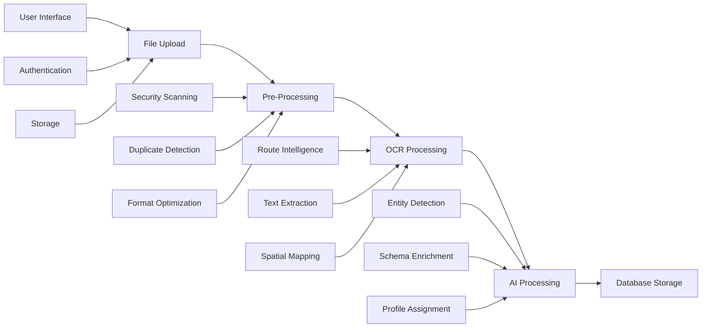

# Exora Medical Document Processing Pipeline: Complete Architecture Overview

## Document Status
- **Created**: 25 August 2025
- **Purpose**: Master overview of the complete medical document processing pipeline architecture
- **Status**: Comprehensive architectural specification
- **Component Files**: References detailed component architectures

## Executive Summary

The Exora medical document processing pipeline transforms unstructured medical documents into structured, coded clinical data through an intelligent four-component architecture. 

## Pipeline Architecture Overview
Complete Processing Flow:
Component 1: File Upload → Secure ingestion with validation and storage
Component 2: Pre-Processing → Intelligent routing and optimization  
Component 3: OCR Processing → Text extraction with spatial coordinates
Component 4: AI Processing → Two-pass entity detection and enrichment
Final Output: Structured clinical data ready for database insertion

## Component Integration Architecture

### Component Dependencies and Data Flow



## Component Specifications

### 1. File Upload Component
**Reference**: [File Upload Architecture](01-file-upload-architecture.md) - Comprehensive upload system specification

**Primary Functions**:
- Secure medical document ingestion via select / drag-drop interface
- Client-side validation (format, size, security pre-checks)
- Supabase Storage integration with user-specific folders
- Initial database record creation with RLS enforcement
- Progress tracking and error handling

**Key Outputs**:
```typescript
interface UploadHandoff {
  documentId: string;
  rawStoragePath: string;
  uploadMetadata: {
    originalFilename: string;
    mimeType: string;
    fileSize: number;
    uploadTimestamp: Date;
  };
  userContext: {
    userId: string;
    sessionId: string;
  };
}
```


### 2. File Pre-Processing Component
**Reference**: [Pre-Processing Architecture](02-file-preprocessing-architecture.md) - Document optimization and routing

**Primary Functions**:
- Security scanning and malware detection
- SHA-256 duplicate detection for cost optimization
- Intelligent document routing (fast/slow/hybrid paths)
- Format optimization and enhancement
- Multi-version storage (original, enhanced, page extracts)

**Processing Strategy Distribution**:
```typescript
const PROCESSING_PATHS = {
  fastPath: {
    percentage: 95,
    documents: 'Clean PDFs, standard images',
    processingTime: '<500ms',
    costImpact: '$0.0001 per document'
  },
  slowPath: {
    percentage: 3,
    documents: 'HEIC, complex Office docs, corrupted files',
    processingTime: '3-8s',
    costImpact: '$0.002 per document'
  },
  hybridPath: {
    percentage: 2,
    documents: 'Mixed content (text + scanned images)',
    processingTime: '1-3s', 
    costImpact: '$0.0008 per document'
  }
};
```

**Key Outputs**:
```typescript
interface PreProcessingHandoff {
  documentId: string;
  processingPath: 'fast' | 'slow' | 'hybrid';
  optimizedVersions: {
    original: string;
    enhanced?: string;
    pageExtracts?: string[];
  };
  qualityMetrics: QualityMetrics;
  securityClearance: boolean;
  duplicateStatus: DuplicateCheckResult;
}
```

### 3. OCR Processing Component
**Reference**: [OCR Processing Architecture](03-ocr-processing-architecture.md) - Text extraction with spatial coordinates

**Primary Functions**:
- Text + spatial data extraction from pre-processed, OCR-ready documents
- Spatial coordinate capture for click-to-zoom functionality

**Extraction Strategy Matrix**:
```typescript
const OCR_STRATEGIES = {
  directTextExtraction: {
    documents: 'Pre-processed PDFs and Office docs (now clean)',
    cost: '$0.0001 per page',
    accuracy: '99.9%',
    processingTime: '50ms per page'
  },
  googleCloudVision: {
    documents: 'Pre-processed image documents (enhanced quality)',
    cost: '$0.0015 per page', 
    accuracy: '95-98%',
    processingTime: '2-3s per page'
  },
  optimizedProcessing: {
    documents: 'All documents receive pre-processing optimization',
    benefit: 'Higher OCR accuracy due to enhanced image quality',
    cost: 'Minimal additional cost for much better results'
  }
};
```

**Key Outputs**:
```typescript
interface OCRHandoff {
  documentId: string;
  extractedText: string;
  spatialData: BoundingBox[];
  textBlocks: TextBlock[];
  documentStructure: DocumentStructure;
  qualityAssessment: QualityMetrics;
  extractionMetadata: ExtractionMetadata;
}
```

### 4. AI Processing Component  
**Reference**: [AI Processing Architecture](04-ai-processing-architecture.md) and [Entity Classification Taxonomy](05-entity-classification-taxonomy.md) - Aligned two-pass architecture with 3-category entity classification

**Primary Functions**:
- Two-pass AI architecture with hierarchical 3-category entity classification system
- Pass 1: Comprehensive entity identification using processing-requirements-based taxonomy
- Pass 2: Targeted schema-based enrichment with multi-layered contextual approach
- Complete audit trail with entity_processing_audit table for regulatory compliance
- Profile assignment suggestions with confidence scoring
- Russian babushka doll layering: essential processing shells in Pass 1, enriched user-facing shells in Pass 2

**Two-Pass Architecture**:
```typescript
const AI_PROCESSING_ARCHITECTURE = {
  pass1: {
    purpose: '3-Category Entity Detection and Classification',
    model: 'Lightweight (GPT-4o-mini, Claude Haiku etc)',
    input: 'Full uploaded optimized file + OCR data + 3-category entity taxonomy',
    output: 'Complete entity inventory with processing categories and schema requirements',
    categories: 'clinical_event, healthcare_context, document_structure',
    cost: '~$0.0002-0.0005 per document',
    time: '1-2 seconds'
  },
  pass2: {
    purpose: 'Multi-Layered Schema-Based Enrichment',
    model: 'High-performance (Claude Sonnet, GPT-5 etc)',  
    input: 'Full document + Filtered entities by category + targeted schemas',
    processing: 'clinical_event (full enrichment), healthcare_context (profile matching), document_structure (skip)',
    output: 'Fully enriched clinical data with complete audit trail',
    cost: '~$0.003-0.006 per document',
    time: '3-5 seconds'
  }
};
```

**Key Outputs**:
```typescript
interface AIProcessingResult {
  documentId: string;
  entityInventory: EntityInventory;
  enrichedClinicalData: EnrichedEntity[];
  processingAuditTrail: EntityProcessingAudit[]; // Complete processing metadata
  profileSuggestions: ProfileAssignment[];
  processingMetadata: ProcessingSession;
  qualityMetrics: AIQualityMetrics;
  contextualLayering: {
    masterRecords: ClinicalEvent[];        // patient_clinical_events
    detailShells: ObservationDetail[];     // patient_observations, patient_vitals, etc
    contextShells: EncounterContext[];     // healthcare_encounters
    auditShells: ProcessingMetadata[];     // entity_processing_audit
  };
}
```

## Entity Processing Architecture

### 3-Category Classification System

The AI processing component uses a sophisticated 3-category entity classification system that determines processing intensity based on clinical value and compliance requirements:

```typescript
const ENTITY_PROCESSING_CATEGORIES = {
  clinical_event: {
    definition: 'Medical observations, interventions, diagnoses requiring full analysis',
    examples: ['BP: 140/90 mmHg', 'Lisinopril 10mg daily', 'Hypertension'],
    processing: 'Full Pass 2 enrichment + comprehensive database storage',
    schemas: ['patient_clinical_events', 'patient_observations', 'patient_interventions'],
    timeline_relevance: 'high',
    cost_impact: 'highest_value'
  },
  
  healthcare_context: {
    definition: 'Contextual healthcare information for profile matching and care coordination',
    examples: ['Dr. Sarah Johnson', 'Memorial Hospital', 'Patient: John Smith'],
    processing: 'Limited Pass 2 enrichment + contextual database storage',
    schemas: ['healthcare_encounters', 'patient_demographics'],
    timeline_relevance: 'medium',
    cost_impact: 'medium_value'
  },
  
  document_structure: {
    definition: 'Formatting elements and non-clinical content for completeness',
    examples: ['[Signature]', 'Hospital letterhead', 'Page 1 of 3'],
    processing: 'Skip Pass 2 - logging only in audit trail',
    schemas: [],
    timeline_relevance: 'low',
    cost_impact: 'minimal_cost'
  }
};
```

### Multi-Layered Contextual Approach (Russian Babushka Doll)

Every clinical entity receives multiple layers of context through connected database records:

```typescript
interface ContextualLayering {
  masterShell: {
    table: 'patient_clinical_events',
    purpose: 'Primary clinical event record with O3 two-axis classification',
    connections: ['encounter_id', 'source_document_id']
  },
  
  detailShells: {
    observations: 'patient_observations', // Vital signs, lab results, assessments
    interventions: 'patient_interventions', // Medications, procedures, treatments  
    conditions: 'patient_conditions', // Diagnoses and medical conditions
    vitals: 'patient_vitals' // Detailed vital sign measurements
  },
  
  contextShells: {
    encounters: 'healthcare_encounters', // Visit context, providers, facilities
    timeline: 'healthcare_timeline_events', // Appointment and care coordination
    demographics: 'patient_demographics' // Patient identity and profile data
  },
  
  auditShells: {
    processing: 'entity_processing_audit', // Complete AI processing metadata
    provenance: 'document_provenance', // Source document traceability
    spatial: 'spatial_coordinates' // Click-to-zoom functionality
  }
}
```

## Data Flow Architecture

### Inter-Component Data Handoffs

```typescript
interface PipelineDataFlow {
  // Upload → Pre-Processing
  uploadToPreProcessing: UploadHandoff;
  
  // Pre-Processing → OCR
  preProcessingToOCR: PreProcessingHandoff;
  
  // OCR → AI Processing
  ocrToAI: OCRHandoff;
  
  // AI Processing → Database
  aiToDatabase: DatabaseInsertionPackage;
}
```

### Error Propagation and Recovery

```typescript
interface PipelineErrorHandling {
  componentFailures: {
    upload: UploadErrorRecovery;
    preprocessing: PreProcessingErrorRecovery;
    ocr: OCRErrorRecovery;
    ai: AIErrorRecovery;
  };
  
  crossComponentRecovery: {
    retryStrategies: RetryStrategy[];
    fallbackPaths: FallbackPath[];
    manualReviewTriggers: ReviewTrigger[];
  };
}
```

## Performance Architecture

### Cost Optimization Summary

```typescript
const COST_OPTIMIZATION = {
  traditionalApproach: {
    averageCost: '$0.25 per document',
    processing: 'OCR + expensive AI for everything'
  },
  
  ExoraPipeline: {
    averageCost: '$0.0035-0.0065 per document',
    costReduction: '85-90%',
    optimization: {
      duplicateDetection: '100% processing cost savings for duplicates',
      intelligentRouting: '95% fast path reduces OCR costs',
      twoPassAI: '70% AI cost reduction vs single comprehensive call'
    }
  }
};
```

### Processing Time Distribution

```typescript
const PERFORMANCE_TARGETS = {
  totalProcessingTime: {
    fastPath: '5-8 seconds end-to-end',
    slowPath: '15-25 seconds end-to-end',
    hybridPath: '8-15 seconds end-to-end'
  },
  
  componentBreakdown: {
    upload: '1-3 seconds',
    preprocessing: '0.5-8 seconds (path dependent)',
    ocr: '0.05-0.1 seconds',
    aiProcessing: '4-7 seconds (two passes)'
  }
};
```

## Quality Assurance Framework

### Cross-Component Quality Gates

```typescript
const QUALITY_GATES = {
  upload: {
    fileValidation: 'Format and security compliance',
    storageIntegrity: 'Successful storage with RLS'
  },
  
  preprocessing: {
    securityClearance: 'No malware or threats detected',
    optimizationSuccess: 'Enhancement improves downstream accuracy',
    pathAccuracy: '>95% correct routing decisions'
  },
  
  ocr: {
    textExtraction: '>96% character accuracy',
    spatialPrecision: '<2% coordinate error',
    medicalContentAccuracy: '>95% for dosages and measurements'
  },
  
  aiProcessing: {
    entityCompleteness: '100% of document content identified',
    schemaAccuracy: '>95% correct schema assignment', 
    clinicalValidation: '>90% medical concept accuracy'
  }
};
```

### End-to-End Validation

```typescript
interface PipelineValidation {
  dataIntegrity: 'No information loss between components';
  spatialConsistency: 'Click-to-zoom coordinates remain accurate';
  clinicalAccuracy: 'Medical data maintains context and meaning';
  profileSafety: 'Zero risk of profile contamination';
  auditTrailCompleteness: 'Full processing provenance maintained';
}
```

## Monitoring and Analytics

### Pipeline Health Metrics

```typescript
interface PipelineHealthDashboard {
  overallMetrics: {
    successRate: number;           // Target: >99.5%
    averageProcessingTime: number; // Target: <15s
    costPerDocument: number;       // Target: <$0.007
    errorRate: number;             // Target: <0.5%
  };
  
  componentHealth: {
    upload: ComponentHealthMetrics;
    preprocessing: ComponentHealthMetrics;
    ocr: ComponentHealthMetrics;
    aiProcessing: ComponentHealthMetrics;
  };
  
  businessMetrics: {
    documentsProcessedToday: number;
    costSavingsVsTraditional: number;
    manualReviewRate: number;
    userSatisfactionScore: number;
  };
}
```

### Real-Time Monitoring

```typescript
interface RealTimeMonitoring {
  activeProcessingSessions: ProcessingSession[];
  componentLoadBalancing: LoadBalancingMetrics;
  errorRateAlerts: AlertConfiguration[];
  performanceDegradationDetection: PerformanceAlert[];
  costBudgetTracking: CostTrackingMetrics;
}
```

## Security and Compliance

### Healthcare Data Protection

```typescript
interface HealthcareCompliance {
  dataEncryption: {
    inTransit: 'HTTPS/TLS 1.3 for all communications';
    atRest: 'AES-256 for storage encryption';
    processing: 'Memory encryption during processing';
  };
  
  accessControl: {
    userIsolation: 'RLS enforcement across all components';
    auditLogging: 'Complete processing trail';
    profileSeparation: 'Zero cross-profile data contamination';
  };
  
  regulatoryCompliance: {
    hipaaReadiness: 'BAA-compliant infrastructure';
    privacyAct: 'Australian Privacy Act 1988 compliance';
    dataRetention: 'Configurable retention policies';
  };
}
```

## Implementation Roadmap

### Phase 1: Core Pipeline (MVP)
- **Components**: Basic versions of all four components
- **Features**: File upload, basic preprocessing, OCR, simple AI processing
- **Timeline**: 8-12 weeks
- **Success Criteria**: End-to-end document processing with >95% success rate

### Phase 2: Intelligence and Optimization
- **Components**: Enhanced routing, hybrid processing, two-pass AI
- **Features**: Cost optimization, advanced quality gates, monitoring
- **Timeline**: 6-8 weeks after Phase 1
- **Success Criteria**: 85%+ cost reduction, >99% success rate

### Phase 3: Advanced Features and Scale
- **Components**: Machine learning optimization, advanced analytics
- **Features**: Predictive routing, auto-tuning, enterprise features
- **Timeline**: 8-10 weeks after Phase 2
- **Success Criteria**: Production-ready at healthcare scale

## Success Criteria

### Technical Performance
- **End-to-end success rate**: >99.5%
- **Average processing time**: <15 seconds per document
- **Cost per document**: <$0.007 average
- **Clinical data accuracy**: >95% for structured medical data

### Business Impact
- **Cost reduction**: 85-90% vs traditional document processing
- **User experience**: Intuitive upload with real-time progress
- **Healthcare compliance**: Full HIPAA and Privacy Act readiness
- **Scalability**: Support 10,000+ documents per day per instance

### Quality Assurance
- **Zero profile contamination**: Perfect user data isolation
- **Complete audit trail**: Full processing provenance
- **Medical accuracy**: >95% accuracy for clinical concepts
- **Spatial precision**: <2% error for click-to-zoom coordinates

---

*This pipeline overview provides the master architectural blueprint for Exora's medical document processing system, designed to transform unstructured medical documents into structured, coded clinical data while maintaining healthcare-grade accuracy, security, and compliance standards.*