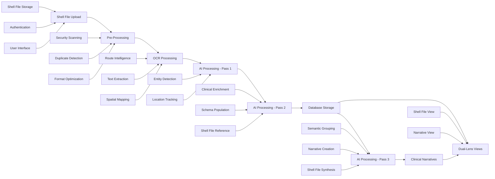

# Exora Medical Document Processing Pipeline: Complete Architecture Overview

## Document Status
- **Created**: 25 August 2025
- **Updated**: 27 August 2025 - Semantic Document Architecture Integration  
- **Purpose**: Master overview of the complete medical document processing pipeline architecture
- **Status**: Architecture complete with semantic document processing and hybrid clinical narratives
- **Component Files**: References detailed component architectures and implementation guides

## Executive Summary

The Exora medical file processing pipeline transforms unstructured medical files into semantically organized clinical narratives through an intelligent **semantic document architecture**. The system solves the critical multi-document problem by creating clinically coherent narratives while maintaining reliable shell file organization, ensuring both clinical safety and user choice.

## Pipeline Architecture Overview (Revised)
Complete Processing Flow:
Component 1: File Upload → Secure shell file ingestion with validation and storage
Component 2: Pre-Processing → Intelligent routing and optimization  
Component 3: OCR Processing → Text extraction with spatial coordinates
Component 4: AI Processing → **Three-pass semantic narrative creation**
  - Pass 1: Entity detection with location data
  - Pass 2: Clinical events population (fully functional system)
  - Pass 3: Semantic narrative creation (complimentary enhancement layer)
Final Output: **Hybrid shell files + clinical narratives** with dual-lens viewing system

## Component Integration Architecture

### Component Dependencies and Data Flow (Semantic Architecture)



## Component Specifications

### 1. File Upload Component
**Reference**: [File Upload Architecture](01-file-upload-architecture.md) - Comprehensive upload system specification

**Primary Functions**:
- Secure medical document ingestion via select / drag-drop interface
- Client-side validation (format, size, security pre-checks)
- Supabase Storage integration with user-specific folders
- Initial database record creation with RLS enforcement
- Progress tracking and error handling

**Key Outputs**:
```typescript
interface UploadHandoff {
  documentId: string;
  rawStoragePath: string;
  uploadMetadata: {
    originalFilename: string;
    mimeType: string;
    fileSize: number;
    uploadTimestamp: Date;
  };
  userContext: {
    userId: string;
    sessionId: string;
  };
}
```


### 2. File Pre-Processing Component
**Reference**: [Pre-Processing Architecture](02-file-preprocessing-architecture.md) - Document optimization and routing

**Primary Functions**:
- Security scanning and malware detection
- SHA-256 duplicate detection for cost optimization
- Intelligent document routing (fast/slow/hybrid paths)
- Format optimization and enhancement
- Multi-version storage (original, enhanced, page extracts)

**Processing Strategy Distribution**:
```typescript
const PROCESSING_PATHS = {
  fastPath: {
    percentage: 95,
    documents: 'Clean PDFs, standard images',
    processingTime: '<500ms',
    costImpact: '$0.0001 per document'
  },
  slowPath: {
    percentage: 3,
    documents: 'HEIC, complex Office docs, corrupted files',
    processingTime: '3-8s',
    costImpact: '$0.002 per document'
  },
  hybridPath: {
    percentage: 2,
    documents: 'Mixed content (text + scanned images)',
    processingTime: '1-3s', 
    costImpact: '$0.0008 per document'
  }
};
```

**Key Outputs**:
```typescript
interface PreProcessingHandoff {
  documentId: string;
  processingPath: 'fast' | 'slow' | 'hybrid';
  optimizedVersions: {
    original: string;
    enhanced?: string;
    pageExtracts?: string[];
  };
  qualityMetrics: QualityMetrics;
  securityClearance: boolean;
  duplicateStatus: DuplicateCheckResult;
}
```

### 3. OCR Processing Component
**Reference**: [OCR Processing Architecture](03-ocr-processing-architecture.md) - Text extraction with spatial coordinates

**Primary Functions**:
- Text + spatial data extraction from pre-processed, OCR-ready documents
- Spatial coordinate capture for click-to-zoom functionality

**Extraction Strategy Matrix**:
```typescript
const OCR_STRATEGIES = {
  directTextExtraction: {
    documents: 'Pre-processed PDFs and Office docs (now clean)',
    cost: '$0.0001 per page',
    accuracy: '99.9%',
    processingTime: '50ms per page'
  },
  googleCloudVision: {
    documents: 'Pre-processed image documents (enhanced quality)',
    cost: '$0.0015 per page', 
    accuracy: '95-98%',
    processingTime: '2-3s per page'
  },
  optimizedProcessing: {
    documents: 'All documents receive pre-processing optimization',
    benefit: 'Higher OCR accuracy due to enhanced image quality',
    cost: 'Minimal additional cost for much better results'
  }
};
```

**Key Outputs**:
```typescript
interface OCRHandoff {
  documentId: string;
  extractedText: string;
  spatialData: BoundingBox[];
  textBlocks: TextBlock[];
  documentStructure: DocumentStructure;
  qualityAssessment: QualityMetrics;
  extractionMetadata: ExtractionMetadata;
}
```

### 4. AI Processing Component (Semantic Architecture)
**Reference**: [Semantic Document Architecture](07-semantic-document-architecture.md), [AI Processing Architecture](04-ai-processing-architecture.md), [Entity Classification Taxonomy](05-entity-classification-taxonomy.md), and [Schema-Driven Processing](06-schema-driven-processing.md) - Complete three-pass semantic architecture

**Primary Functions**:
- **Three-pass AI architecture** with semantic document processing and hybrid clinical narratives
- **Pass 1**: Entity detection with location data and clinical context hints
- **Pass 2**: Clinical events population with shell file references (fully functional system)  
- **Pass 3**: Semantic narrative creation with shell file synthesis (enhancement layer)
- **Hybrid dual-lens system**: Document-centric and story-centric viewing modes
- **Clinical safety**: Prevents dangerous multi-document context mixing
- **System resilience**: Graceful degradation with shell file fallback
- **Russian babushka doll context**: Timeline → Clinical events → Encounters → Narratives → Specialized tables

**✅ Architecture Complete**: Ready for implementation with complete migration execution plan
- **Pass 1**: Entity detection with semantic preparation
- **Pass 2**: Clinical enrichment with dual reference system  
- **Pass 3**: Semantic narrative creator with shell file synthesis
- **Dual-lens views**: Shell file and clinical narrative viewing modes

**Three-Pass Semantic Architecture**:
```typescript
const AI_PROCESSING_ARCHITECTURE = {
  pass1: {
    purpose: 'Entity Detection with Location Data',
    implementation: 'EntityClassifier class with semantic preparation',
    model: 'Lightweight (GPT-4o-mini, Claude Haiku etc)',
    input: 'Shell file + OCR data + 3-category entity taxonomy',
    output: 'Complete entity inventory with page locations and clinical context hints',
    categories: 'clinical_event, healthcare_context, document_structure',
    safetyFeatures: 'Profile validation, age appropriateness, contamination prevention',
    cost: '~$0.0002-0.0005 per document',
    time: '1-2 seconds'
  },
  pass2: {
    purpose: 'Multi-Layered Schema-Based Clinical Enrichment', 
    implementation: 'SchemaLoader class with dynamic schema management',
    model: 'High-performance (Claude Sonnet, GPT-5 etc)',  
    input: 'Full document + Filtered entities by category + dynamically loaded schemas',
    processing: 'clinical_event (full enrichment), healthcare_context (profile matching), document_structure (skip)',
    output: 'Fully enriched clinical data with shell file references (system fully functional)',
    tokenOptimization: 'getOptimalSchemaVersion() with budget management',
    cost: '~$0.003-0.006 per document (75% reduction vs single-pass)',
    time: '3-5 seconds'
  },
  pass3: {
    purpose: 'Semantic Narrative Creation with Shell File Synthesis',
    implementation: 'SemanticNarrativeCreator class with clinical storyline analysis',
    model: 'High-performance (Claude Sonnet, GPT-5 etc) with narrative optimization',
    input: 'Structured clinical events JSON from Pass 2 + shell file metadata',
    processing: 'Semantic grouping → Clinical narratives → Shell file synthesis',
    output: 'Clinical narratives + AI shell file summary (enhancement layer)',
    costOptimization: 'Processes structured JSON vs raw text (major cost savings)',
    gracefulDegradation: 'Optional enhancement - system works without Pass 3',
    cost: '~$0.001-0.003 per document (processes structured data)',
    time: '2-4 seconds'
  }
};
```

**Key Outputs** (Production TypeScript Interfaces):
```typescript
// Pass 1 Output from EntityClassifier
interface Pass1ProcessingResult {
  document_id: string;
  total_entities_detected: number;
  entities_by_category: {
    clinical_event: EntityDetectionResult[];
    healthcare_context: EntityDetectionResult[];
    document_structure: EntityDetectionResult[];
  };
  profile_safety_assessment: {
    identity_verification_confidence: number;
    age_appropriateness_score: number;
    safety_flags: string[];
    requires_manual_review: boolean;
  };
  processing_metadata: ProcessingMetadata;
}

// Schema Loading Results from SchemaLoader
interface SchemaLoadResult {
  schema: AISchema;
  prompt_instructions: string;
  token_estimate: number;
  entity_category: EntityCategory;
  requires_pass2_enrichment: boolean;
  safety_validation_required: boolean;
  profile_classification_needed: boolean;
}

// Pass 3 Semantic Processing Result  
interface Pass3ProcessingResult {
  shell_file_id: string;
  clinical_narratives: {
    narrative_id: string;
    narrative_purpose: string;  // "hypertension_management", "surgical_follow_up"
    ai_narrative_summary: string;
    source_page_ranges: number[]; // Can span non-contiguous pages
    clinical_confidence: number;
  }[];
  shell_file_synthesis: {
    ai_document_summary: string;  // Synthesis of all narratives
    ai_document_purpose: string;  // Overall document purpose
    ai_key_findings: string[];    // Key clinical findings across narratives
    processing_confidence: number;
  };
  dual_lens_references: {
    shell_file_view_ready: boolean;
    narrative_view_ready: boolean;
  };
}

// Complete AI Processing Result (Three-Pass Architecture)
interface AIProcessingResult {
  documentId: string;
  pass1Result: Pass1ProcessingResult;
  schemaLoadResults: SchemaLoadResult[];
  enrichedClinicalData: EnrichedEntity[];  // Pass 2 output
  pass3Result?: Pass3ProcessingResult;     // Optional enhancement layer
  processingAuditTrail: EntityProcessingAudit[];
  qualityMetrics: AIQualityMetrics;
  contextualLayering: {
    masterRecords: ClinicalEvent[];        // patient_clinical_events with shell_file_id references
    detailShells: ObservationDetail[];     // patient_observations, patient_vitals, etc
    contextShells: EncounterContext[];     // healthcare_encounters
    auditShells: ProcessingMetadata[];     // entity_processing_audit
  };
  semanticEnhancement?: {
    clinical_narratives: ClinicalNarrative[];  // Pass 3 narratives if available
    shell_file_summary: ShellFileSummary;      // Synthesized shell file data
  };
}
```

## Entity Processing Architecture

### 3-Category Classification System (Implemented & Validated)

The AI processing component uses a sophisticated 3-category entity classification system that determines processing intensity based on clinical value and compliance requirements. **This system has been fully implemented in TypeScript with working SchemaLoader entity-to-schema mapping.**

```typescript
const ENTITY_PROCESSING_CATEGORIES = {
  clinical_event: {
    definition: 'Medical observations, interventions, diagnoses requiring full analysis',
    examples: ['BP: 140/90 mmHg', 'Lisinopril 10mg daily', 'Hypertension'],
    processing: 'Full Pass 2 enrichment + comprehensive database storage',
    schemas: ['patient_clinical_events', 'patient_observations', 'patient_interventions'],
    timeline_relevance: 'high',
    cost_impact: 'highest_value'
  },
  
  healthcare_context: {
    definition: 'Contextual healthcare information for profile matching and care coordination',
    examples: ['Dr. Sarah Johnson', 'Memorial Hospital', 'Patient: John Smith'],
    processing: 'Limited Pass 2 enrichment + contextual database storage',
    schemas: ['healthcare_encounters', 'patient_demographics'],
    timeline_relevance: 'medium',
    cost_impact: 'medium_value'
  },
  
  document_structure: {
    definition: 'Formatting elements and non-clinical content for completeness',
    examples: ['[Signature]', 'Hospital letterhead', 'Page 1 of 3'],
    processing: 'Skip Pass 2 - logging only in audit trail',
    schemas: [],
    timeline_relevance: 'low',
    cost_impact: 'minimal_cost'
  }
};
```

### Multi-Layered Contextual Approach (Russian Babushka Doll)

Every clinical entity receives multiple layers of context through connected database records:

```typescript
interface ContextualLayering {
  masterShell: {
    table: 'patient_clinical_events',
    purpose: 'Primary clinical event record with O3 two-axis classification',
    connections: ['encounter_id', 'source_document_id']
  },
  
  detailShells: {
    observations: 'patient_observations', // Vital signs, lab results, assessments
    interventions: 'patient_interventions', // Medications, procedures, treatments  
    conditions: 'patient_conditions', // Diagnoses and medical conditions
    vitals: 'patient_vitals' // Detailed vital sign measurements
  },
  
  contextShells: {
    encounters: 'healthcare_encounters', // Visit context, providers, facilities
    timeline: 'healthcare_timeline_events', // Appointment and care coordination
    demographics: 'patient_demographics' // Patient identity and profile data
  },
  
  auditShells: {
    processing: 'entity_processing_audit', // Complete AI processing metadata
    provenance: 'document_provenance', // Source document traceability
    spatial: 'spatial_coordinates' // Click-to-zoom functionality
  }
}
```

## Data Flow Architecture

### Inter-Component Data Handoffs

```typescript
interface PipelineDataFlow {
  // Upload → Pre-Processing
  uploadToPreProcessing: UploadHandoff;
  
  // Pre-Processing → OCR
  preProcessingToOCR: PreProcessingHandoff;
  
  // OCR → AI Processing
  ocrToAI: OCRHandoff;
  
  // AI Processing → Database
  aiToDatabase: DatabaseInsertionPackage;
}
```

### Error Propagation and Recovery

```typescript
interface PipelineErrorHandling {
  componentFailures: {
    upload: UploadErrorRecovery;
    preprocessing: PreProcessingErrorRecovery;
    ocr: OCRErrorRecovery;
    ai: AIErrorRecovery;
  };
  
  crossComponentRecovery: {
    retryStrategies: RetryStrategy[];
    fallbackPaths: FallbackPath[];
    manualReviewTriggers: ReviewTrigger[];
  };
}
```

## Performance Architecture

### Cost Optimization Summary

```typescript
const COST_OPTIMIZATION = {
  traditionalApproach: {
    averageCost: '$0.25 per document',
    processing: 'OCR + expensive AI for everything'
  },
  
  ExoraPipeline: {
    averageCost: '$0.0035-0.0065 per document',
    costReduction: '85-90%',
    optimization: {
      duplicateDetection: '100% processing cost savings for duplicates',
      intelligentRouting: '95% fast path reduces OCR costs',
      twoPassAI: '70% AI cost reduction vs single comprehensive call'
    }
  }
};
```

### Processing Time Distribution

```typescript
const PERFORMANCE_TARGETS = {
  totalProcessingTime: {
    fastPath: '5-8 seconds end-to-end',
    slowPath: '15-25 seconds end-to-end',
    hybridPath: '8-15 seconds end-to-end'
  },
  
  componentBreakdown: {
    upload: '1-3 seconds',
    preprocessing: '0.5-8 seconds (path dependent)',
    ocr: '0.05-0.1 seconds',
    aiProcessing: '4-7 seconds (two passes)'
  }
};
```

## Quality Assurance Framework

### Cross-Component Quality Gates

```typescript
const QUALITY_GATES = {
  upload: {
    fileValidation: 'Format and security compliance',
    storageIntegrity: 'Successful storage with RLS'
  },
  
  preprocessing: {
    securityClearance: 'No malware or threats detected',
    optimizationSuccess: 'Enhancement improves downstream accuracy',
    pathAccuracy: '>95% correct routing decisions'
  },
  
  ocr: {
    textExtraction: '>96% character accuracy',
    spatialPrecision: '<2% coordinate error',
    medicalContentAccuracy: '>95% for dosages and measurements'
  },
  
  aiProcessing: {
    entityCompleteness: '100% of document content identified',
    schemaAccuracy: '>95% correct schema assignment', 
    clinicalValidation: '>90% medical concept accuracy'
  }
};
```

### End-to-End Validation

```typescript
interface PipelineValidation {
  dataIntegrity: 'No information loss between components';
  spatialConsistency: 'Click-to-zoom coordinates remain accurate';
  clinicalAccuracy: 'Medical data maintains context and meaning';
  profileSafety: 'Zero risk of profile contamination';
  auditTrailCompleteness: 'Full processing provenance maintained';
}
```

## Monitoring and Analytics

### Pipeline Health Metrics

```typescript
interface PipelineHealthDashboard {
  overallMetrics: {
    successRate: number;           // Target: >99.5%
    averageProcessingTime: number; // Target: <15s
    costPerDocument: number;       // Target: <$0.007
    errorRate: number;             // Target: <0.5%
  };
  
  componentHealth: {
    upload: ComponentHealthMetrics;
    preprocessing: ComponentHealthMetrics;
    ocr: ComponentHealthMetrics;
    aiProcessing: ComponentHealthMetrics;
  };
  
  businessMetrics: {
    documentsProcessedToday: number;
    costSavingsVsTraditional: number;
    manualReviewRate: number;
    userSatisfactionScore: number;
  };
}
```

### Real-Time Monitoring

```typescript
interface RealTimeMonitoring {
  activeProcessingSessions: ProcessingSession[];
  componentLoadBalancing: LoadBalancingMetrics;
  errorRateAlerts: AlertConfiguration[];
  performanceDegradationDetection: PerformanceAlert[];
  costBudgetTracking: CostTrackingMetrics;
}
```

## Security and Compliance

### Healthcare Data Protection

```typescript
interface HealthcareCompliance {
  dataEncryption: {
    inTransit: 'HTTPS/TLS 1.3 for all communications';
    atRest: 'AES-256 for storage encryption';
    processing: 'Memory encryption during processing';
  };
  
  accessControl: {
    userIsolation: 'RLS enforcement across all components';
    auditLogging: 'Complete processing trail';
    profileSeparation: 'Zero cross-profile data contamination';
  };
  
  regulatoryCompliance: {
    hipaaReadiness: 'BAA-compliant infrastructure';
    privacyAct: 'Australian Privacy Act 1988 compliance';
    dataRetention: 'Configurable retention policies';
  };
}
```

## Implementation Status & Roadmap

### ✅ V3 Infrastructure Complete: Production Deployment Operational
**Status**: Infrastructure fully deployed - AI processing logic integration required
- **V3 Database**: 50+ tables deployed with job coordination system
- **Render.com Worker**: `exora-v3-worker` operational with job polling and heartbeat
- **Edge Functions**: `shell-file-processor-v3` and `audit-logger-v3` deployed
- **Job Pipeline**: Upload → Storage → Job Queue → Worker claiming operational
- **API Rate Limiting**: Backpressure system with OpenAI/Google Vision integration ready
- **Security**: Service role isolation and healthcare compliance audit logging

**Critical Gap**: Worker operational but AI processing logic missing from `processShellFile()` method

### 🚨 URGENT: AI Processing Implementation Required
**Immediate Tasks (Infrastructure Ready)**:
- Implement OpenAI API integration in operational worker (`current_workers/exora-v3-worker/src/worker.ts`)
- Add Google Cloud Vision OCR for text extraction with spatial coordinates
- Implement clinical data extraction to deployed V3 database tables
- Connect three-pass processing logic to existing job coordination system
- Replace simulation code with real AI processing in `processShellFile()` method

**Worker Status**: Operational and processing jobs successfully, but using simulation-only code

### Phase 1: AI Model Integration (Remaining)
- **Components**: OpenAI API integration, Google Vision OCR, clinical data extraction
- **Infrastructure**: Already deployed and operational - worker claiming jobs successfully
- **Timeline**: 1-2 weeks (infrastructure complete, need AI logic implementation)
- **Success Criteria**: Real document processing with clinical data writes to V3 tables
- **File Location**: `current_workers/exora-v3-worker/src/worker.ts:204-238` (processShellFile method)

### Phase 2: Intelligence and Optimization  
- **Components**: Enhanced routing, hybrid processing, production monitoring
- **Features**: Advanced quality gates, performance monitoring, cost optimization tracking
- **Timeline**: 6-8 weeks after Phase 1
- **Success Criteria**: 85%+ cost reduction, >99% success rate

### Phase 3: Advanced Features and Scale
- **Components**: Machine learning optimization, advanced analytics
- **Features**: Predictive routing, auto-tuning, enterprise features
- **Timeline**: 8-10 weeks after Phase 2  
- **Success Criteria**: Production-ready at healthcare scale

## Success Criteria

### Technical Performance
- **End-to-end success rate**: >99.5%
- **Average processing time**: <15 seconds per document
- **Cost per document**: <$0.007 average
- **Clinical data accuracy**: >95% for structured medical data

### Business Impact
- **Cost reduction**: 85-90% vs traditional document processing
- **User experience**: Intuitive upload with real-time progress
- **Healthcare compliance**: Full HIPAA and Privacy Act readiness
- **Scalability**: Support 10,000+ documents per day per instance

### Quality Assurance
- **Zero profile contamination**: Perfect user data isolation
- **Complete audit trail**: Full processing provenance
- **Medical accuracy**: >95% accuracy for clinical concepts
- **Spatial precision**: <2% error for click-to-zoom coordinates

---

## Component File Status Summary

### Architectural Specifications
- **[01-file-upload-architecture.md](01-file-upload-architecture.md)**: Complete upload system specification
- **[02-file-preprocessing-architecture.md](02-file-preprocessing-architecture.md)**: Document optimization and routing
- **[03-ocr-processing-architecture.md](03-ocr-processing-architecture.md)**: Text extraction with spatial coordinates

### AI Processing Implementation (Week 2 Complete)
- **[04-ai-processing-architecture.md](04-ai-processing-architecture.md)**: Two-pass AI architecture specification
- **[05-entity-classification-taxonomy.md](05-entity-classification-taxonomy.md)**: 3-category entity classification system
- **[06-schema-driven-processing.md](06-schema-driven-processing.md)**: ✅ **Implementation guide with working TypeScript components**

### Implementation Artifacts (Production-Ready Code)
- **SchemaLoader TypeScript Class**: Dynamic schema management with V2 safety integration
- **EntityClassifier TypeScript Class**: Pass 1 entity detection with profile safety assessment
- **Integration Workflow Examples**: Complete V3 + V2 processing pipeline demonstrations
- **Production Deployment Patterns**: Environment-specific adaptations for Edge Functions, Node.js, and web clients

---

*This pipeline overview provides the master architectural blueprint for Exora's medical document processing system, with **Week 2 implementation validation** demonstrating successful operationalization of the V3 + V2 architecture through production-ready TypeScript components. The system is designed to transform unstructured medical documents into structured, coded clinical data while maintaining healthcare-grade accuracy, security, and compliance standards.*