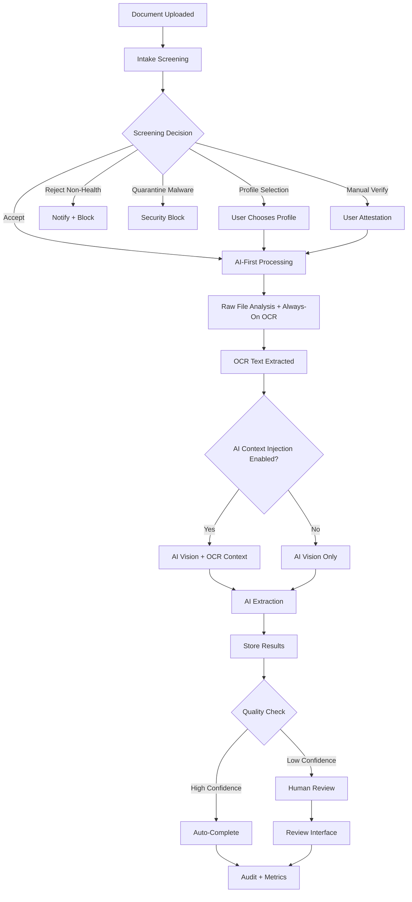

# AI Processing Architecture

**Purpose:** AI-first multimodal document processing with intelligent intake screening  
**Status:** Core infrastructure ready, preparing for production implementation  
**Last updated:** August 18, 2025

---

## 🎯 **Architecture Overview**

Guardian's AI processing system uses an **AI-first multimodal approach** where AI models process raw documents directly, with optional OCR as an adjunct input. The system includes intelligent upfront screening for identity verification and content classification before expensive processing.

```
Upload → Intake Screening → AI-First Processing → Structured Data → Guardian Database
           ↓                    ↗                                              
       Reject/             OCR (Optional Adjunct)                        
       Select Profile                                                       
```

---

## 🔧 **Processing Components**

### **[Intake Screening](./intake-screening/)** *NEW*
*Intelligent upfront validation before expensive processing*

**Status:** In Design  
**Purpose:** Identity verification, profile matching, and content classification  
**Features:**
- **Identity Verification**: Match documents to user profiles or children
- **Content Classification**: Health vs non-health content filtering
- **Malware Scanning**: Security screening before storage
- **Profile Disambiguation**: Smart suggestions for multi-profile accounts
- **Cost Savings**: Block non-relevant processing early

### **[AI Extraction](./ai-extraction/)**
*AI-first multimodal processing of raw documents*

**Status:** Framework Ready  
**Architecture:** AI-first multimodal with optional OCR adjunct  
**Primary Providers:**
- **GPT-4o Mini**: Cost-effective vision + text analysis ($15-30/1K docs)
- **Azure OpenAI**: HIPAA-eligible processing with BAA
- **Google Document AI**: Specialized medical document understanding
**Features:**
- Direct raw file processing (images, PDFs)
- Optional OCR context integration via feature flags
- Provider routing and A/B testing framework
- Independent output storage (AI + OCR results)

### **[OCR Integration](./ocr-integration/)**
*Always-on text extraction with optional AI injection*

**Status:** TBC 
**Role:** **Always-on extraction** with optional AI context injection  
**Primary Provider:** Google Cloud Vision API  
**Features:**
- Always extract OCR text from all documents (cheap operation)
- Optional injection into AI processing (A/B testable)
- Multiple use cases: intake screening, search, validation, fallback
- Independent storage for all extracted text

### **[Processing Pipeline](./processing-pipeline/)**
*PostgreSQL queue-based processing with Render workers*

**Status:** Infrastructure Ready  
**Architecture:** Queue polling workers on Render.com  
**Features:**
- PostgreSQL-based job queue with RPC functions
- Stateless Node.js workers with horizontal scaling
- Retry logic and dead letter handling
- Comprehensive observability and cost tracking

---

## **Architecture Principles**

### **1. AI-First Multimodal Processing**
- **Primary**: AI models process raw images/PDFs directly
- **Always-On OCR**: Extract text from all documents for multiple use cases
- **Optional AI Injection**: OCR context optionally provided to AI (A/B testable)
- **Independent Storage**: Both AI and OCR outputs preserved separately
- **Provider Flexibility**: Multi-provider framework with routing and A/B testing

### **2. Intelligent Intake Screening**
- **Identity Verification**: Ensure documents belong to correct user/profile
- **Content Classification**: Filter health vs non-health content early using OCR + cheap classifiers
- **Cost Protection**: Block expensive processing for invalid content
- **Security First**: Malware scanning and quarantine before processing

### **3. Healthcare-Grade Security & Compliance**
- **HIPAA-Ready**: Azure OpenAI with BAA for PHI processing
- **Audit Trails**: Complete provenance tracking for all decisions
- **RLS Enforcement**: User-specific data isolation throughout pipeline
- **PHI Protection**: No PHI in logs, redacted observability

### **4. Cost-Optimized Processing**
- **Feature Flags**: Enable/disable components (OCR, AI context fusion)
- **Provider Routing**: Cost-based selection (tbc)
- **Early Rejection**: Intake screening prevents expensive processing
- **Observability**: Real-time cost tracking and budget controls

---

## **Processing Workflow**



---

## 📊 **Current Implementation Status**

| Component | Status | Key Features | Target Performance |
|-----------|--------|--------------|-------------------|
| **Intake Screening**      | Design Phase       | Identity matching, content classification | <500ms per upload |
| **AI-First Processing**   | Framework Ready    | GPT-4o Mini multimodal, Azure OpenAI | <2min end-to-end |
| **Always-On OCR**         | Operational        | Google Cloud Vision, always extract text | <2s per document |
| **Processing Pipeline**   | Infrastructure Ready | PostgreSQL queue, Render workers | 1000+ docs/hour |
| **Quality Assurance**     | Design Phase       | Confidence scoring, human review | 95%+ auto-approval |

---

## **Technical Implementation**

### **Architecture Stack**
- **Intake Screening:** OCR text + lightweight AI models for identity/content classification
- **Core Workers:** Node.js TypeScript workers on Render.com
- **AI Processing:** Multi-provider (GPT-4o Mini primary, Azure OpenAI HIPAA)
- **Always-On OCR:** Google Cloud Vision API extracts text from all documents
- **Queue System:** PostgreSQL job queue with RPC functions
- **Storage:** Independent AI/OCR results with audit trails
- **Observability:** Structured logging with PHI redaction

### **AI Extraction Prompt Engineering**
```
Extract medical information from this document text:

REQUIRED EXTRACTIONS:
- Medications (name, dosage, frequency, dates, prescribing doctor)
- Allergies (substance, reaction type, severity, onset date)
- Medical conditions (diagnosis, dates, ICD codes if present, status)
- Procedures (name, date, outcome, performing provider)
- Test results (test name, values, dates, reference ranges, abnormal flags)

OUTPUT FORMAT:
For each extracted item, provide:
1. Exact text from source document (verbatim quote)
2. Justification for medical relevance (why this is clinically significant)
3. Confidence score (0-100, based on text clarity and medical context)
4. Suggested metadata tags (medication, allergy, condition, procedure, test_result)
5. Temporal classification (current, historical, planned, discontinued)

QUALITY REQUIREMENTS:
- Confidence >95% for auto-approval
- Confidence <95% flagged for human review
- 100% source traceability to original document
- No hallucination - only extract information explicitly present
```

---

## **Performance Metrics**

### **OCR Processing**
- **Accuracy:** Target >99.8% (measured against manual transcription)
- **Processing Speed:** Target <5 seconds per document
- **Format Coverage:** Target 100% of common medical document formats
- **Error Rate:** Target <0.2% requiring manual intervention

### **AI Extraction**
- **Medical Data Accuracy:** Target >99% (critical for patient safety)
- **Dosage Accuracy:** Target >99.5% (medication safety critical)
- **False Positive Rate:** Target <1% (avoid extracting non-medical data)
- **False Negative Rate:** Target <2% (avoid missing critical information)

### **Processing Pipeline**
- **Throughput:** 1000+ documents per hour
- **Availability:** 99.9% uptime for processing services
- **Queue Processing:** <30 seconds average queue time
- **Error Recovery:** 100% of failed jobs retried appropriately

---

## **Quality Assurance Framework**

### **Automated Validation**
- Medical terminology consistency checking
- Dosage and numerical value validation
- Date consistency and temporal logic verification
- Cross-reference validation against known medical databases

### **Human Review Triggers**
- Confidence score <95% on any extraction
- Conflicting information detected
- Unusual or rare medical conditions identified
- Medication dosages outside normal ranges

### **Continuous Improvement**
- A/B testing of different AI providers and prompts
- User feedback integration for extraction quality
- Regular model performance evaluation
- Cost optimization based on accuracy/cost ratios

---

## **Future Roadmap**

### **Phase 2+ Enhanced Quality Assurance**
- Advanced validation rules and medical consistency checking
- Improved human review interface and workflow
- Real-time quality metrics and monitoring
- Custom fine-tuned models
- Predictive analysis and health insights generation

---

## **Getting Started**

### **For Developers**
1. Review [OCR integration](./ocr-integration/) implementation
2. Study the [AI extraction](./ai-extraction/) multi-provider framework
3. Understand the [processing pipeline](./processing-pipeline/) architecture


---

*For detailed implementation guides and technical specifications, see the component documentation in each subdirectory.*