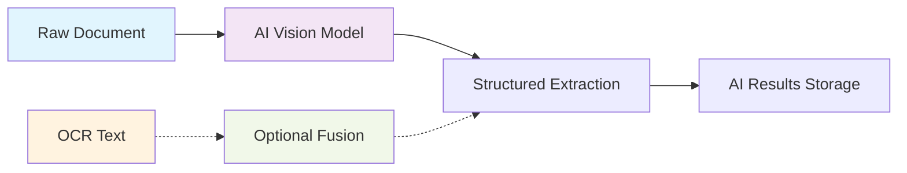

# AI-First Multimodal Extraction

**Status:** Framework Ready - Preparing for implementation  
**Architecture:** AI-first multimodal with optional OCR adjunct  
**Last updated:** August 18, 2025

---

## **Overview**

Guardian's AI extraction system uses an **AI-first multimodal approach** where AI models process raw documents (images, PDFs) directly, with optional OCR text as adjunct context. This approach provides superior accuracy for medical document understanding while maintaining cost efficiency.

## **AI-First Architecture**

### **Primary Processing Path**


### **Core Principles**
1. **AI Vision Primary**: Models process raw visual content directly
2. **OCR as Adjunct**: Optional text context (can be disabled via feature flags)
3. **Independent Storage**: Both AI and OCR outputs preserved separately
4. **Provider Flexibility**: Multi-provider routing with cost optimization and A/B testing an inherent component

---

## **Multi-Provider Framework**

### **Primary Providers**
| Provider | Use Case | Cost | HIPAA Status |
|----------|----------|------|--------------|
| **GPT-4o Mini**         | Primary multimodal | $15-30/1K docs | ⚠️ Standard OpenAI |
| **Azure OpenAI**        | HIPAA-compliant PHI | $20-35/1K docs | ✅ BAA Available |
| **Google Document AI**  | Medical document specialization | $25-40/1K docs | ✅ BAA Available |
| **Claude 3.5 Sonnet**   | Premium accuracy | $50-80/1K docs | ⚠️ No BAA yet |

### **Provider Selection Logic**
```typescript
interface ProviderRouting {
  // Default routing rules
  primary: 'gpt4o-mini';           // Cost-effective primary
  hipaaRequired: 'azure-openai';   // For PHI processing
  highAccuracy: 'document-ai';     // Complex medical forms
  fallback: 'gpt4o-mini';         // When others fail
  
  // Cost controls
  maxCostPerDoc: number;           // Hard limit in cents
  budgetThreshold: number;         // Switch to cheaper when exceeded
  
  // Quality routing
  confidenceThreshold: number;     // Switch to premium if low confidence
  retryWithPremium: boolean;       // Retry failed extractions
}
```

---

## **Multimodal Processing Features**

### **Vision Understanding**
- **Layout Analysis**: Understand document structure and formatting
- **Handwriting Recognition**: Process handwritten prescriptions and notes
- **Medical Form Recognition**: Specialized understanding of medical form layouts
- **Image Quality Assessment**: Detect poor quality scans requiring enhancement

### **Medical Context Awareness**
- **Terminology Recognition**: Medical terms, drug names, procedures
- **Dosage Understanding**: Complex medication instructions and timing
- **Temporal Relationships**: Timeline of treatments and conditions
- **Clinical Significance**: Prioritize critical vs. routine information

### **OCR Adjunct Integration**
```typescript
interface OcrAdjunctConfig {
  enabled: boolean;                    // Global OCR toggle
  useForContext: boolean;             // Provide OCR text to AI
  useForValidation: boolean;          // Cross-validate AI extractions
  costThreshold: number;              // Disable if OCR cost too high
  qualityThreshold: number;           // Disable if OCR quality poor
}
```

---

## **Feature Flag System**

### **Core Processing Flags**
```typescript
interface AiExtractionFlags {
  // Core AI processing
  enableAiProcessing: boolean;         // Default: true
  enableMultimodalVision: boolean;     // Default: true
  enableOcrAdjunct: boolean;          // Default: true
  enableOcrContextFusion: boolean;     // Default: true
  
  // Provider selection
  primaryProvider: ProviderId;         // Default: 'gpt4o-mini'
  enableProviderFallback: boolean;     // Default: true
  enableCostOptimization: boolean;     // Default: true
  enableQualityRouting: boolean;       // Default: true
  
  // HIPAA compliance
  requireHipaaProvider: boolean;       // Default: false
  enablePhiRedaction: boolean;         // Default: true
  enableAuditLogging: boolean;         // Default: true
}
```

### **A/B Testing Framework**
- **Cohort Assignment**: Deterministic user-based splitting
- **Provider Comparison**: Side-by-side quality metrics
- **Cost Analysis**: Real-time cost per accuracy measurement
- **Rollback Capability**: Instant revert to known-good configuration

---

## **Extraction Capabilities**

### **Medical Information Types**
```typescript
interface MedicalExtraction {
  medications: {
    name: string;
    dosage: string;
    frequency: string;
    duration?: string;
    prescriber?: string;
    startDate?: string;
    endDate?: string;
    instructions?: string;
    confidence: number;
  }[];
  
  conditions: {
    diagnosis: string;
    icdCode?: string;
    severity?: string;
    status: 'active' | 'resolved' | 'chronic' | 'suspected';
    diagnosisDate?: string;
    diagnosedBy?: string;
    confidence: number;
  }[];
  
  procedures: {
    name: string;
    date?: string;
    provider?: string;
    location?: string;
    outcome?: string;
    complications?: string;
    confidence: number;
  }[];
  
  labResults: {
    testName: string;
    value: string;
    unit?: string;
    referenceRange?: string;
    abnormalFlag?: boolean;
    testDate?: string;
    orderingProvider?: string;
    confidence: number;
  }[];
  
  allergies: {
    allergen: string;
    reaction: string;
    severity?: 'mild' | 'moderate' | 'severe';
    onsetDate?: string;
    confidence: number;
  }[];
  
  vitals: {
    type: 'blood_pressure' | 'heart_rate' | 'temperature' | 'weight' | 'height';
    value: string;
    unit: string;
    measuredDate?: string;
    confidence: number;
  }[];
}
```

### **Quality Assurance**
```typescript
interface ExtractionQuality {
  overallConfidence: number;           // 0-1 aggregate confidence
  sourceAttribution: {                // Traceability to source
    pageNumber?: number;
    textRegion?: string;
    imageCoordinates?: { x: number; y: number; width: number; height: number };
  };
  validationFlags: {
    dosageReasonable: boolean;         // Medication dosages within normal ranges
    datesConsistent: boolean;          // Temporal logic makes sense
    terminologyValid: boolean;         // Medical terms properly recognized
    duplicatesDetected: boolean;       // Same information extracted multiple times
  };
  reviewRecommendation: 'auto_approve' | 'human_review' | 'specialist_review';
}
```

---

## 💡 **Prompt Engineering Strategy**

### **Multimodal Prompt Template**
```typescript
const MEDICAL_EXTRACTION_PROMPT = `
You are a medical AI assistant analyzing healthcare documents. Extract structured medical information with high accuracy and confidence scoring.

DOCUMENT TYPE: {documentType}
PROCESSING MODE: AI Vision + {ocrContext ? 'OCR Context' : 'Vision Only'}

EXTRACTION REQUIREMENTS:
1. Extract ONLY information explicitly present in the document
2. Provide confidence scores (0-100) for each extracted item
3. Include source attribution (page numbers, sections)
4. Flag any uncertain or unclear information
5. Preserve original terminology and formatting when possible

MEDICAL CATEGORIES TO EXTRACT:
- Medications (name, dosage, frequency, prescriber, dates)
- Medical conditions (diagnosis, ICD codes, status, dates)
- Procedures (name, date, provider, outcome)
- Lab results (test name, values, ranges, dates, abnormal flags)
- Allergies (allergen, reaction type, severity)
- Vital signs (type, value, unit, date)

QUALITY REQUIREMENTS:
- Confidence >95%: Auto-approve
- Confidence 80-95%: Flag for review
- Confidence <80%: Require human validation
- Always provide reasoning for confidence scores

OUTPUT FORMAT: JSON with strict schema validation

{ocrContext ? 'OCR TEXT CONTEXT:\n' + ocrText + '\n' : ''}

Now analyze the document image and extract medical information:
`;
```

### **Provider-Specific Adaptations**
- **GPT-4o Mini**: Optimized for speed and cost efficiency
- **Azure OpenAI**: Enhanced with HIPAA-compliant processing instructions
- **Google Document AI**: Leverages specialized medical document understanding
- **Claude Sonnet**: Complex reasoning for ambiguous medical content

---

## 📊 **Performance Targets**

### **Quality Metrics**
- **Medical Data Accuracy**: >99% (critical for patient safety)
- **Dosage Accuracy**: >99.5% (medication safety critical)  
- **False Positive Rate**: <1% (avoid extracting non-medical data)
- **False Negative Rate**: <2% (avoid missing critical information)
- **Auto-Approval Rate**: >95% (high-confidence extractions)

### **Performance Benchmarks**
- **Processing Latency**: <90 seconds end-to-end per document
- **Multimodal Analysis**: <60 seconds for vision processing
- **OCR Adjunct**: <5 seconds additional when enabled
- **Provider Failover**: <30 seconds automatic retry

### **Cost Efficiency**
- **Primary Path**: $15-30 per 1,000 documents (GPT-4o Mini)
- **HIPAA Path**: $20-35 per 1,000 documents (Azure OpenAI)
- **Premium Path**: $25-40 per 1,000 documents (Document AI)
- **Total Pipeline**: <$35 per 1,000 documents including OCR adjunct

---

## 🔒 **Security & Compliance**

### **HIPAA Compliance**
- **BAA Providers**: Azure OpenAI, Google Document AI prioritized for PHI
- **Data Minimization**: Extract only clinically necessary information
- **Audit Logging**: Complete provenance tracking via audit events
- **PHI Redaction**: Automatic removal of PHI from logs and debug data

### **Data Protection**
```typescript
interface SecurityControls {
  phiHandling: {
    enableRedaction: boolean;          // Remove PHI from logs
    requireHipaaProvider: boolean;     // Force BAA providers for PHI
    enableFieldEncryption: boolean;    // Encrypt sensitive fields
    auditAllAccess: boolean;          // Log all data access
  };
  
  qualityControl: {
    enableSourceValidation: boolean;   // Verify extraction sources
    enableConfidenceScoring: boolean;  // Require confidence metrics
    enableHumanReview: boolean;       // Trigger review for low confidence
    enableSpecialistReview: boolean;   // Escalate complex cases
  };
}
```

---

## **Implementation Roadmap**

### **Phase 2A: Core AI Pipeline (Week 2.1-2.2)**
- Implement GPT-4o Mini multimodal processing
- Build provider adapter framework
- Integrate with existing job queue system
- Basic feature flag implementation

### **Phase 2B: Advanced Features (Week 2.3-2.4)**
- Azure OpenAI HIPAA integration
- OCR adjunct fusion logic
- Quality scoring and validation
- A/B testing framework

### **Phase 3: Optimization (Week 3)**
- Cost optimization and provider routing
- Performance tuning and caching
- Advanced quality assurance
- Production monitoring integration

---

## **Monitoring & Analytics**

### **Real-time Metrics**
- Provider latency and availability
- Extraction confidence distributions
- Cost per document by provider
- Auto-approval vs. human review rates

### **Quality Dashboards**
- Medical accuracy trending
- Provider performance comparison
- User feedback and correction tracking
- Cost efficiency analysis

---

*For detailed implementation specifications, see [Phase 2: AI-First Pipeline](../implementation/phase-2-ai-pipeline.md)*