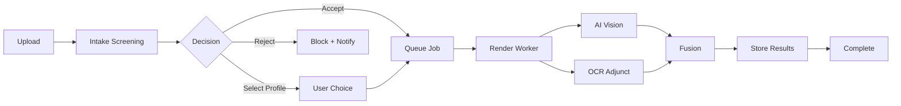

# AI Processing Implementation Roadmap

**Purpose:** Strategic implementation planning for AI-first multimodal processing pipeline  
**Status:** 🚧 Design Phase - Ready for development planning  
**Last updated:** August 18, 2025

---

## 🎯 **Executive Summary**

Guardian's AI processing pipeline implementation follows a **4-phase approach** over 4 weeks, building an AI-first multimodal system with intelligent intake screening, cost optimization, and healthcare-grade security.

### **Core Objectives**
1. **AI-First Architecture**: Process raw documents directly with AI vision models
2. **Intake Screening**: Identity verification and content classification before expensive processing  
3. **Cost Optimization**: 85%+ cost reduction through smart provider routing and early rejection
4. **HIPAA Compliance**: Healthcare-grade security with audit trails and PHI protection

---

## 📋 **Implementation Phases**

| Phase | Duration | Focus | Key Deliverables |
|-------|----------|-------|------------------|
| **[Phase 1](./phase-1-intake-screening.md)** | Week 1 | Intake Screening | Identity verification, content classification, malware scanning |
| **[Phase 2](./phase-2-ai-pipeline.md)** | Week 2 | AI-First Pipeline | Multimodal processing, OCR adjunct, provider routing |
| **[Phase 3](./phase-3-optimization.md)** | Week 3 | Cost & Performance | Feature flags, A/B testing, optimization framework |
| **[Phase 4](./phase-4-production.md)** | Week 4 | Production Ready | Monitoring, compliance review, hardening |

---

## 🏗️ **Architecture Overview**

### **Technology Stack**
- **Workers**: Node.js TypeScript on Render.com
- **Queue**: PostgreSQL RPC functions with job polling  
- **AI Primary**: GPT-4o Mini multimodal (~$15-30/1K docs)
- **AI HIPAA**: Azure OpenAI with BAA for PHI processing
- **OCR Adjunct**: Google Cloud Vision (~$1.50/1K docs)
- **Screening**: Lightweight Edge Functions with cheap models

### **Data Flow Architecture**


---

## 📊 **Database Schema Strategy**

### **Core Tables**
- **`intake_screening`**: Upfront validation decisions and metadata
- **`document_ai_results`**: AI processing outputs with provenance
- **`document_pages`**: OCR text extraction (when enabled)
- **`document_entities`**: Normalized medical entities for queries
- **`job_queue`**: Background processing queue with retry logic

### **Feature Flag Schema**  
- **`processing_config`**: Global and per-user processing preferences
- **`provider_routing`**: Cost-based AI provider selection rules
- **`quality_thresholds`**: Confidence scoring and review triggers

*See [Data Models Documentation](./data-models.md) for complete schema specifications.*

---

## 🎛️ **Feature Flag Strategy**

### **Global Toggles**
```typescript
interface ProcessingConfig {
  // Core components
  enableIntakeScreening: boolean;      // Default: true
  enableAiProcessing: boolean;         // Default: true
  enableOcrAdjunct: boolean;          // Default: true
  enableAiOcrFusion: boolean;         // Default: true
  
  // Provider routing
  primaryAiProvider: 'gpt4o-mini' | 'azure-openai' | 'document-ai';
  enableProviderFallback: boolean;    // Default: true
  enableCostOptimization: boolean;    // Default: true
  
  // Quality controls
  enableHumanReview: boolean;         // Default: true
  autoApprovalThreshold: number;      // Default: 0.95
  enableQualityTracking: boolean;     // Default: true
}
```

### **A/B Testing Framework**
- **Cohort Assignment**: Deterministic user ID hashing for consistent experience
- **Metric Tracking**: Quality, cost, and latency comparisons
- **Rollback Capability**: Instant disable of problematic configurations

---

## 💰 **Cost Optimization Strategy**

### **Target Cost Structure**
- **Intake Screening**: <$0.05 per upload (cheap models only)
- **AI Processing**: $15-30 per 1,000 documents (85% reduction from AWS Textract)
- **OCR Adjunct**: $1.50 per 1,000 documents (when enabled)
- **Total Pipeline**: <$32 per 1,000 documents all-inclusive

### **Cost Control Mechanisms**
1. **Early Rejection**: Block non-health content before expensive processing
2. **Provider Routing**: Cheap models for simple docs, premium for complex
3. **OCR Toggle**: Disable OCR when AI-only performs better
4. **Budget Limits**: Hard caps on per-document and daily spending

---

## 🔒 **Security & Compliance Framework**

### **HIPAA Requirements**
- **BAA Coverage**: Azure OpenAI with signed Business Associate Agreement
- **PHI Protection**: No PHI in logs, structured data redaction
- **Access Controls**: RLS policies enforce user data isolation
- **Audit Trails**: Complete provenance tracking via `log_audit_event`

### **Australian Privacy Act Compliance**
- **Data Minimization**: Store only necessary extracted information
- **Consent Management**: User control over AI processing preferences  
- **Breach Response**: Automated alerting and incident response procedures
- **Data Retention**: Configurable retention policies for processed data

*See [Security & Compliance Documentation](./security-compliance.md) for detailed requirements.*

---

## 📈 **Performance Targets**

### **Latency Benchmarks**
- **Intake Screening**: <500ms per upload
- **AI Processing**: <2 minutes end-to-end (single page)
- **OCR Adjunct**: <5 seconds per document
- **Queue Processing**: <30 seconds average queue time

### **Quality Metrics**
- **Medical Data Accuracy**: >99% (critical for patient safety)
- **Identity Matching**: >98% correct profile assignment
- **False Positive Rate**: <1% (health docs incorrectly rejected)
- **Auto-Approval Rate**: >95% (high-confidence extractions)

### **Scalability Targets**
- **Throughput**: 1,000+ documents per hour
- **Availability**: 99.9% uptime for processing services
- **Error Recovery**: 100% of failed jobs retried appropriately
- **Cost Efficiency**: <$0.05 per document for successful processing

---

## 🧪 **Testing Strategy**

### **Unit Testing**
- Provider adapters (AI, OCR, screening models)
- Data normalization and entity extraction logic
- Queue management and retry mechanisms
- Feature flag and configuration systems

### **Integration Testing**
- End-to-end document upload → completion workflows
- Provider failover and cost optimization logic
- Database schema and RLS policy enforcement
- Audit logging and compliance reporting

### **Quality Assurance**
- **Golden Dataset**: Curated set of real medical documents
- **Regression Testing**: Weekly comparison of extraction quality
- **Performance Testing**: Load testing with synthetic documents
- **Security Testing**: PHI leakage and access control validation

*See [Testing Strategy Documentation](./testing-strategy.md) for detailed test plans and procedures.*

---

## 🚀 **Deployment Strategy**

### **Environment Progression**
1. **Development**: Local testing with mock providers and sample data
2. **Staging**: Full provider integration with synthetic test documents  
3. **Production**: Gradual rollout with feature flags and monitoring

### **Rollout Plan**
- **Week 1**: Deploy intake screening to staging
- **Week 2**: Deploy AI pipeline workers to staging  
- **Week 3**: Production deployment with 10% traffic
- **Week 4**: Full production rollout with monitoring

### **Rollback Procedures**
- **Feature Flags**: Instant disable of problematic components
- **Provider Switching**: Fallback to previous working providers
- **Queue Pausing**: Stop processing while maintaining user experience
- **Database Rollback**: Schema migration rollback procedures

---

## 📊 **Success Criteria**

### **Technical Acceptance**
- ✅ All Phase 1-4 deliverables completed successfully
- ✅ Performance targets met in production environment
- ✅ Security audit passed with no critical findings
- ✅ Cost targets achieved (<$32/1K documents)

### **Business Acceptance**  
- ✅ >95% of health documents processed successfully
- ✅ <2% user manual intervention required
- ✅ Zero PHI leakage incidents detected
- ✅ Cost savings >80% vs. previous AWS Textract pipeline

### **Quality Assurance**
- ✅ Medical data accuracy >99% on golden dataset
- ✅ Identity matching >98% correct profile assignment
- ✅ Comprehensive audit trails for all processing decisions
- ✅ HIPAA compliance verified by external audit

---

## 🔄 **Maintenance & Operations**

### **Monitoring & Alerting**
- **Queue Depth**: Alert on processing delays >5 minutes
- **Error Rates**: Alert on >1% processing failures
- **Cost Spikes**: Alert on daily spend >110% of budget
- **Security Events**: Immediate alert on potential PHI exposure

### **Continuous Improvement**
- **Weekly Quality Reviews**: Compare AI vs. human annotation  
- **Monthly Cost Analysis**: Optimize provider routing and feature flags
- **Quarterly Security Audits**: Review access controls and compliance
- **Bi-annual Model Updates**: Evaluate new AI providers and capabilities

---

## 📚 **Documentation Index**

### **Implementation Guides**
- [Phase 1: Intake Screening](./phase-1-intake-screening.md)
- [Phase 2: AI-First Pipeline](./phase-2-ai-pipeline.md)  
- [Phase 3: Cost Optimization](./phase-3-optimization.md)
- [Phase 4: Production Readiness](./phase-4-production.md)

### **Technical Specifications**
- [Data Models & Schema](./data-models.md)
- [Security & Compliance](./security-compliance.md)
- [Testing Strategy](./testing-strategy.md)
- [API Specifications](./api-specifications.md)

### **Operations Guides**
- [Deployment Procedures](./deployment-procedures.md)
- [Monitoring & Alerting](./monitoring-alerting.md)
- [Incident Response](./incident-response.md)
- [Cost Management](./cost-management.md)

---

*This roadmap provides the strategic framework for implementing Guardian's next-generation AI processing pipeline. Each phase builds incrementally toward a production-ready, healthcare-compliant document processing system.*