# Health Content Classification

**Purpose:** Intelligent filtering of health vs non-health content before expensive AI processing  
**Status:** 🚧 Design Phase - Classification algorithms ready for implementation  
**Last updated:** August 18, 2025

---

## 🎯 **Overview**

The Content Classification system provides cost-effective filtering to ensure only health-related documents enter the full AI processing pipeline, preventing wasted compute on financial documents, spam, and non-medical content.

## 🧠 **Classification Framework**

### **1. Multi-Layered Classification Strategy**

```mermaid
graph TD
    A[📄 Document Upload] --> B[📋 Metadata Analysis]
    B --> C[🔍 Heuristic Classification]
    C --> D{Confidence > 80%?}
    
    D -->|Yes| E[✅ Accept/Reject]
    D -->|No| F[🤖 AI Classification]
    
    F --> G{Confidence > 90%?}
    G -->|Yes| H[✅ Final Decision]
    G -->|No| I[❓ User Confirmation]
    
    I --> J[📚 Learning Update]
    J --> H
```



### **2. Health Content Categories**

#### **Primary Health Content (Auto-Accept)**
```typescript
interface HealthContentCategories {
  medicalRecords: {
    patterns: [
      /medical\s*record/i,
      /patient\s*chart/i,
      /clinical\s*notes/i,
      /discharge\s*summary/i,
      /progress\s*notes/i
    ];
    confidence: 0.95;
    keywords: ['diagnosis', 'treatment', 'patient', 'clinical'];
  };

  prescriptions: {
    patterns: [
      /prescription/i,
      /rx\s*number/i,
      /medication\s*list/i,
      /pharmacy/i,
      /dosage/i
    ];
    confidence: 0.98;
    keywords: ['mg', 'ml', 'tablet', 'capsule', 'twice daily'];
  };

  labResults: {
    patterns: [
      /lab\s*result/i,
      /blood\s*test/i,
      /pathology\s*report/i,
      /lab\s*report/i,
      /specimen/i
    ];
    confidence: 0.96;
    keywords: ['normal', 'abnormal', 'reference range', 'units'];
  };

  imaging: {
    patterns: [
      /x[-\s]*ray/i,
      /mri\s*scan/i,
      /ct\s*scan/i,
      /ultrasound/i,
      /radiology/i
    ];
    confidence: 0.97;
    keywords: ['findings', 'impression', 'radiologist', 'contrast'];
  };

  insurance: {
    patterns: [
      /explanation\s*of\s*benefits/i,
      /eob/i,
      /insurance\s*claim/i,
      /medicare\s*summary/i,
      /health\s*insurance/i
    ];
    confidence: 0.90;
    keywords: ['copay', 'deductible', 'coverage', 'claim'];
  };
}
```

#### **Non-Health Content (Auto-Reject)**
```typescript
interface NonHealthContentCategories {
  financial: {
    patterns: [
      /bank\s*statement/i,
      /credit\s*card/i,
      /loan\s*document/i,
      /mortgage/i,
      /tax\s*return/i
    ];
    confidence: 0.95;
    keywords: ['account balance', 'interest rate', 'payment due'];
  };

  utilities: {
    patterns: [
      /electric\s*bill/i,
      /gas\s*bill/i,
      /water\s*bill/i,
      /internet\s*bill/i,
      /utility\s*statement/i
    ];
    confidence: 0.98;
    keywords: ['kilowatt', 'usage', 'meter reading'];
  };

  employment: {
    patterns: [
      /employment\s*contract/i,
      /pay\s*stub/i,
      /salary\s*statement/i,
      /job\s*offer/i,
      /performance\s*review/i
    ];
    confidence: 0.96;
    keywords: ['gross pay', 'net pay', 'employee id'];
  };

  legal: {
    patterns: [
      /legal\s*document/i,
      /court\s*order/i,
      /contract/i,
      /terms\s*of\s*service/i,
      /privacy\s*policy/i
    ];
    confidence: 0.94;
    keywords: ['whereas', 'party', 'jurisdiction', 'liability'];
  };

  spam: {
    patterns: [
      /special\s*offer/i,
      /limited\s*time/i,
      /click\s*here/i,
      /congratulations/i,
      /winner/i
    ];
    confidence: 0.99;
    keywords: ['discount', 'promotion', 'expired', 'hurry'];
  };
}
```

#### **Ambiguous Content (Requires AI Classification)**
```typescript
interface AmbiguousContentCategories {
  healthAdjacent: {
    examples: [
      'Fitness tracker data',
      'Vitamin supplement information',
      'Health insurance correspondence',
      'Wellness program materials',
      'Medical device user manuals'
    ];
    requiresAiClassification: true;
    confidence: 0.6;
  };

  mixedContent: {
    examples: [
      'Email with health attachment + non-health content',
      'Multi-page documents with mixed topics',
      'Insurance documents covering health + other benefits'
    ];
    requiresContentSeparation: true;
    confidence: 0.5;
  };
}
```

### **3. Heuristic Classification Engine**

#### **Fast Pattern Matching**
```typescript
class HeuristicClassifier {
  async classifyDocument(
    filePath: string,
    quickOcrText?: string,
    metadata?: FileMetadata
  ): Promise<ClassificationResult> {
    
    let score = 0;
    const reasons: string[] = [];
    const categories: string[] = [];

    // Step 1: Filename analysis
    const filenameScore = this.analyzeFilename(filePath);
    score += filenameScore.score * 0.2; // 20% weight
    reasons.push(...filenameScore.reasons);

    // Step 2: Metadata analysis
    if (metadata) {
      const metadataScore = this.analyzeMetadata(metadata);
      score += metadataScore.score * 0.1; // 10% weight
      reasons.push(...metadataScore.reasons);
    }

    // Step 3: Quick text analysis
    if (quickOcrText) {
      const textScore = this.analyzeText(quickOcrText);
      score += textScore.score * 0.7; // 70% weight
      reasons.push(...textScore.reasons);
      categories.push(...textScore.categories);
    }

    const confidence = Math.min(score, 1.0);
    const isHealthRelated = score > 0;

    return {
      isHealthRelated,
      confidence,
      categories,
      reasons,
      classificationMethod: 'heuristic',
      needsAiClassification: confidence < 0.8
    };
  }

  private analyzeFilename(filePath: string): ScoreResult {
    const filename = path.basename(filePath).toLowerCase();
    const reasons: string[] = [];
    let score = 0;

    // Health indicators in filename
    const healthFilenamePatterns = [
      /medical|prescription|lab|test|result|doctor|hospital/,
      /blood|urine|scan|xray|mri|ct/,
      /medication|pill|drug|pharmacy/
    ];

    // Non-health indicators
    const nonHealthFilenamePatterns = [
      /bill|invoice|statement|receipt/,
      /bank|credit|loan|mortgage|tax/,
      /contract|legal|employment|pay/
    ];

    for (const pattern of healthFilenamePatterns) {
      if (pattern.test(filename)) {
        score += 0.8;
        reasons.push(`Health indicator in filename: ${pattern.source}`);
        break;
      }
    }

    for (const pattern of nonHealthFilenamePatterns) {
      if (pattern.test(filename)) {
        score -= 0.8;
        reasons.push(`Non-health indicator in filename: ${pattern.source}`);
        break;
      }
    }

    return { score: Math.max(0, Math.min(1, score)), reasons };
  }

  private analyzeText(text: string): TextAnalysisResult {
    const lowerText = text.toLowerCase();
    const reasons: string[] = [];
    const categories: string[] = [];
    let healthScore = 0;
    let nonHealthScore = 0;

    // Health keyword analysis
    const healthKeywords = {
      medical: ['patient', 'doctor', 'physician', 'nurse', 'clinic', 'hospital'],
      conditions: ['diagnosis', 'symptom', 'condition', 'disease', 'disorder'],
      medications: ['medication', 'prescription', 'dosage', 'mg', 'ml', 'tablet'],
      procedures: ['surgery', 'procedure', 'treatment', 'therapy', 'examination'],
      tests: ['test', 'result', 'lab', 'blood', 'urine', 'scan', 'imaging']
    };

    // Non-health keyword analysis  
    const nonHealthKeywords = {
      financial: ['payment', 'balance', 'account', 'interest', 'loan', 'credit'],
      business: ['invoice', 'receipt', 'purchase', 'sale', 'contract', 'agreement'],
      utilities: ['electric', 'gas', 'water', 'internet', 'utility', 'meter'],
      employment: ['salary', 'wage', 'employee', 'employer', 'job', 'position']
    };

    // Score health content
    for (const [category, keywords] of Object.entries(healthKeywords)) {
      const matches = keywords.filter(keyword => lowerText.includes(keyword));
      if (matches.length > 0) {
        const categoryScore = matches.length * 0.2;
        healthScore += categoryScore;
        categories.push(`health:${category}`);
        reasons.push(`Health ${category}: ${matches.join(', ')}`);
      }
    }

    // Score non-health content
    for (const [category, keywords] of Object.entries(nonHealthKeywords)) {
      const matches = keywords.filter(keyword => lowerText.includes(keyword));
      if (matches.length > 0) {
        const categoryScore = matches.length * 0.3; // Slightly higher weight for rejection
        nonHealthScore += categoryScore;
        categories.push(`non-health:${category}`);
        reasons.push(`Non-health ${category}: ${matches.join(', ')}`);
      }
    }

    // Calculate final score
    const totalScore = healthScore + nonHealthScore;
    const confidence = Math.min(totalScore / 3, 1.0); // Normalize to 0-1
    const finalScore = totalScore > 0 ? healthScore / totalScore : 0.5;

    return {
      score: finalScore,
      confidence,
      categories,
      reasons,
      healthScore,
      nonHealthScore
    };
  }
}
```

### **4. AI-Powered Classification**

#### **Vision-Based Classification**
```typescript
class AIContentClassifier {
  async classifyWithAI(filePath: string): Promise<AIClassificationResult> {
    const prompt = this.buildClassificationPrompt();
    
    try {
      // Use lightweight vision model for cost efficiency
      const response = await this.callVisionAPI(filePath, prompt);
      
      return {
        isHealthRelated: response.isHealthRelated,
        confidence: response.confidence,
        categories: response.categories,
        reasoning: response.reasoning,
        classificationMethod: 'ai-vision',
        cost: response.cost || 0.02 // ~2 cents per classification
      };
      
    } catch (error) {
      console.error('AI classification failed:', error);
      
      // Fallback to conservative acceptance
      return {
        isHealthRelated: true, // Err on side of inclusion
        confidence: 0.5,
        categories: ['uncertain'],
        reasoning: [`AI classification failed: ${error.message}`],
        classificationMethod: 'ai-vision-fallback',
        cost: 0
      };
    }
  }

  private buildClassificationPrompt(): string {
    return `
Analyze this document image and determine if it contains healthcare-related content.

HEALTHCARE CONTENT INCLUDES:
- Medical records, doctor notes, patient charts
- Prescriptions, medication lists, pharmacy labels  
- Lab results, blood tests, pathology reports
- Medical imaging reports (X-ray, MRI, CT scan)
- Insurance claims, EOBs, Medicare summaries
- Vaccination records, immunization certificates
- Hospital discharge summaries, clinical notes
- Medical device readings, glucose logs
- Health insurance correspondence
- Medical bills and statements

NON-HEALTHCARE CONTENT INCLUDES:
- Bank statements, credit card bills
- Utility bills (electric, gas, water, internet)
- Employment documents, pay stubs, contracts
- Tax documents, financial statements
- Shopping receipts, invoices
- Legal documents, contracts
- Entertainment content, social media
- Educational materials (non-medical)
- General correspondence, personal letters

AMBIGUOUS CASES:
- Fitness tracker data → Health-related if medical context
- Vitamin supplements → Health-related if prescribed/recommended
- Health insurance → Health-related if about medical benefits
- Wellness programs → Health-related if medical component

Respond with JSON:
{
  "isHealthRelated": boolean,
  "confidence": number (0-1),
  "categories": ["category1", "category2"],
  "reasoning": ["reason1", "reason2"],
  "primaryContentType": "medical|insurance|financial|utility|other",
  "medicalRelevance": "high|medium|low|none"
}

Be conservative: when uncertain, lean toward health-related classification.
`;
  }
}
```

### **5. Learning & Adaptation System**

#### **User Feedback Integration**
```typescript
class ClassificationLearning {
  async incorporateUserFeedback(
    documentId: string,
    originalClassification: ClassificationResult,
    userCorrection: UserFeedback
  ): Promise<void> {
    
    // Store feedback for model improvement
    await this.storeFeedback({
      documentId,
      originalClassification,
      userCorrection,
      timestamp: new Date(),
      confidenceGap: Math.abs(
        originalClassification.confidence - 
        (userCorrection.isHealthRelated ? 1 : 0)
      )
    });

    // Update classification patterns if high confidence error
    if (originalClassification.confidence > 0.8 && userCorrection.wasWrong) {
      await this.updateClassificationPatterns(originalClassification, userCorrection);
    }

    // Retrain lightweight models periodically
    if (await this.shouldRetrain()) {
      await this.scheduleModelRetraining();
    }
  }

  private async updateClassificationPatterns(
    original: ClassificationResult,
    correction: UserFeedback
  ): Promise<void> {
    
    // Extract patterns that led to misclassification
    const problematicPatterns = original.reasons.filter(reason =>
      reason.includes('keyword') || reason.includes('pattern')
    );

    // Add to exception list or adjust weights
    for (const pattern of problematicPatterns) {
      if (correction.isHealthRelated && !original.isHealthRelated) {
        // False negative: reduce weight of non-health patterns
        await this.adjustPatternWeight(pattern, -0.1);
      } else if (!correction.isHealthRelated && original.isHealthRelated) {
        // False positive: reduce weight of health patterns  
        await this.adjustPatternWeight(pattern, -0.1);
      }
    }
  }
}
```

### **6. Performance Optimization**

#### **Caching Strategy**
```typescript
interface ClassificationCache {
  // Cache results for similar documents
  resultCache: {
    contentHash: string;
    classification: ClassificationResult;
    expiresAt: Date;
    hitCount: number;
  };

  // Cache common patterns
  patternCache: {
    pattern: string;
    category: string;
    weight: number;
    lastUpdated: Date;
  };
}

class ClassificationOptimizer {
  async optimizeClassification(filePath: string): Promise<ClassificationResult> {
    // Generate content hash for caching
    const contentHash = await this.generateContentHash(filePath);
    
    // Check cache first
    const cached = await this.getCachedResult(contentHash);
    if (cached && cached.confidence > 0.8) {
      return cached.classification;
    }

    // Progressive classification strategy
    const result = await this.progressiveClassification(filePath);
    
    // Cache high-confidence results
    if (result.confidence > 0.7) {
      await this.cacheResult(contentHash, result);
    }
    
    return result;
  }

  private async progressiveClassification(filePath: string): Promise<ClassificationResult> {
    // Start with fastest methods
    const quickResult = await this.quickHeuristicClassification(filePath);
    
    if (quickResult.confidence > 0.85) {
      return quickResult; // Early exit for clear cases
    }

    // Add OCR text analysis
    const ocrResult = await this.withOCRAnalysis(filePath, quickResult);
    
    if (ocrResult.confidence > 0.8) {
      return ocrResult;
    }

    // Last resort: AI classification
    return await this.withAIClassification(filePath, ocrResult);
  }
}
```

## 🔊 **User Experience Integration**

### **Confirmation Dialogs**
```typescript
interface UserConfirmationFlows {
  uncertainClassification: {
    threshold: 0.6; // Show dialog when confidence < 60%
    message: "We're not sure if this document is health-related. Please help us categorize it correctly.";
    options: [
      { label: "Yes, it's health-related", value: true },
      { label: "No, it's not health-related", value: false },
      { label: "I'm not sure", value: 'uncertain' }
    ];
  };

  borderlineContent: {
    examples: [
      "This appears to be fitness/wellness content. Should we process it as health-related?",
      "This looks like a supplement label. Should we include it in your health records?",
      "This appears to be health insurance correspondence. Should we process it?"
    ];
  };

  learningFeedback: {
    message: "Help us improve! Was our classification of this document correct?";
    showAfterProcessing: true;
    collectReasons: true;
  };
}
```

## 📊 **Metrics & Monitoring**

### **Classification Performance**
```typescript
interface ClassificationMetrics {
  // Accuracy metrics
  overallAccuracy: number;          // Correct classifications / total
  healthPrecision: number;          // True health / classified as health  
  healthRecall: number;             // True health / actual health
  nonHealthPrecision: number;       // True non-health / classified as non-health
  
  // Performance metrics
  averageLatency: number;           // Milliseconds per classification
  cacheHitRate: number;            // Percentage of cached results used
  aiClassificationRate: number;     // Percentage requiring AI classification
  
  // Cost metrics
  averageCostPerDoc: number;        // Average cost including AI calls
  costSavings: number;              // Estimated savings from early rejection
  
  // User feedback
  userCorrectionRate: number;       // Percentage of classifications corrected
  uncertaintyRate: number;          // Percentage requiring user confirmation
}
```

---

## 🧪 **Testing Strategy**

### **Test Dataset Categories**
1. **Clear Health Content**: Obvious medical documents
2. **Clear Non-Health Content**: Financial, utility bills, etc.
3. **Ambiguous Content**: Fitness data, supplements, wellness
4. **Mixed Content**: Documents with both health and non-health sections
5. **Edge Cases**: Unusual document types, poor quality scans

### **Performance Targets**
- **Health Content Precision**: >95% (minimize false rejections)
- **Non-Health Content Recall**: >90% (catch most irrelevant content)
- **Classification Speed**: <200ms average
- **Cost per Classification**: <$0.02 including AI calls
- **User Satisfaction**: <5% require manual correction

---

*For implementation details, see [Phase 1: Intake Screening](../implementation/phase-1-intake-screening.md)*