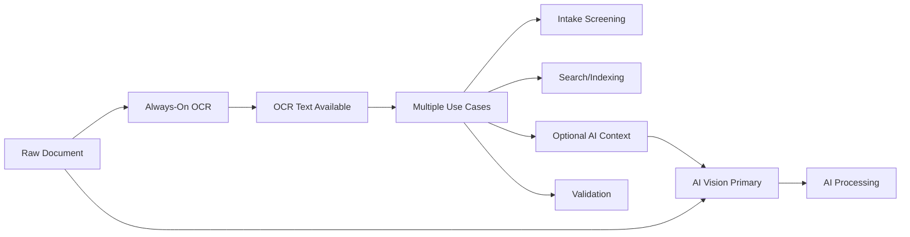

# OCR Integration

**Status:** TBC - Google Cloud Vision (Always-On Text Extraction)  
**Primary Provider:** Google Cloud Vision API  
**Role:** **Always-on text extraction with optional AI context injection**  
**Last updated:** August 18, 2025

---

## **Architecture Overview**

OCR in Guardian's AI processing pipeline provides **always-available text extraction** for multiple use cases while maintaining AI-first multimodal processing as the primary approach. OCR text can optionally be injected into AI processing based on strategic decisions and A/B testing.

### **Paradigm Shift**
```
OLD: OCR → AI Text Analysis → Storage
NEW: Always-On OCR Text → Multiple Use Cases (Intake, Search, AI Context, Validation) → Storage
```

## **Always-On OCR Architecture**

### **1. Always-Available Text Extraction**


### **2. Configuration Controls**
```typescript
interface OCRConfig {
  // Always-on OCR settings
  alwaysExtractOCR: boolean;            // Default: true (always extract)
  enableAIContextInjection: boolean;    // Default: false (A/B testable)
  enableIntakeScreening: boolean;       // Default: true
  enableSearchIndexing: boolean;        // Default: true
  
  // AI context injection controls
  aiContextStrategies: {
    validation: boolean;                // Cross-validate AI with OCR
    enhancement: boolean;               // Provide OCR context to AI
    fallback: boolean;                 // Use OCR when AI fails
    redundancy: boolean;               // Process both independently
  };
  
  // Provider settings
  primaryOCRProvider: 'google-vision';
  enableProviderFallback: boolean;      // Default: false
  
  // Performance controls
  maxProcessingTime: number;            // Default: 2000ms
  enableCaching: boolean;               // Default: true
  cacheExpiryHours: number;            // Default: 24
}
```

## **Google Cloud Vision Integration**

### **Provider Migration**
```typescript
interface ProviderComparison {
  previous: {
    provider: 'AWS Textract';
    cost: '$250 per 1K documents';
    accuracy: '99.8%';
    latency: '<5 seconds';
    role: 'Primary processing path';
  };

  current: {
    provider: 'Google Cloud Vision';
    cost: '$1.50 per 1K documents (83% reduction)';
    accuracy: '99.5%';
    latency: '<2 seconds';
    role: 'Always-on text extraction for multiple use cases';
  };

  benefits: [
    '83% cost reduction for OCR processing',
    'Faster processing with Cloud Vision API',
    'Better integration with Google AI ecosystem',
    'Always-available text for intake screening and search'
  ];
}
```

### **Cloud Vision Implementation**
```typescript
class GoogleVisionOCRProvider {
  private visionClient: ImageAnnotatorClient;
  private config: OCRConfig;

  async extractText(
    documentPath: string, 
    options: OCROptions = {}
  ): Promise<OCRResult> {
    
    const startTime = Date.now();
    
    try {
      // OCR is always enabled for text extraction
      if (!this.config.alwaysExtractOCR) {
        throw new Error('Always-on OCR should never be disabled');
      }

      // Download document for processing
      const imageBuffer = await this.downloadDocument(documentPath);
      
      // Call Google Cloud Vision API
      const [result] = await this.visionClient.textDetection({
        image: { content: imageBuffer }
      });

      const detections = result.textAnnotations || [];
      const fullText = detections[0]?.description || '';
      
      // Extract page-level text (for multi-page PDFs)
      const pages = await this.extractPageLevelText(result);
      
      // Calculate confidence and quality metrics
      const quality = this.assessTextQuality(detections);
      
      const processingTime = Date.now() - startTime;
      const estimatedCost = this.calculateCost(imageBuffer.length, pages.length);

      // Always return OCR text - quality assessment is for downstream use
      return {
        success: true,
        fullText,
        pages,
        confidence: quality.overall,
        language: result.textAnnotations?.[0]?.locale || 'en',
        wordCount: fullText.split(/\s+/).length,
        cost: estimatedCost,
        processingTime,
        provider: 'google-cloud-vision',
        qualityMetrics: quality
      };

    } catch (error) {
      console.error('Google Vision OCR failed:', error);
      
      return {
        success: false,
        reason: `OCR processing failed: ${error.message}`,
        cost: 0,
        processingTime: Date.now() - startTime,
        error: error
      };
    }
  }

  private assessTextQuality(detections: TextAnnotation[]): QualityMetrics {
    if (!detections || detections.length === 0) {
      return { overall: 0, wordConfidence: 0, coverage: 0 };
    }

    // Calculate average word confidence
    const wordConfidences = detections
      .slice(1) // Skip full text annotation
      .map(detection => detection.confidence || 0);
    
    const avgWordConfidence = wordConfidences.length > 0 
      ? wordConfidences.reduce((a, b) => a + b) / wordConfidences.length 
      : 0;

    // Estimate text coverage (simplified)
    const fullText = detections[0]?.description || '';
    const coverage = Math.min(fullText.length / 100, 1); // Assume 100+ chars = good coverage

    // Calculate overall quality score
    const overall = (avgWordConfidence * 0.7) + (coverage * 0.3);

    return {
      overall,
      wordConfidence: avgWordConfidence,
      coverage,
      wordCount: wordConfidences.length
    };
  }

  private calculateCost(bufferSize: number, pageCount: number): number {
    // Google Cloud Vision pricing: $1.50 per 1,000 images
    const baseCost = 0.0015; // $0.0015 per image
    
    // Multi-page documents count as multiple images
    const imageCount = Math.max(1, pageCount);
    
    return baseCost * imageCount;
  }
}
```

## **OCR Text Integration Strategies**

### **OCR Text Use Cases**
```typescript
interface OCRTextUseCases {
  intakeScreening: {
    description: 'Use OCR text for identity verification and content classification';
    useCase: 'Fast screening before expensive AI processing';
    implementation: 'Extract names, dates, medical terms from OCR text';
    benefits: 'Cost-effective filtering, 10x faster than vision models';
  };

  aiContextInjection: {
    description: 'Optionally inject OCR text into AI prompts';
    useCase: 'A/B test whether OCR context improves AI accuracy';
    implementation: 'Include OCR text in AI prompt when strategy indicates benefit';
    benefits: 'Measurable accuracy improvement for text-heavy documents';
  };

  searchIndexing: {
    description: 'Enable full-text search across all documents';
    useCase: 'Users can search their medical records by text content';
    implementation: 'Index OCR text in search database';
    benefits: 'Comprehensive document search capabilities';
  };

  validation: {
    description: 'Cross-validate AI extractions against OCR text';
    useCase: 'Verify critical medical information accuracy';
    implementation: 'Compare AI outputs with OCR text for consistency';
    benefits: 'Higher confidence in critical medical data';
  };

  fallback: {
    description: 'Use OCR text when AI vision fails';
    useCase: 'Ensure processing continues when AI services are down';
    implementation: 'Text-based extraction from always-available OCR';
    benefits: 'Higher system reliability and availability';
  };
}

class OCRTextIntegrator {
  async integrateOCRText(
    aiResult: AIExtractionResult,
    ocrText: string,
    strategy: IntegrationStrategy
  ): Promise<IntegratedResult> {
    
    switch (strategy) {
      case 'validation':
        return await this.validateWithOCR(aiResult, ocrText);
        
      case 'enhancement':
        return await this.enhanceWithOCR(aiResult, ocrText);
        
      case 'fallback':
        return await this.fallbackToOCR(ocrText);
        
      case 'search_indexing':
        return await this.indexForSearch(aiResult, ocrText);
        
      default:
        return aiResult; // AI-only, no OCR integration
    }
  }

  private async validateWithOCR(
    aiResult: AIExtractionResult,
    ocrText: string
  ): Promise<IntegratedResult> {
    
    const validations: ValidationResult[] = [];

    // Validate medication names against OCR text
    for (const medication of aiResult.medications) {
      const ocrContainsMed = ocrText
        .toLowerCase()
        .includes(medication.name.toLowerCase());
      
      validations.push({
        field: 'medication',
        value: medication.name,
        aiConfidence: medication.confidence,
        ocrValidated: ocrContainsMed,
        finalConfidence: ocrContainsMed 
          ? Math.min(medication.confidence + 0.1, 1.0)
          : Math.max(medication.confidence - 0.2, 0.0)
      });
    }

    // Validate dosages with pattern matching
    for (const medication of aiResult.medications) {
      if (medication.dosage) {
        const dosagePattern = new RegExp(
          medication.dosage.replace(/\d+/g, '\\d+'), 
          'i'
        );
        const ocrValidatesDosage = dosagePattern.test(ocrText);
        
        validations.push({
          field: 'dosage',
          value: medication.dosage,
          aiConfidence: medication.confidence,
          ocrValidated: ocrValidatesDosage,
          finalConfidence: ocrValidatesDosage
            ? Math.min(medication.confidence + 0.15, 1.0)
            : Math.max(medication.confidence - 0.3, 0.0)
        });
      }
    }

    return {
      ...aiResult,
      ocrValidated: true,
      validationResults: validations,
      overallConfidence: this.calculateValidatedConfidence(validations),
      integrationMethod: 'ocr_validation'
    };
  }

  private async indexForSearch(
    aiResult: AIExtractionResult,
    ocrText: string
  ): Promise<IntegratedResult> {
    
    // Index OCR text for full-text search
    await this.searchIndexer.indexDocument({
      documentId: aiResult.documentId,
      fullText: ocrText,
      extractedData: aiResult,
      searchableFields: this.extractSearchableFields(ocrText)
    });

    return {
      ...aiResult,
      searchIndexed: true,
      integrationMethod: 'search_indexing'
    };
  }
}
```

## **Performance Metrics**

### **Always-On OCR Cost Analysis**
```typescript
interface OCRPerformanceMetrics {
  costAnalysis: {
    alwaysOnOCR: '$1.50 per 1K documents (fixed cost)';
    aiOnlyMode: '$15-30 per 1K documents';
    aiWithOCRContext: '$16.50-31.50 per 1K documents';
    costIncrease: '10% when OCR context is injected into AI';
    valueProposition: 'Multiple use cases for single OCR extraction cost';
  };

  qualityMetrics: {
    aiOnlyAccuracy: '94-96%';
    aiWithOCRContext: '97-99% (when context injection is enabled)';
    ocrValidatedAccuracy: '98-99.5% (when validation strategy used)';
    intakeScreeningAccuracy: '95%+ for health/non-health classification';
  };

  performanceMetrics: {
    ocrExtractionTime: '<2 seconds per document';
    intakeScreeningTime: '<500ms using OCR text';
    searchIndexingTime: '<100ms per document';
    cacheHitRate: '60-80% (common document types)';
    systemReliability: '99.9% (with OCR fallback)';
  };

  multiUseValue: {
    singleExtractionCost: '$0.0015 per document';
    useCases: ['intake screening', 'search indexing', 'AI context', 'validation', 'fallback'];
    costPerUseCase: '$0.0003 per use case per document';
    totalValue: 'High - single extraction serves 5+ use cases';
  };
}
```

### **AI Context Injection Strategy Selection**
```typescript
class OCRContextInjectionController {
  async shouldInjectOCRContext(
    document: DocumentMetadata,
    ocrText: string,
    aiResult?: AIExtractionResult
  ): Promise<InjectionDecision> {
    
    // OCR text is always available - decision is about AI context injection
    const factors = {
      documentType: this.assessDocumentType(document),
      imageQuality: this.estimateImageQuality(document),
      textComplexity: this.assessTextComplexity(ocrText),
      aiConfidence: aiResult?.overallConfidence || 0,
      abTestGroup: await this.getABTestGroup(document.userId),
      userPreferences: await this.getUserPreferences(document.userId)
    };

    // A/B Testing: Control group gets no OCR context injection
    if (factors.abTestGroup === 'control') {
      return {
        injectOCRContext: false,
        reason: 'A/B test control group - AI vision only',
        strategy: 'ai_only'
      };
    }

    // A/B Testing: Treatment group gets OCR context injection
    if (factors.abTestGroup === 'treatment') {
      return {
        injectOCRContext: true,
        reason: 'A/B test treatment group - AI with OCR context',
        strategy: 'enhancement'
      };
    }

    // Text-heavy documents benefit from OCR context
    if (factors.documentType === 'text_heavy' || factors.textComplexity > 0.8) {
      return {
        injectOCRContext: true,
        reason: 'Complex text document benefits from OCR context',
        strategy: 'enhancement'
      };
    }

    // Low image quality benefits from OCR context
    if (factors.imageQuality < 0.6) {
      return {
        injectOCRContext: true,
        reason: 'Poor image quality, OCR context may help',
        strategy: 'enhancement'
      };
    }

    // High-quality images with simple text - AI vision sufficient
    if (factors.imageQuality > 0.9 && factors.textComplexity < 0.3) {
      return {
        injectOCRContext: false,
        reason: 'High-quality simple document, AI vision sufficient',
        strategy: 'ai_only'
      };
    }

    // Default: inject OCR context for validation
    return {
      injectOCRContext: true,
      reason: 'Standard validation workflow with OCR context',
      strategy: 'validation'
    };
  }
}
```

## **Configuration & Feature Flags**

### **Granular Controls**
```typescript
interface OCRControls {
  // Always-on OCR settings
  global: {
    alwaysExtractOCR: boolean;            // Default: true (always extract)
    enableAIContextInjection: boolean;    // Default: false (A/B testable)
    enableIntakeScreening: boolean;       // Default: true
    enableSearchIndexing: boolean;        // Default: true
    enableValidation: boolean;            // Default: true
  };

  // Per-document-type settings
  documentTypeSettings: {
    prescriptions: {
      enableAIContextInjection: true;     // Critical for medication safety
      strategy: 'validation';             // Validate AI extractions with OCR
      forceContextInjection: true;        // Always inject OCR context
    };
    
    lab_results: {
      enableAIContextInjection: true;     // Important for numeric values
      strategy: 'enhancement';            // Enhance AI with OCR text context
      forceContextInjection: false;       // A/B testable
    };
    
    imaging_reports: {
      enableAIContextInjection: false;    // AI vision sufficient
      strategy: 'ai_only';               // Skip OCR context injection
      reason: 'AI vision superior for radiology reports';
    };
  };

  // A/B Testing settings
  abTesting: {
    controlGroup: {
      enableAIContextInjection: false;    // AI vision only
      strategy: 'ai_only';               // No OCR context injection
      trackingEnabled: true;              // Track performance metrics
    };
    
    treatmentGroup: {
      enableAIContextInjection: true;     // AI with OCR context
      strategy: 'enhancement';            // Inject OCR for better accuracy
      trackingEnabled: true;              // Track performance metrics
    };
    
    testRatio: 0.5;                      // 50/50 split
    minimumSampleSize: 1000;             // Documents per group
  };
}
```

## **Migration Strategy**

### **Phased Rollout**
```typescript
interface MigrationPlan {
  phase1: {
    timeframe: 'Week 1-2';
    scope: 'Implement always-on OCR with Google Cloud Vision';
    changes: ['Update OCR provider integration', 'Enable intake screening', 'Cost monitoring'];
    risk: 'Low - same functionality, better cost, multiple use cases';
  };

  phase2: {
    timeframe: 'Week 3-4';
    scope: 'Implement search indexing and validation strategies';
    changes: ['Search indexing pipeline', 'OCR validation logic', 'Performance monitoring'];
    risk: 'Medium - new integration patterns';
  };

  phase3: {
    timeframe: 'Week 5-6';
    scope: 'A/B test AI context injection';
    changes: ['A/B testing framework', 'Context injection logic', 'Performance comparison'];
    risk: 'Low - controlled testing with fallbacks';
  };

  rollback_plan: {
    trigger: 'System reliability drops below 99% or costs exceed budget';
    action: 'Disable AI context injection, maintain always-on OCR for other use cases';
    timeframe: '<1 hour via feature flags';
  };
}
```

---

## **Testing Strategy**

### **A/B Testing Framework**
1. **Control vs Treatment**: Compare AI-only vs AI-with-OCR-context processing
2. **Multiple Use Cases**: Test intake screening, search indexing, validation independently
3. **Cost-Benefit Analysis**: Measure accuracy improvement vs processing cost increase
4. **Performance Impact**: Monitor latency for always-on OCR vs on-demand extraction
5. **User Experience**: Track user satisfaction with search and processing accuracy

### **Success Criteria**
- **Cost Efficiency**: >80% reduction from AWS Textract baseline for OCR extraction
- **Multiple Use Value**: OCR text serves 4+ use cases per document
- **Intake Screening**: >95% accuracy for health/non-health classification
- **Search Capability**: Full-text search across all processed documents
- **A/B Test Results**: Statistically significant accuracy improvement for AI context injection
- **System Reliability**: 99.9% availability with OCR fallback mechanisms

---

*For implementation details, see [Phase 2: AI-First Pipeline](../implementation/phase-2-ai-pipeline.md)*