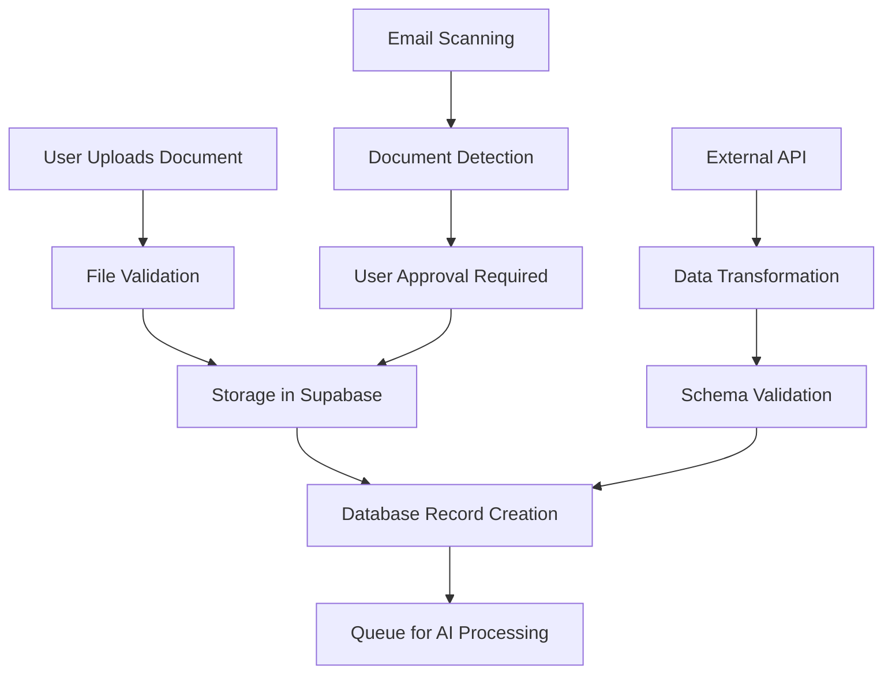

# Data Ingestion Architecture

**Purpose:** Documentation for all data input pathways into Exora  
**Status:** Manual upload complete, automated systems planned  
**Last updated:** August 2025

---

## 🎯 **Overview**

The Data Ingestion layer is the first stage of the Exora pipeline, responsible for getting healthcare data into the system through multiple pathways. This stage focuses on data acquisition, initial validation, and preparation for AI processing.

```
📱 Manual Upload | 📧 Email Sync | 📷 Photo Scanning | 🔗 External APIs | ----------> 🤖 AI Processing
```

---

## 📁 **Ingestion Pathways**

### **[📱 Manual Upload](./manual-upload/)**
*User-initiated document and image uploads*

**Status:** ✅ Production Ready  
**Implementation:** Supabase Storage integration with Next.js frontend  
**Supported Formats:** PDF, JPG, PNG, TIFF, HEIC  
**Features:**
- Multiple avenues for file selection and deposit; file folder select, drag-and-drop
- Real-time upload progress
- File validation and error handling
- User-specific storage buckets
- Atomic database operations

### **[📧 Automated Aggregation](./automated-aggregation/)**
*Automated collection from user's digital ecosystem*

**Status:** 🎯 Planned (v7.2)  
**Scope:**
- **Email Integration** - Scan for medical documents, lab results, appointment confirmations
- **Photo Library Scanning** - Identify and extract health-related photos
- **Document Recognition** - AI-powered identification of medical documents
- **Smart Filtering** - Reduce false positives and irrelevant content
- **Final User Confirmation** - Relevant files presented to user for final submission confirmation

### **[🔗 External Integrations](./external-integrations/)**
*Direct API connections to healthcare systems*

**Status:** 🎯 Future (v7.3+)  
**Integration Categories:**
- **Wearable Devices** - Garmin, Fitbit, Apple Health, Samsung Health
- **Government institutions** - MyHealth Record, Aus national medication registry (cant rememmber the name)
- **Healthcare Providers** - Private clinic healthcare management systems (cant remeber the names of the two big ones), PathLabs, imaging centers, large hospital data silos (cerner, epic).
- **Insurance Systems** - Claims data, coverage information
- **Pharmacy Systems** - Prescription history, medication adherence

---

## 🏗️ **Architecture Principles**

### **1. Multiple Input Pathways**
- Support diverse user preferences and technical capabilities
- Redundant data acquisition methods for comprehensive coverage
- Graceful degradation when specific pathways are unavailable

### **2. Data Quality Assurance**
- File format validation and standardization
- Medical relevancy checks (uploaded file is actually about healthcare or is a healthcare doc)
    - one idea is to have embedding RAG system in place, so that if OCR embedded content doesnt have a high average knn (or something like that, then it gets flagged to the user and blocked or reviewed by cheaper model etc)
- Duplicate detection and deduplication
- Source attribution and provenance tracking
- Quality scoring for downstream AI processing

### **3. Privacy & Security**
- User consent for each ingestion pathway
- Granular permissions for automated systems
- Secure credential management for external APIs
- Comprehensive audit trails for all data access
- Patient identity verification for uploaded documents
  - Match patient details in documents against profile
  - Flag potential mismatches for manual review
  - Block uploads for non-matching patient identifiers
  - Audit trail of identity verification checks

### **4. Scalable Processing**
- Asynchronous processing for large files
- Queue-based architecture for high-volume ingestion
- Intelligent batching for external API calls
- Rate limiting and error recovery

---

## 🔄 **Data Flow**



---

## 📊 **Current Implementation Status**

| Pathway | Status | Features | Next Steps |
|---------|--------|----------|------------|
| **Manual Upload** | ✅ Complete | File upload, validation, storage | UI/UX improvements |
| **Email Sync** | 📋 Planned | Design complete | Implementation v7.2 |
| **Photo Scanning** | 📋 Planned | AI detection strategy | Research phase |
| **Wearable APIs** | 📋 Future | Integration architecture | Partnership discussions |
| **Healthcare APIs** | 📋 Future | FHIR integration | Standards compliance |

---

## 🛠️ **Technical Implementation**

### **Current Stack**
- **Frontend:** Next.js with React file upload components
- **Storage:** Supabase Storage with user-specific buckets
- **Database:** PostgreSQL with comprehensive audit logging
- **Validation:** TypeScript schemas with runtime validation
- **Queue:** Job queue system for asynchronous processing

### **Planned Enhancements**
- **Email Processing:** IMAP/Exchange integration with AI filtering
- **Mobile Integration:** React Native camera and document scanning
- **API Framework:** Standardized external integration patterns
- **Monitoring:** Comprehensive ingestion metrics and alerting

---

## 🎯 **Success Metrics**

### **User Experience**
- **Upload Success Rate:** >99% goal
- **Processing Speed:** <5 seconds for standard documents
- **User Satisfaction:** Intuitive, reliable upload experience

### **Data Quality**
- **Format Support:** 100% coverage of medical document formats. 
    - This could be a real annoyance for users and we should aim for the vast majority of formats being uploadable and ingestable.
    - We ought to have system in palce to detect and log when a format is not recognised or when upload error occurs due to file format incompatibility, for constant optimization of this step.  
- **Duplicate Detection:** >95% accuracy in identifying duplicates
- **Source Attribution:** 100% traceability to original source

### **System Performance**
- **Throughput:** Support 1000+ concurrent uploads
    - not really relevant to this sectioon, but right from the get go we need to have upload and ai analysis caps per patient to prevent cash bleed. With payment tier upgrades to expand caps. 
- **Reliability:** 99.9% uptime for ingestion services
- **Scalability:** Linear scaling with user base growth

---

## 📋 **Future Roadmap**

### **Phase 1: Enhanced Manual Upload (v7.1)**
- Improved UI/UX for document upload
- Better progress indication and error handling
- Batch upload capabilities

### **Phase 2: Automated Aggregation (v7.2)**
- Email integration with smart filtering
- Photo library scanning and identification
- User consent and privacy controls

### **Phase 3: External Integrations (v7.3+)**
- Wearable device data synchronization
- Healthcare provider API connections
- Insurance and pharmacy system integration

---

## 🔍 **Getting Started**

### **For Developers**
1. Review [manual upload implementation](./manual-upload/)
2. Study the file validation and storage patterns
3. Understand the queue system for AI processing handoff

### **For Product Managers**
1. Review user experience flows and success metrics
2. Understand privacy and consent requirements
3. Plan feature prioritization for automated systems

### **For Healthcare Professionals**
1. Review data quality assurance measures
2. Understand source attribution and audit trails
3. Provide feedback on clinical workflow integration

---

*For detailed implementation guides, see the specific pathway documentation in each subdirectory.*