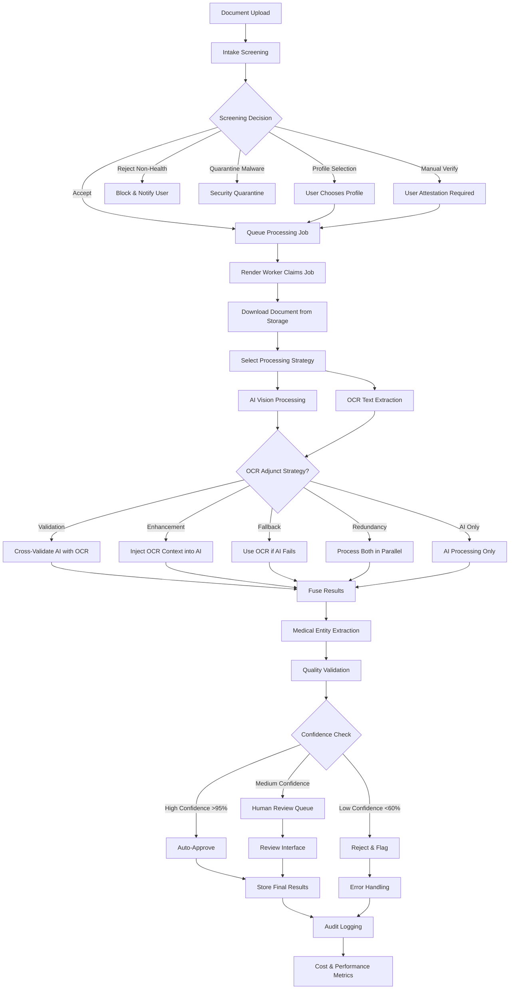

# AI Processing Architecture

**Purpose:** AI-first multimodal document processing with intelligent intake screening  
**Status:** Implementation ready - 4-phase roadmap completed  
**Last updated:** August 18, 2025

---

## **Architecture Overview**

Guardian's AI processing system uses an **AI-first multimodal approach** where AI models process raw documents directly, with always-available OCR text for multiple use cases including validation, enhancement, and fallback scenarios. The system features intelligent upfront screening for identity verification and content classification before expensive processing.

```
Upload → Intake Screening → Queue Job → AI-First Processing → Quality Validation → Structured Data
           ↓                            ↗                                              
       Reject/                     OCR Text (Always Available)                        
       Select Profile                    ↓
                                 Search, Validation, Fallback                        
```

---

## **Core Processing Components**

### **[Intake Screening](./intake-screening/)**
*Intelligent upfront validation before expensive processing*

**Status:** Implementation Ready (Phase 1)  
**Purpose:** Identity verification, profile matching, and content classification  
**Features:**
- **Identity Verification**: Match documents to user profiles using AI analysis
- **Content Classification**: Health vs non-health content filtering using lightweight models
- **Malware Scanning**: Security screening with ClamAV integration
- **Profile Disambiguation**: Smart suggestions for multi-profile accounts with confidence scoring
- **Cost Protection**: Block expensive processing for invalid content (target <$0.05 per upload)

### **[AI Extraction](./ai-extraction/)**
*AI-first multimodal processing of raw documents*

**Status:** Implementation Ready (Phase 2)  
**Architecture:** AI-first multimodal with OCR as adjunct input  
**Primary Providers:**
- **GPT-4o Mini**: Cost-effective vision + text analysis (~$15-30/1K docs)
- **Azure OpenAI**: HIPAA-compliant processing with Business Associate Agreement
- **Google Document AI**: Specialized medical document understanding
**Features:**
- Direct raw file processing (images, PDFs) without OCR dependency
- OCR adjunct strategies: validation, enhancement, fallback, redundancy
- Intelligent provider routing based on document complexity and cost
- Medical entity extraction with SNOMED-CT and ICD-10 code mapping

### **[OCR Integration](./ocr-integration/)**
*Always-extracted text with intelligent adjunct strategies*

**Status:** Implementation Ready (Phase 2)  
**Role:** Always-extracted OCR text with intelligent AI injection strategies  
**Primary Provider:** Google Cloud Vision API (~$1.50/1K docs)  
**Adjunct Strategies:**
- **Validation**: Cross-validate AI extractions against OCR text for critical medical data
- **Enhancement**: Inject OCR context into AI processing for poor quality images
- **Fallback**: Use OCR-based extraction when AI vision fails or has low confidence
- **Redundancy**: Parallel AI and OCR processing for maximum accuracy on critical documents

### **[Processing Pipeline](./processing-pipeline/)**
*PostgreSQL queue-based processing with Render.com workers*

**Status:** Implementation Ready (Phase 2)  
**Architecture:** Background job processing with horizontal scaling  
**Features:**
- PostgreSQL job queue with RPC functions and advisory locks
- Node.js TypeScript workers on Render.com with auto-scaling
- Intelligent retry logic with exponential backoff
- Real-time cost and performance monitoring

---

## **Implementation Roadmap**

### **[Phase 1: Intake Screening](./implementation/phase-1-intake-screening.md)** (Week 1)
**Focus:** Identity verification and content classification  
**Key Deliverables:**
- Identity verification using lightweight AI models
- Content classification for health vs non-health filtering  
- Malware scanning with ClamAV integration
- Profile matching with confidence-based suggestions
- Early rejection system for cost protection

### **[Phase 2: AI-First Pipeline](./implementation/phase-2-ai-pipeline.md)** (Week 2)
**Focus:** Core multimodal processing with OCR adjunct  
**Key Deliverables:**
- Multi-provider AI framework (GPT-4o Mini, Azure OpenAI, Document AI)
- OCR adjunct strategies (validation, enhancement, fallback, redundancy)
- Medical entity extraction and normalization
- Quality validation with confidence scoring
- Structured data storage with audit trails

### **[Phase 3: Cost & Performance Optimization](./implementation/phase-3-optimization.md)** (Week 3)
**Focus:** Advanced optimization and A/B testing  
**Key Deliverables:**
- Advanced feature flag system with hierarchical configuration
- A/B testing framework with statistical analysis
- Intelligent provider routing based on document complexity
- Real-time cost monitoring and budget controls
- Adaptive quality thresholds with continuous learning

### **[Phase 4: Production Readiness](./implementation/phase-4-production.md)** (Week 4)
**Focus:** Compliance validation and operational excellence  
**Key Deliverables:**
- HIPAA and Australian Privacy Act compliance validation
- Production monitoring with real-time dashboards
- Automated incident detection and response
- Security hardening and penetration testing
- Operational documentation and team training

---

## **Architecture Principles**

### **1. AI-First Multimodal Processing**
- **Primary Path**: AI models process raw images/PDFs directly without OCR dependency
- **Always-Available OCR**: Extract text from all documents for multiple use cases
- **Intelligent Adjunct**: OCR strategically used for validation, enhancement, fallback, or redundancy
- **Independent Storage**: AI and OCR outputs stored separately with full provenance
- **Provider Flexibility**: Multi-provider framework with cost-based routing

### **2. Intelligent Intake Screening**
- **Identity Verification**: Advanced AI matching of documents to user profiles
- **Content Classification**: Early filtering using OCR + lightweight classification models
- **Cost Protection**: Block expensive processing for non-health or invalid content
- **Security First**: Comprehensive malware scanning and quarantine procedures

### **3. Healthcare-Grade Security & Compliance**
- **HIPAA Compliance**: Azure OpenAI with BAA for PHI processing requirements
- **Audit Trails**: Complete provenance tracking for all processing decisions
- **Row Level Security**: User-specific data isolation throughout entire pipeline
- **PHI Protection**: No PHI in logs with structured data redaction

### **4. Cost-Optimized Processing**
- **Target Cost**: <$25 per 1,000 documents (85% reduction from AWS Textract)
- **Feature Flags**: Granular control over AI providers, OCR usage, and processing strategies
- **Intelligent Routing**: Cost-based provider selection with document complexity analysis
- **Budget Controls**: Hard limits with emergency brake functionality

---

## **Processing Workflow**



---

## **Performance Targets**

### **Cost Optimization**
- **Overall Pipeline**: <$25 per 1,000 documents processed
- **AI Processing**: $15-30 per 1,000 documents (provider dependent)
- **OCR Adjunct**: $1.50 per 1,000 documents (when enabled)
- **Intake Screening**: <$0.05 per document uploaded
- **Budget Adherence**: Zero overruns with automated controls

### **Processing Performance**
- **Intake Screening**: <500ms per upload decision
- **AI Processing**: <2 minutes end-to-end per document
- **OCR Processing**: <5 seconds per document (when used)
- **Overall Throughput**: 1,000+ documents per hour
- **Queue Processing**: <30 seconds average queue time

### **Quality Metrics**
- **Medical Data Accuracy**: >99% (critical for patient safety)
- **Medication Accuracy**: >99.5% (safety critical)
- **Human Review Rate**: <3% (optimized from 5% baseline)
- **Auto-Approval Rate**: >95% for high-confidence extractions
- **False Positive Rate**: <1% (avoid non-medical data extraction)

### **System Reliability**
- **Availability**: 99.9% uptime for processing services
- **Error Recovery**: 100% of failed jobs retried with exponential backoff
- **Security**: Zero PHI exposure incidents
- **Compliance**: 100% HIPAA and Privacy Act compliance

---

## **Quality Assurance Framework**

### **Automated Validation**
- **Medical Terminology**: Consistency checking against SNOMED-CT and ICD-10
- **Dosage Validation**: Medication dosages validated against therapeutic ranges
- **Temporal Logic**: Date consistency and temporal relationship verification
- **Cross-Reference**: Validation against medical knowledge databases

### **Human Review Triggers**
- **Low Confidence**: Overall confidence score <95% on any critical extraction
- **Conflicting Data**: Contradictory information detected across document sections
- **Unusual Conditions**: Rare medical conditions or unusual medication combinations
- **Safety Flags**: Medication dosages outside normal therapeutic ranges

### **Continuous Improvement**
- **A/B Testing**: Compare AI providers, OCR strategies, and processing configurations
- **User Feedback**: Integration of correction feedback for model improvement
- **Performance Monitoring**: Real-time quality metrics with automated alerting
- **Cost Optimization**: Regular analysis of accuracy vs cost trade-offs

---

## **Security & Compliance**

### **HIPAA Compliance**
- **Business Associate Agreements**: Signed BAAs with Azure OpenAI for PHI processing
- **Administrative Safeguards**: Security officer designation and workforce training
- **Physical Safeguards**: Secure cloud infrastructure with access controls
- **Technical Safeguards**: Encryption, audit logging, and access control systems

### **Australian Privacy Act Compliance**
- **Privacy Principles**: Full compliance with 13 Australian Privacy Principles
- **Data Minimization**: Only collect and process necessary medical information
- **Consent Management**: Clear user control over AI processing preferences
- **Breach Notification**: Automated detection and reporting procedures

### **Data Protection**
- **Encryption**: All data encrypted at rest and in transit using AES-256
- **Access Control**: Role-based access with principle of least privilege
- **Audit Logging**: Complete audit trails for all data access and processing
- **Data Retention**: Configurable retention policies with secure deletion

---

## **Monitoring & Observability**

### **Real-Time Dashboards**
- **Executive Dashboard**: Processing volume, cost performance, quality metrics
- **Operational Dashboard**: System health, queue status, provider performance
- **Compliance Dashboard**: Security metrics, audit status, incident tracking

### **Automated Alerting**
- **Critical Alerts**: PHI exposure, security breaches, processing failures
- **Performance Alerts**: Latency spikes, quality degradation, cost overruns
- **Operational Alerts**: Queue depth, worker health, provider outages

### **Cost Monitoring**
- **Real-Time Tracking**: Live cost monitoring with budget threshold alerts
- **Predictive Analysis**: Cost forecasting based on processing patterns
- **Optimization Recommendations**: Automated suggestions for cost reduction

---

## **Getting Started**

### **Implementation Sequence**
1. **[Phase 1](./implementation/phase-1-intake-screening.md)**: Start with intake screening implementation
2. **[Phase 2](./implementation/phase-2-ai-pipeline.md)**: Build core AI processing pipeline
3. **[Phase 3](./implementation/phase-3-optimization.md)**: Add optimization and A/B testing
4. **[Phase 4](./implementation/phase-4-production.md)**: Prepare for production deployment

### **For Developers**
1. Review [Implementation Roadmap](./implementation/) for detailed technical specifications
2. Study [OCR Integration Strategies](./ocr-integration/) for adjunct processing approaches
3. Understand [Processing Pipeline](./processing-pipeline/) architecture and job queue design
4. Examine [Intake Screening](./intake-screening/) for identity verification and content classification

### **For Operations**
1. Review [Production Monitoring](./implementation/phase-4-production.md#production-monitoring--observability) setup
2. Study [Incident Response](./implementation/phase-4-production.md#incident-response--recovery) procedures
3. Understand [Compliance Validation](./implementation/phase-4-production.md#healthcare-compliance-framework) requirements

---

*Guardian's AI processing architecture provides a comprehensive, healthcare-compliant solution for intelligent medical document processing with industry-leading accuracy, cost efficiency, and security standards.*