# User Experience Flows

**Purpose:** UX design for intake screening edge cases and user interactions  
**Status:** 🚧 Design Phase - User flow specifications ready for implementation  
**Last updated:** August 18, 2025

---

## 🎯 **Overview**

The User Experience system handles all user interactions during the intake screening process, providing clear feedback, intuitive choices, and graceful error handling for edge cases that require human input.

## 🎨 **Core UX Principles**

### **1. Healthcare-First Design**
- **Trust & Transparency**: Clear explanations for all automated decisions
- **Patient Safety**: Conservative defaults that prioritize security
- **Accessibility**: WCAG 2.1 AA compliance for healthcare professionals
- **Speed**: Minimize friction for routine document uploads

### **2. Progressive Disclosure**
```typescript
interface ProgressiveDisclosure {
  // Show complexity only when needed
  simpleFlow: {
    scenario: 'Clear identity match, health content detected';
    userExperience: 'Silent success - document processes automatically';
    feedback: 'Toast notification: "Document uploaded successfully"';
  };

  mediumComplexity: {
    scenario: 'Multiple profile matches found';
    userExperience: 'Profile selection dialog with smart suggestions';
    feedback: 'Clear explanation of why selection is needed';
  };

  highComplexity: {
    scenario: 'Identity unclear, manual verification required';
    userExperience: 'Step-by-step verification flow with help text';
    feedback: 'Educational content about why verification helps';
  };
}
```

## 🔄 **User Flow Scenarios**

### **Scenario 1: Successful Auto-Processing (80% of cases)**

```mermaid
graph TD
    A[📄 User Uploads Document] --> B[⚡ Quick Processing]
    B --> C[✅ Success Toast]
    C --> D[📊 Dashboard Updates]
    
    style A fill:#e8f5e8
    style B fill:#fff3e0
    style C fill:#e8f5e8
    style D fill:#e3f2fd
```



**UX Design:**
```typescript
interface AutoSuccessFlow {
  uploadFeedback: {
    immediate: 'Upload progress bar with estimated time';
    processing: 'Subtle spinner with "Analyzing document..." text';
    success: 'Green checkmark toast: "Document processed successfully"';
    duration: '2-3 seconds total';
  };

  visualFeedback: {
    documentThumbnail: 'Show thumbnail with processing overlay';
    statusIndicator: 'Green checkmark when complete';
    metadata: 'Auto-extracted document type and date';
  };

  dashboardIntegration: {
    immediateUpdate: 'Document appears in recent uploads';
    categoryPlacement: 'Automatically sorted into correct category';
    notification: 'Optional email digest for batch uploads';
  };
}
```

### **Scenario 2: Profile Selection Required (15% of cases)**

```mermaid
graph TD
    A[📄 Document Upload] --> B[🔍 Identity Analysis]
    B --> C[👥 Multiple Matches Found]
    C --> D[🎯 Profile Selection Dialog]
    D --> E{User Selects Profile}
    E -->|Valid Selection| F[✅ Continue Processing]
    E -->|Skip/Cancel| G[📋 Save as Pending]
    
    style C fill:#fff3e0
    style D fill:#e1f5fe
    style F fill:#e8f5e8
    style G fill:#f3e5f5
```



**UX Components:**
```typescript
interface ProfileSelectionDialog {
  header: {
    title: "Which profile does this document belong to?";
    subtitle: "We found multiple possible matches for this document";
    icon: 'family-group';
  };

  profileCards: {
    layout: 'Horizontal cards with avatars';
    information: {
      name: string;
      relationship: 'Self' | 'Child' | 'Dependent';
      matchConfidence: number; // Shown as filled stars
      matchReasons: string[];  // "Name similarity", "Age appropriate"
    };
    sorting: 'Highest confidence first';
    maxVisible: 3; // Show top 3 matches
  };

  actionButtons: {
    primary: "Select Profile & Continue";
    secondary: "I'm not sure - Save for later";
    tertiary: "This document isn't for anyone in my family";
  };

  helpSection: {
    expandable: true;
    title: "Why do I need to select a profile?";
    content: `
      Guardian keeps medical records separate for each family member to ensure:
      • Privacy protection for each individual
      • Accurate health tracking per person  
      • Compliance with healthcare data regulations
      
      If you're unsure, you can save this document and review it later.
    `;
  };
}

// React Component Example
function ProfileSelectionDialog({ candidates, onSelect, onSkip }: Props) {
  return (
    <Dialog open={true} maxWidth="md">
      <DialogHeader>
        <FamilyIcon />
        <Typography variant="h5">Which profile does this document belong to?</Typography>
        <Typography variant="body2" color="textSecondary">
          We found multiple possible matches for this document
        </Typography>
      </DialogHeader>
      
      <DialogContent>
        <Grid container spacing={2}>
          {candidates.map(candidate => (
            <Grid item xs={12} md={4} key={candidate.profileId}>
              <ProfileCard
                profile={candidate.profile}
                confidence={candidate.score}
                reasons={candidate.reasons}
                onClick={() => onSelect(candidate.profileId)}
              />
            </Grid>
          ))}
        </Grid>
        
        <ExpandableHelp title="Why do I need to select a profile?">
          <Typography variant="body2">
            Guardian keeps medical records separate for each family member...
          </Typography>
        </ExpandableHelp>
      </DialogContent>
      
      <DialogActions>
        <Button onClick={onSkip} variant="outlined">
          Save for Later
        </Button>
        <Button disabled variant="contained">
          Select a Profile Above
        </Button>
      </DialogActions>
    </Dialog>
  );
}
```

### **Scenario 3: Manual Verification Required (4% of cases)**

```mermaid
graph TD
    A[📄 Document Upload] --> B[🔍 Identity Analysis]
    B --> C[❓ Unclear Identity]
    C --> D[✋ Manual Verification Flow]
    D --> E[📝 User Attestation]
    E --> F{User Confirms}
    F -->|Confirms Ownership| G[✅ Continue Processing]
    F -->|Denies Ownership| H[🚫 Document Rejected]
    F -->|Needs Help| I[💬 Support Contact]
    
    style C fill:#fff3e0
    style D fill:#e1f5fe
    style E fill:#f3e5f5
```



**Verification Flow:**
```typescript
interface ManualVerificationFlow {
  step1_explanation: {
    title: "We need to verify this document belongs to you";
    content: `
      This document doesn't contain clear identifying information that we can 
      automatically match to your profile. This is common with:
      
      • Generic medication bottles or labels
      • Partial documents or photos
      • Documents with minimal text
      
      To maintain the security of your health records, we need you to confirm 
      this document is yours.
    `;
    icon: 'shield-check';
  };

  step2_documentPreview: {
    layout: 'Side-by-side: document thumbnail + form';
    documentView: {
      thumbnail: 'Blurred preview for privacy';
      metadata: 'File name, size, upload time';
      extractedInfo: 'Any text we could identify';
    };
  };

  step3_attestation: {
    question: "Can you confirm this document belongs to you or someone in your family?";
    options: [
      {
        value: 'mine',
        label: 'Yes, this document is mine',
        icon: 'check-circle',
        color: 'success'
      },
      {
        value: 'family',
        label: 'Yes, it belongs to someone in my family',
        icon: 'users',
        color: 'primary',
        followUp: 'ProfileSelectionDialog'
      },
      {
        value: 'not_mine',
        label: 'No, this document is not mine',
        icon: 'x-circle',
        color: 'error'
      },
      {
        value: 'unsure',
        label: 'I\'m not sure',
        icon: 'help-circle',
        color: 'warning',
        followUp: 'SupportContactDialog'
      }
    ];
  };

  step4_confirmation: {
    mine: {
      message: "Thank you! We'll process this document for your profile.";
      action: 'Continue processing';
    };
    family: {
      message: "Please select which family member this document belongs to.";
      action: 'Show profile selection';
    };
    not_mine: {
      message: "We'll securely delete this document. No health information has been stored.";
      action: 'Delete and cleanup';
    };
    unsure: {
      message: "No problem! We can help you figure this out.";
      action: 'Contact support options';
    };
  };
}
```

### **Scenario 4: Content Classification Issues (1% of cases)**

```mermaid
graph TD
    A[📄 Document Upload] --> B[🔍 Content Analysis]
    B --> C[❓ Uncertain Health Content]
    C --> D[👤 User Clarification]
    D --> E{User Response}
    E -->|Health Related| F[✅ Continue Processing]
    E -->|Not Health Related| G[🚫 Document Rejected]
    E -->|Unsure| H[💾 Save for Review]
    
    style C fill:#fff3e0
    style D fill:#e1f5fe
```



**Content Clarification Dialog:**
```typescript
interface ContentClarificationDialog {
  scenarios: {
    fitness_data: {
      title: "Is this fitness data medically relevant?";
      content: "This appears to be fitness tracker data. Should we include it in your health records?";
      examples: "Heart rate data, step counts, sleep tracking";
      guidance: "Include if: prescribed by doctor, monitoring medical condition, or tracking recovery";
    };

    supplements: {
      title: "Are these supplements medically prescribed?";
      content: "This appears to be vitamin or supplement information.";
      guidance: "Include if: prescribed by healthcare provider, monitoring deficiency, or part of treatment plan";
    };

    insurance_correspondence: {
      title: "Is this health insurance correspondence?";
      content: "This appears to be insurance-related documentation.";
      guidance: "Include if: related to medical claims, coverage decisions, or health benefits";
    };
  };

  interface: {
    layout: 'Question + context + action buttons';
    documentPreview: 'Thumbnail with relevant sections highlighted';
    helpText: 'Clear guidance on when to include vs exclude';
    examples: 'Specific examples relevant to document type';
  };

  actions: [
    {
      label: 'Yes, include in health records',
      style: 'primary',
      consequence: 'Document will be processed and stored'
    },
    {
      label: 'No, this isn\'t health-related',
      style: 'secondary',
      consequence: 'Document will be securely deleted'
    },
    {
      label: 'I\'m not sure - save for later',
      style: 'outlined',
      consequence: 'Document saved in pending folder'
    }
  ];
}
```

### **Scenario 5: Security Threats Detected (<0.1% of cases)**

```mermaid
graph TD
    A[📄 Document Upload] --> B[🛡️ Security Scan]
    B --> C[🚨 Threat Detected]
    C --> D[🔒 Automatic Quarantine]
    D --> E[📧 User Notification]
    E --> F[🎫 Support Ticket]
    
    style C fill:#ffebee
    style D fill:#ffebee
    style E fill:#fff3e0
```



**Security Alert Interface:**
```typescript
interface SecurityAlertDialog {
  severity_levels: {
    malware: {
      title: "Security Threat Detected";
      message: "We detected a potential security threat in your uploaded file.";
      icon: 'shield-alert';
      color: 'error';
      urgency: 'high';
    };

    suspicious: {
      title: "Suspicious File Detected";
      message: "Your file has been flagged for additional security review.";
      icon: 'shield-exclamation';
      color: 'warning';
      urgency: 'medium';
    };
  };

  user_communication: {
    immediate_feedback: {
      title: "Upload Blocked for Your Protection";
      message: `
        For your security, we've blocked this file upload and quarantined the file.
        
        This doesn't necessarily mean your device is infected - sometimes legitimate 
        files can trigger our security systems.
        
        Our security team will review this file and contact you within 24 hours.
      `;
    };

    what_happens_next: [
      'File is securely quarantined (not stored with your health data)',
      'Security team reviews the file within 24 hours',
      'You\'ll receive an email with the review results',
      'If safe, you can re-upload the file'
    ];

    user_actions: [
      {
        label: 'Contact Support Now',
        action: 'Open support chat',
        priority: 'primary'
      },
      {
        label: 'View Security Report',
        action: 'Show technical details',
        priority: 'secondary'
      },
      {
        label: 'Try Different File',
        action: 'Return to upload',
        priority: 'outlined'
      }
    ];
  };

  follow_up_email: {
    subject: "Security Review: Your Document Upload";
    template: `
      Hi [Name],
      
      We recently blocked a file upload for security reasons. Our review is complete:
      
      [RESULT: Safe/Threat Confirmed/Still Under Review]
      
      [If Safe]: You can now safely re-upload this file.
      [If Threat]: Please run a security scan on your device.
      [If Under Review]: We need additional time for analysis.
      
      Questions? Reply to this email or contact support.
      
      Guardian Security Team
    `;
  };
}
```

## 📱 **Mobile Experience Considerations**

### **Touch-Optimized Interfaces**
```typescript
interface MobileUXAdaptations {
  profileSelection: {
    layout: 'Vertical stack instead of horizontal cards';
    cardSize: 'Minimum 44px touch targets';
    scrolling: 'Smooth scroll with momentum';
    gestures: 'Swipe to dismiss, tap to select';
  };

  verification: {
    singleHanded: 'All actions reachable with thumb';
    orientation: 'Adapts to portrait/landscape';
    keyboard: 'Appropriate input types for forms';
    camera: 'Direct camera integration for re-upload';
  };

  notifications: {
    pushNotifications: 'Real-time upload status updates';
    backgroundProcessing: 'Continue processing when app backgrounded';
    offlineSupport: 'Queue uploads when offline';
  };
}
```

## ♿ **Accessibility Features**

### **WCAG 2.1 AA Compliance**
```typescript
interface AccessibilityFeatures {
  visualImpairment: {
    screenReader: 'Full ARIA labels and descriptions';
    highContrast: 'Color contrast ratios >4.5:1';
    textScaling: 'Support up to 200% text zoom';
    focusManagement: 'Clear focus indicators and logical order';
  };

  motorImpairment: {
    keyboard: 'Full keyboard navigation support';
    clickTargets: 'Minimum 44x44px touch targets';
    dragDrop: 'Alternative to drag-and-drop upload';
    timeout: 'Extended timeouts for complex flows';
  };

  cognitiveAccessibility: {
    language: 'Clear, simple language (Grade 8 reading level)';
    instructions: 'Step-by-step guidance with progress indicators';
    errorRecovery: 'Clear error messages with recovery steps';
    consistency: 'Consistent UI patterns throughout';
  };

  assistiveTechnology: {
    screenReaders: 'NVDA, JAWS, VoiceOver support';
    voiceControl: 'Dragon NaturallySpeaking compatibility';
    switchControl: 'Switch navigation support';
    eyeTracking: 'Compatible with eye-tracking devices';
  };
}
```

## 🔄 **Error Handling & Recovery**

### **Graceful Degradation**
```typescript
interface ErrorRecoveryFlows {
  network_errors: {
    detection: 'Monitor upload progress and detect failures';
    user_feedback: 'Clear message: "Upload failed due to network issue"';
    recovery_options: [
      'Retry automatically after 5 seconds',
      'Save for offline upload later',
      'Try smaller file size or different format'
    ];
  };

  processing_errors: {
    scenarios: {
      ai_service_down: {
        message: "Processing temporarily unavailable";
        fallback: "Save document for processing when service restored";
      };
      
      quota_exceeded: {
        message: "Daily upload limit reached";
        options: ["Upgrade plan", "Try again tomorrow", "Contact support"];
      };

      file_corrupted: {
        message: "File appears to be corrupted";
        suggestions: ["Try re-saving the file", "Upload different format"];
      };
    };
  };

  recovery_mechanisms: {
    auto_retry: 'Exponential backoff with maximum 3 attempts';
    manual_retry: 'User-initiated retry with different options';
    alternative_flows: 'Simplified flows when advanced features fail';
    support_escalation: 'Seamless handoff to human support';
  };
}
```

## 📊 **UX Metrics & Analytics**

### **Success Metrics**
```typescript
interface UXMetrics {
  flow_completion: {
    auto_success_rate: number;      // % of uploads that process automatically
    manual_intervention_rate: number; // % requiring user input
    abandonment_rate: number;       // % of users who give up mid-flow
    time_to_completion: number;     // Average time from upload to processed
  };

  user_satisfaction: {
    ease_of_use_score: number;      // 1-10 rating from user surveys
    error_recovery_success: number; // % who successfully recover from errors
    support_ticket_rate: number;    // % of uploads that generate support tickets
    repeat_usage_rate: number;      // % who upload again within 30 days
  };

  accessibility_metrics: {
    keyboard_navigation_success: number;  // % successful keyboard-only navigation
    screen_reader_completion: number;     // % completion rate with screen readers
    mobile_success_rate: number;          // % successful uploads on mobile devices
  };
}
```

### **A/B Testing Framework**
```typescript
interface UXExperiments {
  profile_selection: {
    test_variations: [
      'Grid layout vs. list layout',
      'Confidence scores visible vs. hidden',
      'Auto-suggestion vs. manual selection'
    ];
    metrics: ['selection_speed', 'accuracy', 'user_satisfaction'];
  };

  verification_flow: {
    test_variations: [
      'Single-step vs. multi-step verification',
      'Document preview vs. text-only',
      'Checkbox vs. button confirmation'
    ];
    metrics: ['completion_rate', 'user_confidence', 'support_contacts'];
  };
}
```

---

## 🎨 **Design System Integration**

### **Component Library**
- **Buttons**: Primary, secondary, outlined, icon buttons
- **Cards**: Profile cards, document cards, information cards
- **Dialogs**: Modal dialogs, confirmation dialogs, full-screen flows
- **Forms**: Input fields, radio groups, checkboxes, file upload
- **Feedback**: Toast notifications, progress indicators, status badges
- **Navigation**: Stepper, breadcrumbs, tab navigation

### **Visual Design Language**
- **Color Palette**: Healthcare-appropriate blues and greens
- **Typography**: Clean, readable fonts with clear hierarchy
- **Iconography**: Medical and family-oriented icon set
- **Spacing**: Consistent 8px grid system
- **Animation**: Subtle transitions that enhance understanding

---

*For implementation details, see [Phase 1: Intake Screening](../implementation/phase-1-intake-screening.md)*