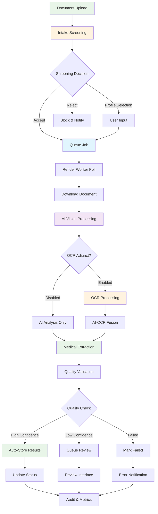

# Processing Pipeline Architecture

**Purpose:** End-to-end AI-first multimodal document processing workflow  
**Status:** Infrastructure Ready - Preparing for implementation  
**Last updated:** August 18, 2025

---

## **Overview**

The Processing Pipeline orchestrates Guardian's complete document processing workflow, from intake screening through AI-first extraction to final storage. Built on PostgreSQL job queues with Render.com workers, it provides scalable, reliable, and cost-effective medical document processing.

## **Pipeline Architecture**

### **Complete Processing Flow**


### **System Components**
```typescript
interface PipelineComponents {
  // Core infrastructure
  jobQueue: 'PostgreSQL with RPC functions';
  workers: 'Node.js TypeScript on Render.com';
  coordination: 'Database-driven job polling';
  
  // Processing engines
  intakeScreening: 'Supabase Edge Functions';
  aiProcessing: 'Multi-provider (GPT-4o Mini, Azure OpenAI, Document AI)';
  ocrAdjunct: 'Google Cloud Vision (optional)';
  
  // Data storage
  rawStorage: 'Supabase Storage (medical-docs bucket)';
  resultStorage: 'PostgreSQL with structured schemas';
  auditStorage: 'Immutable audit log tables';
  
  // Observability
  monitoring: 'Structured logging with correlation IDs';
  metrics: 'Real-time cost and performance tracking';
  alerting: 'Slack/email notifications for failures';
}
```

## 📋 **Job Queue Architecture**

### **PostgreSQL-Based Queue System**
```sql
-- Core job queue table
CREATE TABLE job_queue (
  id UUID PRIMARY KEY DEFAULT gen_random_uuid(),
  type job_type_enum NOT NULL,
  payload JSONB NOT NULL,
  priority INTEGER DEFAULT 1,
  
  -- Scheduling
  scheduled_for TIMESTAMP WITH TIME ZONE DEFAULT NOW(),
  claimed_at TIMESTAMP WITH TIME ZONE,
  started_at TIMESTAMP WITH TIME ZONE,
  completed_at TIMESTAMP WITH TIME ZONE,
  
  -- Status tracking
  status job_status_enum DEFAULT 'pending',
  retry_count INTEGER DEFAULT 0,
  max_retries INTEGER DEFAULT 3,
  
  -- Worker management
  worker_id TEXT,
  last_heartbeat TIMESTAMP WITH TIME ZONE,
  timeout_at TIMESTAMP WITH TIME ZONE,
  
  -- Error handling
  error_details JSONB,
  failed_at TIMESTAMP WITH TIME ZONE,
  
  -- Metadata
  created_by TEXT,
  correlation_id UUID,
  tags TEXT[],
  
  created_at TIMESTAMP WITH TIME ZONE DEFAULT NOW(),
  updated_at TIMESTAMP WITH TIME ZONE DEFAULT NOW()
);

-- Job status enum
CREATE TYPE job_status_enum AS ENUM (
  'pending',        -- Waiting to be claimed
  'claimed',        -- Claimed by worker but not started
  'running',        -- Currently being processed
  'completed',      -- Successfully completed
  'failed',         -- Failed after retries
  'cancelled',      -- Manually cancelled
  'timeout'         -- Timed out during processing
);

-- Job type enum
CREATE TYPE job_type_enum AS ENUM (
  'document_processing',    -- Main document processing
  'intake_screening',       -- Identity verification and content classification
  'quality_review',         -- Human review tasks
  'audit_cleanup',          -- Maintenance tasks
  'cost_reporting',         -- Usage and cost analytics
  'user_notification'       -- User communication
);

-- Indexes for performance
CREATE INDEX idx_job_queue_status_priority ON job_queue(status, priority DESC, scheduled_for);
CREATE INDEX idx_job_queue_worker ON job_queue(worker_id, status);
CREATE INDEX idx_job_queue_correlation ON job_queue(correlation_id);
CREATE INDEX idx_job_queue_timeout ON job_queue(timeout_at) WHERE status IN ('claimed', 'running');
```

### **Queue Management Functions**
```sql
-- Enqueue a new job
CREATE OR REPLACE FUNCTION enqueue_job(
  p_type job_type_enum,
  p_payload JSONB,
  p_priority INTEGER DEFAULT 1,
  p_scheduled_for TIMESTAMP WITH TIME ZONE DEFAULT NOW(),
  p_max_retries INTEGER DEFAULT 3,
  p_correlation_id UUID DEFAULT NULL,
  p_tags TEXT[] DEFAULT NULL
) RETURNS UUID AS $$
DECLARE
  job_id UUID;
BEGIN
  INSERT INTO job_queue (
    type, payload, priority, scheduled_for, max_retries, 
    correlation_id, tags, created_by
  ) VALUES (
    p_type, p_payload, p_priority, p_scheduled_for, p_max_retries,
    COALESCE(p_correlation_id, gen_random_uuid()), p_tags, 'system'
  ) RETURNING id INTO job_id;
  
  RETURN job_id;
END;
$$ LANGUAGE plpgsql SECURITY DEFINER;

-- Claim next available job
CREATE OR REPLACE FUNCTION claim_next_job(
  p_worker_id TEXT,
  p_job_types job_type_enum[] DEFAULT NULL,
  p_timeout_minutes INTEGER DEFAULT 30
) RETURNS TABLE(
  job_id UUID,
  job_type job_type_enum,
  payload JSONB,
  correlation_id UUID,
  retry_count INTEGER
) AS $$
DECLARE
  claimed_job_id UUID;
  timeout_time TIMESTAMP WITH TIME ZONE;
BEGIN
  -- Calculate timeout
  timeout_time := NOW() + (p_timeout_minutes || ' minutes')::INTERVAL;
  
  -- Claim next available job with advisory lock
  UPDATE job_queue 
  SET 
    status = 'claimed',
    claimed_at = NOW(),
    worker_id = p_worker_id,
    timeout_at = timeout_time,
    last_heartbeat = NOW()
  WHERE id = (
    SELECT jq.id
    FROM job_queue jq
    WHERE jq.status = 'pending'
      AND jq.scheduled_for <= NOW()
      AND (p_job_types IS NULL OR jq.type = ANY(p_job_types))
      AND pg_try_advisory_xact_lock(hashtext(jq.id::TEXT))
    ORDER BY jq.priority DESC, jq.scheduled_for ASC
    LIMIT 1
    FOR UPDATE SKIP LOCKED
  )
  RETURNING id INTO claimed_job_id;
  
  -- Return job details if claimed
  IF claimed_job_id IS NOT NULL THEN
    RETURN QUERY
    SELECT 
      jq.id, jq.type, jq.payload, jq.correlation_id, jq.retry_count
    FROM job_queue jq 
    WHERE jq.id = claimed_job_id;
  END IF;
END;
$$ LANGUAGE plpgsql SECURITY DEFINER;

-- Update job status
CREATE OR REPLACE FUNCTION update_job_status(
  p_job_id UUID,
  p_status job_status_enum,
  p_worker_id TEXT,
  p_error_details JSONB DEFAULT NULL,
  p_result_data JSONB DEFAULT NULL
) RETURNS BOOLEAN AS $$
DECLARE
  current_status job_status_enum;
  current_worker TEXT;
BEGIN
  -- Verify worker owns this job
  SELECT status, worker_id INTO current_status, current_worker
  FROM job_queue WHERE id = p_job_id;
  
  IF NOT FOUND THEN
    RAISE EXCEPTION 'Job not found: %', p_job_id;
  END IF;
  
  IF current_worker != p_worker_id THEN
    RAISE EXCEPTION 'Job owned by different worker: % vs %', current_worker, p_worker_id;
  END IF;
  
  -- Update status based on target status
  CASE p_status
    WHEN 'running' THEN
      UPDATE job_queue SET
        status = 'running',
        started_at = NOW(),
        last_heartbeat = NOW()
      WHERE id = p_job_id AND status = 'claimed';
      
    WHEN 'completed' THEN
      UPDATE job_queue SET
        status = 'completed',
        completed_at = NOW(),
        last_heartbeat = NOW()
      WHERE id = p_job_id AND status = 'running';
      
      -- Store result data if provided
      IF p_result_data IS NOT NULL THEN
        INSERT INTO job_results (job_id, result_data, created_at)
        VALUES (p_job_id, p_result_data, NOW());
      END IF;
      
    WHEN 'failed' THEN
      UPDATE job_queue SET
        status = 'failed',
        failed_at = NOW(),
        error_details = p_error_details,
        last_heartbeat = NOW()
      WHERE id = p_job_id AND status IN ('claimed', 'running');
      
    ELSE
      RAISE EXCEPTION 'Invalid status transition: %', p_status;
  END CASE;
  
  RETURN FOUND;
END;
$$ LANGUAGE plpgsql SECURITY DEFINER;

-- Heartbeat function to prevent timeouts
CREATE OR REPLACE FUNCTION update_job_heartbeat(
  p_job_id UUID,
  p_worker_id TEXT
) RETURNS BOOLEAN AS $$
BEGIN
  UPDATE job_queue 
  SET last_heartbeat = NOW()
  WHERE id = p_job_id 
    AND worker_id = p_worker_id 
    AND status IN ('claimed', 'running');
    
  RETURN FOUND;
END;
$$ LANGUAGE plpgsql SECURITY DEFINER;
```

## 🔄 **Render Worker Architecture**

### **Worker Implementation**
```typescript
// Worker main class
class DocumentProcessingWorker {
  private workerId: string;
  private supabase: SupabaseClient;
  private aiProvider: AIProvider;
  private ocrProvider: OCRProvider;
  private config: WorkerConfig;
  private isRunning: boolean = false;
  private currentJob: JobInfo | null = null;

  constructor(config: WorkerConfig) {
    this.workerId = `worker-${os.hostname()}-${process.pid}`;
    this.config = config;
    this.supabase = createSupabaseClient(config.supabase);
    this.aiProvider = new MultiProviderAI(config.aiProviders);
    this.ocrProvider = new GoogleVisionProvider(config.googleVision);
  }

  async start(): Promise<void> {
    console.log(`🚀 Starting document processing worker: ${this.workerId}`);
    
    this.isRunning = true;
    
    // Set up graceful shutdown
    process.on('SIGTERM', () => this.gracefulShutdown());
    process.on('SIGINT', () => this.gracefulShutdown());
    
    // Start main processing loop
    while (this.isRunning) {
      try {
        await this.processNextJob();
        
        // Short pause between job polling
        await this.sleep(this.config.pollIntervalMs || 1000);
        
      } catch (error) {
        console.error('Worker error:', error);
        
        // Longer pause on errors to prevent tight error loops
        await this.sleep(5000);
      }
    }
    
    console.log(`✅ Worker stopped: ${this.workerId}`);
  }

  private async processNextJob(): Promise<void> {
    // Claim next available job
    const { data: jobs } = await this.supabase.rpc('claim_next_job', {
      p_worker_id: this.workerId,
      p_job_types: ['document_processing'],
      p_timeout_minutes: 30
    });

    if (!jobs || jobs.length === 0) {
      return; // No jobs available
    }

    const job = jobs[0];
    this.currentJob = job;
    
    const correlationId = job.correlation_id;
    
    console.log(`📋 Processing job ${job.job_id} (correlation: ${correlationId})`);
    
    try {
      // Update status to running
      await this.updateJobStatus(job.job_id, 'running');
      
      // Process the document
      const result = await this.processDocument(job.payload, correlationId);
      
      // Mark as completed
      await this.updateJobStatus(job.job_id, 'completed', null, result);
      
      console.log(`✅ Completed job ${job.job_id}`);
      
    } catch (error) {
      console.error(`❌ Job ${job.job_id} failed:`, error);
      
      // Handle retry logic
      await this.handleJobFailure(job, error);
      
    } finally {
      this.currentJob = null;
    }
  }

  private async processDocument(
    payload: DocumentJobPayload,
    correlationId: string
  ): Promise<ProcessingResult> {
    
    const { document_id, patient_id, file_path, processing_options } = payload;
    
    // Start heartbeat to prevent timeout
    const heartbeatInterval = setInterval(async () => {
      if (this.currentJob) {
        await this.updateHeartbeat(this.currentJob.job_id);
      }
    }, 30000); // Every 30 seconds

    try {
      // Step 1: Download document from storage
      console.log(`📥 Downloading document: ${file_path}`);
      const documentBuffer = await this.downloadDocument(file_path);
      
      // Step 2: Determine processing strategy
      const strategy = await this.selectProcessingStrategy(
        documentBuffer, 
        processing_options
      );
      
      console.log(`🎯 Using processing strategy: ${strategy}`);
      
      // Step 3: Execute AI-first processing
      const aiResult = await this.executeAIProcessing(
        documentBuffer, 
        file_path, 
        strategy,
        correlationId
      );
      
      // Step 4: Optional OCR adjunct processing
      let ocrResult: OCRResult | null = null;
      if (strategy.useOCRAdjunct) {
        ocrResult = await this.executeOCRProcessing(
          documentBuffer,
          strategy.ocrStrategy,
          correlationId
        );
      }
      
      // Step 5: Fusion and validation
      const fusedResult = await this.fuseResults(aiResult, ocrResult, strategy);
      
      // Step 6: Quality validation
      const validatedResult = await this.validateQuality(fusedResult);
      
      // Step 7: Store results in database
      await this.storeProcessingResults(
        document_id,
        patient_id,
        validatedResult,
        correlationId
      );
      
      // Step 8: Update document status
      await this.updateDocumentStatus(document_id, validatedResult);
      
      // Step 9: Audit logging
      await this.logProcessingAudit(document_id, validatedResult, correlationId);
      
      return {
        success: true,
        document_id,
        processing_method: strategy.name,
        overall_confidence: validatedResult.overallConfidence,
        entities_extracted: this.countExtractedEntities(validatedResult),
        processing_time_ms: Date.now() - strategy.startTime,
        cost_cents: this.calculateTotalCost(aiResult, ocrResult),
        review_required: validatedResult.reviewRequired
      };

    } finally {
      clearInterval(heartbeatInterval);
    }
  }

  private async selectProcessingStrategy(
    documentBuffer: Buffer,
    options: ProcessingOptions
  ): Promise<ProcessingStrategy> {
    
    // Analyze document characteristics
    const characteristics = await this.analyzeDocument(documentBuffer);
    
    // Check user preferences and budget
    const budget = await this.checkProcessingBudget(options.patient_id);
    
    // Select optimal strategy
    const strategySelector = new ProcessingStrategySelector();
    const strategy = await strategySelector.selectStrategy({
      characteristics,
      budget,
      userPreferences: options.preferences,
      documentType: options.document_type
    });
    
    strategy.startTime = Date.now();
    return strategy;
  }

  private async executeAIProcessing(
    documentBuffer: Buffer,
    filePath: string,
    strategy: ProcessingStrategy,
    correlationId: string
  ): Promise<AIExtractionResult> {
    
    const provider = strategy.aiProvider || 'gpt4o-mini';
    
    console.log(`🤖 Running AI extraction with ${provider}`);
    
    const result = await this.aiProvider.extractMedicalData({
      documentBuffer,
      filePath,
      provider,
      processingHints: strategy.aiHints,
      correlationId
    });
    
    // Log cost and performance
    await this.logProcessingMetrics({
      type: 'ai_processing',
      provider,
      cost: result.cost,
      latency: result.processingTime,
      confidence: result.overallConfidence,
      correlationId
    });
    
    return result;
  }

  private async executeOCRProcessing(
    documentBuffer: Buffer,
    ocrStrategy: OCRStrategy,
    correlationId: string
  ): Promise<OCRResult> {
    
    console.log(`👁️ Running OCR adjunct processing`);
    
    const result = await this.ocrProvider.extractText(documentBuffer, {
      strategy: ocrStrategy,
      correlationId
    });
    
    // Log cost and performance
    await this.logProcessingMetrics({
      type: 'ocr_processing',
      provider: 'google-cloud-vision',
      cost: result.cost,
      latency: result.processingTime,
      confidence: result.confidence,
      correlationId
    });
    
    return result;
  }

  private async handleJobFailure(
    job: JobInfo,
    error: Error
  ): Promise<void> {
    
    const isRetryable = this.isRetryableError(error);
    const canRetry = job.retry_count < this.config.maxRetries;
    
    if (isRetryable && canRetry) {
      // Schedule retry with exponential backoff
      const retryDelay = Math.min(
        this.config.baseRetryDelay * Math.pow(2, job.retry_count),
        this.config.maxRetryDelay
      );
      
      const scheduledFor = new Date(Date.now() + retryDelay);
      
      await this.supabase.rpc('retry_job', {
        p_job_id: job.job_id,
        p_worker_id: this.workerId,
        p_scheduled_for: scheduledFor.toISOString(),
        p_error_details: {
          error: error.message,
          retry_count: job.retry_count + 1,
          retryable: true
        }
      });
      
      console.log(`🔄 Scheduled retry ${job.retry_count + 1} for job ${job.job_id} in ${retryDelay}ms`);
      
    } else {
      // Mark as permanently failed
      await this.updateJobStatus(job.job_id, 'failed', {
        error: error.message,
        stack: error.stack,
        final_retry_count: job.retry_count,
        retryable: isRetryable,
        reason: canRetry ? 'non_retryable_error' : 'max_retries_exceeded'
      });
      
      // Send failure notification
      await this.sendFailureNotification(job, error);
    }
  }

  private async gracefulShutdown(): Promise<void> {
    console.log(`🛑 Graceful shutdown initiated for worker: ${this.workerId}`);
    
    this.isRunning = false;
    
    // If currently processing a job, allow it to complete
    if (this.currentJob) {
      console.log(`⏳ Waiting for current job ${this.currentJob.job_id} to complete...`);
      
      // Wait up to 5 minutes for current job to complete
      const maxWaitTime = 5 * 60 * 1000; // 5 minutes
      const startTime = Date.now();
      
      while (this.currentJob && (Date.now() - startTime) < maxWaitTime) {
        await this.sleep(1000);
      }
      
      // If job still running after wait time, mark as cancelled
      if (this.currentJob) {
        console.log(`⚠️ Force cancelling job ${this.currentJob.job_id} due to shutdown`);
        
        await this.updateJobStatus(this.currentJob.job_id, 'cancelled', {
          reason: 'worker_shutdown',
          worker_id: this.workerId
        });
      }
    }
  }
}
```

## 📊 **Monitoring & Observability**

### **Metrics Collection**
```typescript
interface PipelineMetrics {
  // Queue metrics
  queueDepth: number;              // Jobs waiting to be processed
  avgQueueTime: number;            // Average time jobs spend in queue
  jobsPerHour: number;            // Processing throughput
  
  // Processing metrics
  avgProcessingTime: number;       // Average end-to-end processing time
  aiProcessingTime: number;        // AI extraction time
  ocrProcessingTime: number;       // OCR processing time (when used)
  
  // Quality metrics
  autoApprovalRate: number;        // % of jobs completing without review
  avgConfidenceScore: number;      // Average extraction confidence
  errorRate: number;               // % of jobs failing
  retryRate: number;               // % of jobs requiring retries
  
  // Cost metrics
  avgCostPerDocument: number;      // Average processing cost
  aiCostPerDocument: number;       // AI processing cost
  ocrCostPerDocument: number;      // OCR processing cost (when used)
  dailyProcessingCost: number;     // Total daily spending
  
  // Worker metrics
  activeWorkers: number;           // Number of active workers
  workerUtilization: number;       // % of time workers are busy
  avgJobsPerWorker: number;        // Jobs processed per worker
}

class MetricsCollector {
  async collectPipelineMetrics(): Promise<PipelineMetrics> {
    const [queueMetrics, processingMetrics, costMetrics, workerMetrics] = 
      await Promise.all([
        this.collectQueueMetrics(),
        this.collectProcessingMetrics(),
        this.collectCostMetrics(),
        this.collectWorkerMetrics()
      ]);
    
    return {
      ...queueMetrics,
      ...processingMetrics,
      ...costMetrics,
      ...workerMetrics
    };
  }

  private async collectQueueMetrics(): Promise<Partial<PipelineMetrics>> {
    const { data } = await this.supabase.rpc('get_queue_metrics');
    
    return {
      queueDepth: data.pending_jobs,
      avgQueueTime: data.avg_queue_time_minutes * 60 * 1000, // Convert to ms
      jobsPerHour: data.jobs_completed_last_hour
    };
  }
}
```

### **Real-time Alerting**
```typescript
class AlertingSystem {
  async checkAlertConditions(): Promise<void> {
    const metrics = await this.metricsCollector.collectPipelineMetrics();
    
    // Queue depth alerts
    if (metrics.queueDepth > 100) {
      await this.sendAlert({
        type: 'queue_depth_high',
        severity: 'warning',
        message: `Queue depth is ${metrics.queueDepth} jobs`,
        threshold: 100,
        current: metrics.queueDepth
      });
    }
    
    // Error rate alerts
    if (metrics.errorRate > 0.05) { // 5%
      await this.sendAlert({
        type: 'error_rate_high',
        severity: 'critical',
        message: `Error rate is ${(metrics.errorRate * 100).toFixed(1)}%`,
        threshold: 5,
        current: metrics.errorRate * 100
      });
    }
    
    // Cost alerts
    if (metrics.dailyProcessingCost > this.config.dailyCostLimit) {
      await this.sendAlert({
        type: 'daily_cost_exceeded',
        severity: 'warning',
        message: `Daily cost $${metrics.dailyProcessingCost.toFixed(2)} exceeds limit $${this.config.dailyCostLimit}`,
        threshold: this.config.dailyCostLimit,
        current: metrics.dailyProcessingCost
      });
    }
    
    // Worker availability alerts
    if (metrics.activeWorkers === 0) {
      await this.sendAlert({
        type: 'no_active_workers',
        severity: 'critical',
        message: 'No active workers available for processing',
        threshold: 1,
        current: 0
      });
    }
  }

  private async sendAlert(alert: AlertInfo): Promise<void> {
    // Send to multiple channels
    await Promise.all([
      this.sendSlackAlert(alert),
      this.sendEmailAlert(alert),
      this.logAlert(alert)
    ]);
  }
}
```

---

## 🔒 **Security & Compliance**

### **Data Protection**
- **Encryption**: All data encrypted in transit and at rest
- **Access Control**: Workers use service accounts with minimal permissions
- **Audit Trails**: Complete logging of all processing activities
- **PHI Handling**: No PHI in logs, structured data redaction

### **Compliance Framework**
- **HIPAA**: Business Associate Agreements with all AI providers
- **Australian Privacy Act**: Data minimization and consent management
- **Audit Requirements**: Immutable audit logs for regulatory review

---

## 🧪 **Testing Strategy**

### **Pipeline Testing**
1. **End-to-End Tests**: Complete document upload to completion flow
2. **Load Testing**: High-volume processing under stress
3. **Failure Testing**: Worker failures, service outages, network issues
4. **Cost Testing**: Verify cost calculations and budget controls
5. **Security Testing**: Data protection and access control validation

### **Performance Targets**
- **Throughput**: 1,000+ documents per hour
- **Latency**: <2 minutes end-to-end processing
- **Reliability**: 99.9% successful processing rate
- **Cost Efficiency**: <$35 per 1,000 documents all-inclusive

---

*For detailed implementation specifications, see component documentation:*
- *[Queue Management](./queue-management.md)*
- *[Worker Architecture](./worker-architecture.md)*  
- *[Monitoring & Observability](./monitoring-observability.md)*