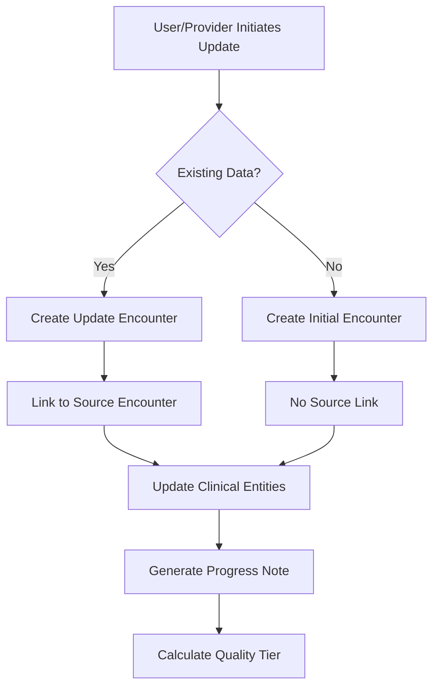
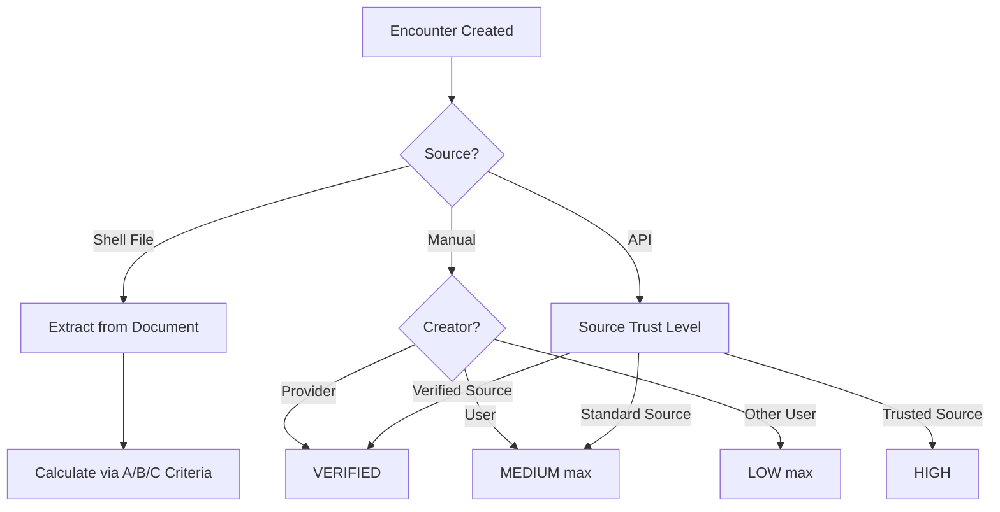
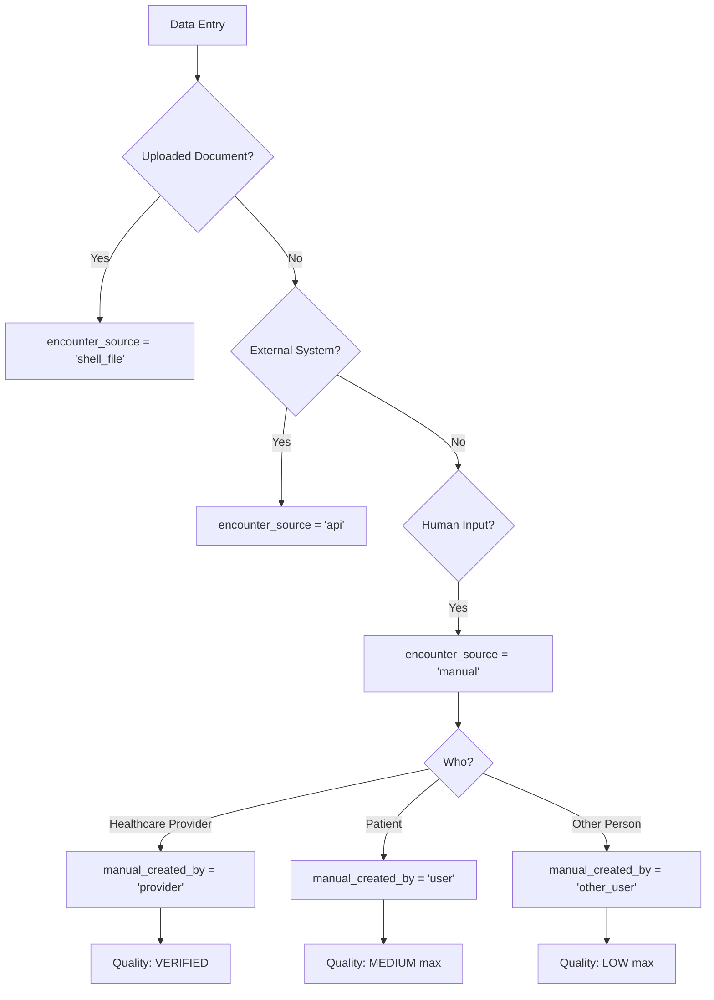

# Unified Encounter Sources Architecture

**Date:** November 17, 2024
**Status:** System Architecture Specification
**Scope:** All Encounter Creation Pathways

## 1. Executive Summary

This document defines the unified architecture for all pathways through which healthcare encounters enter the Exora system. Every piece of health data in Exora originates from an encounter, whether that encounter comes from a document upload, manual entry, or API transfer. This architecture ensures consistency, auditability, and quality tracking across all data sources.

### Core Principles

1. **Everything is an Encounter**: All health data flows through the encounter model
2. **Immutable Source Layer**: Original encounters are never modified, only supplemented
3. **Clear Source Hierarchy**: Three primary sources (shell_file, manual, api) with subtypes
4. **Quality Inheritance**: Clinical entities inherit quality from their source encounters
5. **Complete Audit Trail**: Every change creates a traceable record

### Key Innovation: Manual Updates as Encounters

Rather than creating a separate edit/update system, all manual changes create new encounters that reference and supplement existing data. This unifies the architecture and maintains consistency.

## 2. Encounter Source Taxonomy

### 2.1 Primary Classification

Every encounter MUST have exactly one source:

```sql
encounter_source ENUM('shell_file', 'manual', 'api')
```

### 2.2 Source-Specific Subtypes

#### Shell File Encounters (Traditional Document Uploads)

```sql
-- Existing classification
is_real_world_visit boolean  -- TRUE: clinical visit, FALSE: pseudo-encounter

-- Examples:
-- Real visit: Discharge summary, consultation letter
-- Pseudo: Medication list, admin summary 
```

#### Manual Encounters (Human Input)

```sql
manual_created_by ENUM('provider', 'user', 'other_user')
manual_action_type ENUM('create', 'update', 'confirm')

-- Examples:
-- Provider update: Doctor adjusts medication dose
-- User confirm: Patient confirms still taking medication
-- Other user create: Spouse adds allergy information
```

#### API Encounters (System-to-System)

```sql
api_source_org_id uuid  -- References registered_api_sources
api_transfer_type ENUM('bulk_import', 'single_record', 'subscription_update')

-- Examples:
-- Bulk import: MyHealth Record full history
-- Single record: Lab result push
-- Subscription: Regular pharmacy updates
```

## 3. Manual Encounter Architecture

### 3.1 Conceptual Model

Manual encounters represent healthcare data entry or modification by humans through the Exora interface. They serve dual purposes:

1. **Create new data** when no prior record exists
2. **Update existing data** by creating supplementary 'manual session' encounters

### 3.2 Manual Encounter Lifecycle



### 3.3 Session-Based Updates

Manual updates within a time window are batched into a single encounter:

```typescript
interface ManualUpdateSession {
  session_id: string;
  started_at: timestamp;
  completed_at: timestamp;

  // All changes in this session
  updates: Array<{
    entity_type: 'medication' | 'allergy' | 'condition';
    entity_id?: string;      // NULL for new entities
    action: 'create' | 'update' | 'confirm' | 'discontinue';
    previous_value?: any;
    new_value: any;
    timestamp: timestamp;
  }>;

  // Generated encounter
  encounter_id: string;

  // Auto-generated documentation
  progress_note_generated: boolean;
  progress_note_content?: string;
}
```

### 3.4 Progress Note Generation

Every manual encounter generates a structured progress note of what was changed during that session, by the provider or by a user:

```markdown
## Clinical Review - Dr. Sarah Johnson
Date: November 17, 2024
Type: Remote Record Review
Duration: 5 minutes

### Medications Updated:
- Aspirin: Dose increased from 100mg to 150mg daily
  Reason: Per cardiology recommendations
- Metformin: Confirmed still taking 500mg BD
- Atorvastatin: Discontinued
  Reason: Patient stopped 2 weeks ago due to muscle pain

### New Entries:
- Allergy added: Penicillin (reaction: rash)

### Provider Notes:
"Reviewed current medications with patient via secure message.
Adjusted aspirin per recent cardiology consultation. Patient
reports good adherence to diabetes medications."

### Next Steps:
- Monitor for bleeding with increased aspirin dose
- Discuss statin alternatives at next visit
```

### 3.5 Quality Tier Assignment

Manual encounters receive quality tiers based on creator:

| Creator | Maximum Quality | Conditions | Attribution Display |
|---------|----------------|------------|---------------------|
| Provider (registered) | VERIFIED | Must have valid NPI/AHPRA | "Verified by Registered Healthcare Provider - Dr. [Name], [Date]" |
| User (patient) | MEDIUM | Only able to tick criteria A of the data-quality grade logic criteria | "Updated by you, [Date]" |
| Other user | LOW/MEDIUM | If granted full write permission status by the auth user | "Updated by [relationship], [Date]" |

**Note:** VERIFIED tier is visible to both patients and providers to encourage network-building. Patients are prompted to request their healthcare providers verify their Exora records, creating engagement and trust.

## 4. API Integration Framework

### 4.1 Registered API Sources

```sql
CREATE TABLE registered_api_sources (
  id uuid PRIMARY KEY,
  organization_name text NOT NULL,
  organization_type varchar(50), -- 'government', 'hospital', 'pharmacy', 'lab'

  -- Technical details
  api_endpoint text,
  api_version varchar(20),
  authentication_method varchar(50),

  -- Trust and quality
  trust_level varchar(20) DEFAULT 'standard', -- 'verified', 'trusted', 'standard'
  data_quality_tier varchar(20) DEFAULT 'HIGH', -- Default tier for this source

  -- Operational
  active boolean DEFAULT true,
  last_sync timestamp,
  sync_frequency interval,

  -- Audit
  created_at timestamp DEFAULT CURRENT_TIMESTAMP,
  approved_by uuid REFERENCES user_profiles(id),
  approval_date timestamp
);
```

### 4.2 API Encounter Creation

API transfers create encounters with full provenance:

```sql
-- API-specific fields in healthcare_encounters
api_source_org_id uuid REFERENCES registered_api_sources(id),
api_transfer_id varchar(100),     -- Their reference number
api_transfer_timestamp timestamp, -- When they sent it
api_payload_hash varchar(64),     -- For duplicate detection
api_processing_log jsonb,         -- Processing details
```

### 4.3 API Data Flow

```
External System → API Gateway → Validation → Encounter Creation → Clinical Entities
                                     ↓
                              Duplicate Check
                                     ↓
                              Quality Assignment
```

## 5. AI-Assisted Updates

AI assistance is designed to empower and streamline user interactions without removing human oversight. Ideally, the AI acts as an extension of the user—executing actions they authorize, but never operating without clear user consent. To mitigate risks of erroneous or inappropriate edits, strict safety mechanisms must be in place: for example, a "two-step confirmation" process. Here, any AI-initiated modification to a core clinical entity category (such as allergies or medications) requires explicit user approval before each table is updated. So, if updates span five tables, users would complete five separate approve-then-apply cycles.

Any manual update to a user's health data - whether initiated by the user themselves or AI-assisted - will be capped at a maximum data quality grade of 'MEDIUM.' Additionally, a 'manually altered by user' indicator could be designed and implemented to complement the 'MEDIUM' quality tag for further transparency. To elevate the data quality tier to 'HIGH,' users must either provide supporting documents or have a healthcare provider formally verify the changes.


### 5.1 AI Interaction Model

AI assistance enhances but doesn't replace human decisions:

```sql
-- AI tracking fields (can apply to any encounter source)
ai_assisted boolean DEFAULT false,
ai_model_used varchar(100),          -- 'claude-3.5-sonnet', 'gpt-4'
ai_confidence_score numeric(3,2),    -- 0.00 to 1.00
ai_action_type varchar(50),          -- 'direct_confirm', 'guided_update', 'suggested'
ai_conversation_id text,             -- Link to chat transcript
```

### 5.2 AI Capability Matrix

| Action | Allowed | Conditions |
|--------|---------|------------|
| Confirm existing data | ✓ | User must explicitly agree |
| Update simple fields | ✓ | Dose, frequency only |
| Discontinue medication | ✓ | With user confirmation |
| Create new conditions | ✗ | Too risky |
| Delete any data | ✗ | Audit trail must persist |
| Make diagnoses | ✗ | Clinical decisions prohibited |

### 5.3 AI Audit Trail

```sql
CREATE TABLE ai_interaction_audit (
  id uuid PRIMARY KEY,
  encounter_id uuid REFERENCES healthcare_encounters(id),

  -- Conversation context
  ai_prompt text NOT NULL,
  user_response text NOT NULL,
  ai_interpretation jsonb,

  -- Action taken
  action_proposed text,
  action_confirmed boolean,
  action_executed boolean,

  -- Safety checks
  safety_checks_passed jsonb,
  risk_score numeric(3,2),

  created_at timestamp DEFAULT CURRENT_TIMESTAMP
);
```

### 5.4 Example AI Flows

#### Simple Confirmation
```
AI: "I see you have Aspirin 100mg daily in your medications. Are you still taking this?"
User: "Yes"
AI: [Creates manual encounter with action='confirm', ai_assisted=true]
"✓ Confirmed Aspirin 100mg daily - still taking"
```

#### Guided Update
```
AI: "You mentioned your doctor increased your blood pressure medication.
     What's the new dose of Lisinopril?"
User: "20mg now instead of 10mg"
AI: [Creates manual encounter with action='update', shows changes]
"I'll update Lisinopril from 10mg to 20mg daily. Is this correct?"
User: "Yes"
AI: "Updated successfully"
```

## 6. Database Schema

### 6.1 Core Encounter Extensions

```sql
ALTER TABLE healthcare_encounters ADD COLUMN
  -- Primary source classification
  encounter_source varchar(20) NOT NULL DEFAULT 'shell_file'
    CHECK (encounter_source IN ('shell_file', 'manual', 'api')),

  -- Source encounter linkage (for updates)
  source_encounter_id uuid REFERENCES healthcare_encounters(id),

  -- Manual encounter fields
  manual_created_by varchar(20)
    CHECK (manual_created_by IN ('provider', 'user', 'other_user')),
  manual_action_type varchar(20)
    CHECK (manual_action_type IN ('create', 'update', 'confirm')),
  manual_session_id uuid,  -- Groups updates in same session

  -- Creator tracking (universal)
  created_by_user_id uuid NOT NULL REFERENCES auth.users(id),
  created_by_permission_id uuid, -- Future: REFERENCES user_permissions(id)

  -- Provider details (if applicable)
  provider_user_id uuid REFERENCES user_profiles(id),
  provider_npi varchar(20),
  provider_verified boolean DEFAULT false,

  -- API fields
  api_source_org_id uuid REFERENCES registered_api_sources(id),
  api_transfer_id varchar(100),
  api_transfer_timestamp timestamp,

  -- AI assistance
  ai_assisted boolean DEFAULT false,
  ai_model_used varchar(100),
  ai_confidence_score numeric(3,2),
  ai_conversation_id text,

  -- Progress note (for manual encounters)
  progress_note_generated boolean DEFAULT false,
  progress_note_id uuid, -- REFERENCES generated_progress_notes(id)

  -- Quality and validation
  data_quality_tier varchar(20),  -- Inherited or calculated
  requires_review boolean DEFAULT false,
  reviewed_by uuid REFERENCES user_profiles(id),
  reviewed_at timestamp
);

-- Indexes for performance
CREATE INDEX idx_encounters_source ON healthcare_encounters(encounter_source);
CREATE INDEX idx_encounters_manual_creator ON healthcare_encounters(manual_created_by)
  WHERE encounter_source = 'manual';
CREATE INDEX idx_encounters_api_source ON healthcare_encounters(api_source_org_id)
  WHERE encounter_source = 'api';
CREATE INDEX idx_encounters_ai_assisted ON healthcare_encounters(ai_assisted)
  WHERE ai_assisted = true;
```

### 6.2 Supporting Tables

#### Manual Update Sessions

```sql
CREATE TABLE manual_update_sessions (
  id uuid PRIMARY KEY DEFAULT gen_random_uuid(),

  -- Session metadata
  started_at timestamp NOT NULL DEFAULT CURRENT_TIMESTAMP,
  completed_at timestamp,
  session_duration_seconds integer,

  -- Creator
  created_by_user_id uuid NOT NULL REFERENCES auth.users(id),
  created_by_role varchar(20) NOT NULL,

  -- Resulting encounter
  encounter_id uuid REFERENCES healthcare_encounters(id),

  -- Statistics
  entities_created integer DEFAULT 0,
  entities_updated integer DEFAULT 0,
  entities_confirmed integer DEFAULT 0,

  -- AI involvement
  ai_assisted boolean DEFAULT false,
  ai_suggestions_accepted integer,
  ai_suggestions_rejected integer
);
```

#### Generated Progress Notes

```sql
CREATE TABLE generated_progress_notes (
  id uuid PRIMARY KEY DEFAULT gen_random_uuid(),
  encounter_id uuid NOT NULL REFERENCES healthcare_encounters(id),

  -- Content
  note_content text NOT NULL,
  note_format varchar(20) DEFAULT 'markdown', -- 'markdown', 'plain', 'html'

  -- Metadata
  generated_at timestamp DEFAULT CURRENT_TIMESTAMP,
  generation_method varchar(50), -- 'template', 'ai_assisted', 'manual'

  -- Storage as document
  stored_as_file boolean DEFAULT false,
  shell_file_id uuid REFERENCES shell_files(id),

  -- Visibility
  visible_to_patient boolean DEFAULT true,
  visible_to_providers boolean DEFAULT true
);
```

### 6.3 Future Shareability Integration

Designed for future permissions system:

```sql
-- Placeholder for future shareability/permissions
-- created_by_permission_id will reference:

-- FUTURE TABLE (not part of Strategy A)
CREATE TABLE user_permissions (
  id uuid PRIMARY KEY,
  granting_user_id uuid,        -- Who gave permission
  granted_to_user_id uuid,      -- Who received permission
  relationship_type varchar(50), -- 'spouse', 'parent', 'caregiver'
  permission_level varchar(20),  -- 'read', 'write', 'admin'
  -- More fields as needed
);

-- This allows us to track:
-- 1. Who made the update (created_by_user_id)
-- 2. Under what permission (created_by_permission_id)
-- 3. What their relationship is (via join to future permissions table)
```

## 7. Quality Tier Inheritance

### 7.1 Quality Assignment Rules



### 7.2 Clinical Entity Quality Inheritance

```sql
-- Clinical entities inherit quality from their source encounter
UPDATE clinical_medications
SET data_quality_tier = (
  SELECT data_quality_tier
  FROM healthcare_encounters
  WHERE id = clinical_medications.source_encounter_id
);

-- But manual confirmation can upgrade
UPDATE clinical_medications
SET data_quality_tier = 'VERIFIED'
WHERE id = ?
  AND confirmed_by_provider_id IS NOT NULL;
```

## 8. Implementation Strategy

### 8.1 Phase 1: Foundation (Pass 0.5)
- Add encounter_source field to existing encounters
- Support basic manual encounters (no AI)
- Implement quality tier inheritance

### 8.2 Phase 2: Manual Updates
- Full manual encounter creation
- Progress note generation
- Session management
- Provider verification system

### 8.3 Phase 3: API Integration
- Registered API sources table
- API encounter creation pipeline
- Duplicate detection
- Bulk import handling

### 8.4 Phase 4: AI Enhancement
- AI interaction audit table
- Confidence scoring
- Safety checks
- Guided update flows

## 9. User Experience

### 9.1 Timeline Display

Encounters appear differently based on source:

```typescript
function getTimelineDisplay(encounter: Encounter) {
  switch(encounter.encounter_source) {
    case 'shell_file':
      if (encounter.is_real_world_visit) {
        return {
          icon: '🏥',
          title: encounter.encounter_type,
          subtitle: encounter.facility_name,
          timeline: 'primary'
        };
      } else {
        return {
          icon: '📄',
          title: 'Document',
          subtitle: encounter.document_type,
          timeline: 'secondary'
        };
      }

    case 'manual':
      if (encounter.manual_created_by === 'provider') {
        return {
          icon: '👨‍⚕️',
          title: 'Clinical Review',
          subtitle: `Dr. ${encounter.provider_name}`,
          timeline: 'primary'
        };
      } else {
        return {
          icon: '✏️',
          title: 'Updated',
          subtitle: `by ${encounter.manual_created_by}`,
          timeline: 'updates'
        };
      }

    case 'api':
      return {
        icon: '🔄',
        title: 'System Import',
        subtitle: encounter.api_source_name,
        timeline: 'primary'
      };
  }
}
```

### 9.2 Data Provenance Display

Every piece of data shows its origin with full attribution:

**Example 1: Provider-Verified Medication**
```
Aspirin 100mg daily
├─ Quality: VERIFIED ✓
│  Verified by Registered Healthcare Provider
│  Dr. Sarah Johnson (AHPRA: MED0012345)
│  Verified on November 1, 2024 during remote record review
├─ Source: Original prescription from GP visit March 15, 2024
├─ Last Updated: November 1, 2024
└─ History: 2 encounters [View all]
   ├─ March 15, 2024: Prescribed by Dr. Sarah Johnson
   └─ Nov 1, 2024: Verified by Dr. Sarah Johnson (remote review)
```

**Example 2: API-Verified Medication**
```
Atorvastatin 20mg nocte
├─ Quality: VERIFIED ✓
│  Verified by Trusted Healthcare System
│  MyHealth Record API
│  Imported on October 15, 2024
├─ Source: Prescription dispensed at Community Pharmacy
├─ Last Updated: October 15, 2024
└─ History: 1 encounter [View details]
```

**Example 3: High Quality (Not Yet Verified)**
```
Metformin 500mg BD
├─ Quality: HIGH ◆
├─ Source: Hospital Discharge Summary - Royal Melbourne Hospital
├─ Date: November 1, 2024
├─ Action: [Ask your doctor to verify this medication]
└─ History: 1 encounter [View details]
```

## 10. Audit and Compliance

### 10.1 Complete Audit Trail

Every encounter maintains:
- Who created it (user/provider/system)
- When it was created
- What it updated (if applicable)
- Why it was created (action type)
- How it was created (manual/upload/API)

### 10.2 Regulatory Compliance

The system supports:
- **HIPAA**: Complete audit logs of all data access and modifications
- **GDPR**: Clear data provenance and user consent tracking
- **Australian Privacy Act**: Appropriate consent and access controls

## 11. Technical Considerations

### 11.1 Performance Optimization

- Encounters are immutable after creation (except review flags)
- Clinical entities cache their current state
- Quality tiers are calculated once and stored
- Progress notes are generated asynchronously

### 11.2 Data Consistency

- All updates within a session are atomic
- Failed updates roll back completely
- Duplicate detection prevents double-entry
- Source encounters are never modified

### 11.3 Scalability

- Manual sessions batch updates
- API imports use bulk operations
- AI interactions are queued
- Progress notes are generated async

## 12. Security Considerations

### 12.1 Access Control

- Manual encounters require authenticated user
- Provider updates require verified provider status
- API sources require pre-registration
- AI updates require explicit user consent

### 12.2 Data Integrity

- Source encounters are immutable
- All changes create audit records
- Quality tiers cannot be artificially inflated
- AI cannot make unsupervised changes

## 13. Future Enhancements

### 13.1 Advanced AI Features
- Proactive health maintenance reminders
- Intelligent conflict detection
- Natural language updates
- Voice-based confirmations

### 13.2 Enhanced API Integration
- Real-time webhooks
- Bi-directional sync
- FHIR compliance
- HL7 message handling

### 13.3 Collaboration Features
- Multi-provider reviews
- Family member permissions
- Care team coordination
- Shared care plans

## Appendix A: Encounter Source Decision Tree



## Appendix B: Example Scenarios

### Scenario 1: Patient Updates Medication

```sql
-- User confirms still taking medication
INSERT INTO healthcare_encounters (
  encounter_source: 'manual',
  manual_created_by: 'user',
  manual_action_type: 'confirm',
  source_encounter_id: 'abc-123',  -- Original prescription
  created_by_user_id: 'user-456',
  data_quality_tier: 'MEDIUM'
);
```

### Scenario 2: Provider Reviews Records

```sql
-- Doctor updates multiple medications in one session
INSERT INTO healthcare_encounters (
  encounter_source: 'manual',
  manual_created_by: 'provider',
  manual_action_type: 'update',
  manual_session_id: 'session-789',
  provider_user_id: 'provider-012',
  provider_npi: '1234567890',
  data_quality_tier: 'VERIFIED',
  progress_note_generated: true
);
```

### Scenario 3: AI-Assisted Confirmation

```sql
-- AI helps user confirm medications
INSERT INTO healthcare_encounters (
  encounter_source: 'manual',
  manual_created_by: 'user',
  manual_action_type: 'confirm',
  created_by_user_id: 'user-456',
  ai_assisted: true,
  ai_model_used: 'claude-3.5-sonnet',
  ai_confidence_score: 0.95,
  ai_conversation_id: 'conv-345',
  data_quality_tier: 'MEDIUM'
);
```

---

**END OF SPECIFICATION**

This unified architecture ensures all health data in Exora flows through a consistent, auditable, and quality-tracked encounter system, regardless of its source.


Xavier's feedback and comments – 18th Nov 2025: 
1. As I review the unified encounter sources document, a few thoughts come to mind. First, every manual update or change - whether made by a user or provider—results in the creation of a manual encounter. There’s also the concept of a session-based manual encounter, since a user or provider might make several changes within a single session, and all these are grouped into one manual encounter. In addition to the encounter, the system creates a progress note: either a user progress note or a provider progress note. My question is whether this progress note is essentially what gets pushed into the Exora processing pipeline to generate the manual encounter with all its attached clinical entity updates and changes. This workflow makes sense to me, and it also fits with the process for AI-assisted manual updates via the in-app AI chatbot. For instance, if a user interacts with the chatbot and confirms, updates, or creates multiple health data points, that AI chat session essentially becomes a manual session progress note. At the end of the interaction—whether it lasts an hour or several hours - when the session is complete, the AI-generated summary is exported or analyzed, and a comprehensive progress note is created that includes all AI-assisted updates and confirmations that the user consented to and approved. The result is a manual encounter progress note, in a structured in an optimized digital format designed specifically for the Exora processing system, and ready to pass cleanly through modules like pass0.5, pass1, and pass2 without needing traditional file parsing or OCR. (And note that the progress note will also need to have a format structure that is presentable and user friendly for dashboard display)   --- I dont think this is truly represented and relected in the file, so read through the file and identify the parts and sections that do not align with this approach and update them, and also ensure any new sections are added that are not currently covered by this file. respond abck to me now with your plan after you have reviewed the file
2. Also, we need to include real-world clinic visit recordings as a type of input into the system. A user may want to be able to record their appointment visit with their doctor, or they may record their telehealth appointment. The audio recording and audo-transcript would then be uploaded to the app just like how a shell file is uplaoded. The app could have this visit recording feature in-app, or a recoridng file coule be uploaded. We can discuss and plan out the details later but we need to prepare for this feature too. I imagine its not complex to incorporate, all we need is for the audio to be turned into a transcript, ensure date and location (facility/provider) context info are included somehow, and then its just like any other file upload. But these healthcare encounter recordings should also have some addtional processing streams they go down, in order to display on the users app dashboard in the clinic visits sections or progress notes section or whatever it is (in a nice summarized manner rather than displaying as an ugly trasncript) - the questio here would be, do we send the summarized version or the original transcript to the ai processing pipeline (the summarized version may actually lead to better results if there are line breakd and parargraph breaks and dot points and clearly outlined context info and headers etc).

Claude OPUS 4.1's respose:
⏺ Excellent insights from your second opinion AI! This reinforces exactly what you were saying. Let me
  incorporate both your feedback AND the voice/visit recording requirement into my update plan.

⏺ Refined Update Plan (Incorporating Both Feedback Sources)

  Core Architectural Shift

  OLD MODEL (Current Doc):
  Manual UI Update → Encounter Creation → Progress Note Generation (byproduct)

  NEW MODEL (Your Vision + AI Review):
  Progress Note Creation → Pipeline Processing → Encounter + Clinical Entities
                  ↑
          (Everything is a document)

  Key Principle: Everything is a Shell File

  1. Traditional uploads: PDF/image → shell_file → OCR → Pass 0.5/1/2
  2. Manual updates: Progress note → shell_file (subtype: manual_progress_note) → Pass 0.5/1/2 (skip OCR)
  3. AI chat sessions: Conversation → Progress note → shell_file → Pass 0.5/1/2
  4. Visit recordings: Audio → Transcript → Progress note → shell_file → Pass 0.5/1/2
  5. API imports: Data → Progress note format → shell_file → Pass 0.5/1/2

  Updated Sections Plan

  1. Executive Summary - Reframe Core Architecture

  Add:
  - "All data enters through shell_files (documents)"
  - Manual updates & AI sessions create structured progress notes
  - Progress notes are special shell_file subtype (no OCR needed)
  - Voice recordings → Transcripts → Progress notes → Pipeline

  2. Section 2 - Encounter Source Taxonomy

  Add new shell_file subtype:
  shell_file_type ENUM(
    'uploaded_document',      -- Traditional PDF/image
    'manual_progress_note',   -- User/provider session note
    'ai_session_note',        -- AI chat session export
    'visit_recording',        -- Audio/transcript from clinic visit
    'api_import_note'         -- API data formatted as note
  )

  3. Section 3 - Manual Encounter Architecture → RENAME to "Progress Note Architecture"

  Complete rewrite showing:
  - Progress note is PRIMARY input (not output)
  - Two authoring methods:
  a) Direct UI (implicit note generation)
  b) Explicit session (AI chat, provider review)
  - Note structure: Machine-readable (JSON) + Human-readable (Markdown)
  - Pipeline flow: Note → shell_file → Pass 0.5/1/2 → Encounter

  4. NEW Section 3.6 - Progress Note Format Specification

  interface ProgressNote {
    // Metadata
    note_type: 'provider_review' | 'user_update' | 'ai_session' | 'visit_recording';
    created_by: User | Provider;
    session_id: string;
    session_duration_minutes: number;

    // Context
    date: ISO8601;
    location?: {facility_name, provider_name};

    // Structured changes (machine-readable)
    changes: Array<{
      entity_type: 'medication' | 'allergy' | 'condition';
      action: 'create' | 'update' | 'confirm' | 'discontinue';
      before?: EntityState;
      after: EntityState;
      reason?: string;
    }>;

    // Human-readable narrative
    narrative: {
      summary: string;
      details: MarkdownString;
      next_steps?: string[];
    };

    // Processing hints
    bypass_ocr: true;
    structured_data: true;
  }

  5. NEW Section 4 - Voice Recording Integration

  ## 4. Clinical Visit Recordings

  ### 4.1 Recording Sources
  - In-app recording during visit
  - Upload of external recording file
  - Telehealth session auto-capture

  ### 4.2 Processing Pipeline
  Audio → Transcript → Progress Note → shell_file → Pass 0.5/1/2

  ### 4.3 Enhanced Processing for Recordings
  - Conversation summarization
  - Speaker diarization (patient vs provider)
  - Clinical entity extraction
  - Decision/plan extraction
  - Presentation layer: Summary view (not raw transcript)

  ### 4.4 Dual Output
  1. **For Pipeline**: Structured progress note (optimized for Pass 0.5)
  2. **For Display**: Summarized conversation with key points highlighted

  6. Section 5 - AI-Assisted Updates → Reframe as "AI Session Note Generation"

  Rewrite to show:
  AI Chat Session (minutes to hours)
      ↓
  Conversation happens (user confirms/updates multiple items)
      ↓
  Session completion triggered
      ↓
  AI exports structured progress note
      ↓
  Progress note becomes shell_file
      ↓
  Enters Pass 0.5/1/2 pipeline
      ↓
  Encounter + Clinical entities created/updated

  7. NEW Section 6.5 - Pipeline Processing for Manual Shell Files

  ### 6.5 Optimized Pipeline for Structured Notes

  Manual progress notes skip OCR and use optimized path:

  ┌─────────────────────────────────────────┐
  │ Traditional Shell File (PDF)            │
  │   → OCR                                 │
  │   → Text extraction                     │
  │   → Pass 0.5 (AI interprets text)       │
  │   → Pass 1/2 (entity extraction)        │
  └─────────────────────────────────────────┘

  ┌─────────────────────────────────────────┐
  │ Manual Progress Note (Structured)       │
  │   → Skip OCR                            │
  │   → Direct JSON parse                   │
  │   → Pass 0.5 (lightweight validation)   │
  │   → Pass 1/2 (direct entity creation)   │
  │   → 80% faster, 90% cheaper             │
  └─────────────────────────────────────────┘

  8. Database Schema Updates

  -- shell_files table additions
  ALTER TABLE shell_files ADD COLUMN
    file_source_type varchar(30) CHECK (file_source_type IN (
      'uploaded_document',
      'manual_progress_note',
      'ai_session_note',
      'visit_recording_transcript',
      'api_import_note'
    )),

    structured_data boolean DEFAULT false,  -- Can skip OCR
    progress_note_id uuid,                  -- Link to generated_progress_notes

    -- For recordings
    audio_file_id uuid,                     -- Original audio
    transcript_quality varchar(20),         -- 'high', 'medium', 'low'
    speaker_count integer,                  -- Diarization info
    session_recording_metadata jsonb;

  -- Progress notes table update
  ALTER TABLE generated_progress_notes ADD COLUMN
    note_source varchar(30) CHECK (note_source IN (
      'provider_manual',
      'user_manual',
      'ai_session',
      'visit_recording',
      'auto_generated'
    )),

    -- Dual format storage
    structured_data jsonb,        -- Machine-readable
    narrative_markdown text,      -- Human-readable

    -- Shell file linkage
    shell_file_id uuid REFERENCES shell_files(id),

    -- Session info
    session_id uuid,
    session_duration_minutes integer;

  Implementation Flow Example

  Simple UI Toggle (Implicit Note)

  User clicks "Still taking Aspirin" checkbox
    ↓
  System creates minimal progress note:
  {
    note_type: 'user_update',
    changes: [{
      entity_type: 'medication',
      action: 'confirm',
      entity_id: 'aspirin-123',
      timestamp: now()
    }],
    narrative: {summary: "Confirmed Aspirin 100mg daily - still taking"}
  }
    ↓
  Progress note → shell_file (manual_progress_note)
    ↓
  Pass 0.5/1/2 processing (fast path)
    ↓
  Medication.last_confirmed_at updated

  AI Multi-Hour Session

  User chats with AI for 2 hours, confirming 5 medications, updating 2 doses
    ↓
  User says "That's all, thanks"
    ↓
  AI generates comprehensive progress note:
  {
    session_duration_minutes: 120,
    changes: [7 entity updates],
    narrative: {
      summary: "Medication review completed via AI assistant",
      details: "**Confirmed (5):** Aspirin, Metformin... \n**Updated (2):** Lisinopril dose increased..."
    }
  }
    ↓
  Progress note → shell_file
    ↓
  Pipeline processing
    ↓
  All changes applied atomically

  Visit Recording

  User records 30-min doctor visit
    ↓
  Audio → Transcript service
    ↓
  Transcript → AI summarization:
  {
    note_type: 'visit_recording',
    speaker_count: 2,
    changes: [medication adjustments from conversation],
    narrative: {
      summary: "Routine follow-up with Dr. Johnson",
      details: "## Visit Summary\nPatient reported good adherence...\n## Medication Changes\n- Increased 
  metformin to 1000mg..."
    }
  }
    ↓
  Progress note → shell_file
    ↓
  Pipeline processing
    ↓
  Timeline shows: "Clinical Visit - Dr. Johnson (recorded)"

  This unified architecture treats everything as a document, keeping the pipeline simple and extensible.
  Should I proceed with these comprehensive updates?


Xavier's additional comments - 18th Nov 2025
1. Not all AI chat sessions will lead to updates or changes in health data.
  - The system should distinguish between different outcomes for AI chat sessions: not every chat should generate a progress note, not every progress note generates a shell file and manual encotuner, and in order for a manual data to enter the processing pipeline a progress note (and resultant shell file) must be created. 
  - AI chat sessions:
    - All chat sessions will be recorded and stored in the chat sessions section. 
    - Chat sessions that result in changes to health data, and attained user approval, will result in the generation of a progress note, shell file and manual encounter
    - Chat sessions that the user wants to turn into a progress note but not add to thier health profile, such as to show their doctor at the upcoming appointment, should be saved and stored as a progress note, but with a flag stating that its contents have not been added to the system. 
    (we need a naming and storage design system to keep track of which progress notes have been proceed/added and which havent)
  - AI chat session categorization:
    - Actionable AI sessions: When a chat leads to a user-confirmed and consented update to health data, the system should automatically generate a progress note, create a shell file for processing, and log a manual encounter.
    - Information-gathering sessions: If an AI chat session gathers new symptoms or health information, the AI will ask the user for explicit consent as to whether the users wishes for this data to be A) stored as a progress note to show their doctor. Maybe at the end of a chat sessions, a binary question asking if the user wants to store chat session as a progress note to show their doctor; Y/N (if no its just stored as a chat session).
    - General/exploratory sessions: For AI chats that are not directly related to the user’s health, no progress note is generated. However, all chat transcripts can still be saved as "chat sessions," distinctly separate from manual progress notes. These should be stored in a dedicated chat sessions area, that are by default private to the user (not accessible to providers unless the user changes permissions), with the user also having the power to delete these sessions at will.
    - To keep it simple we could just ask at the end of every chat session if they want the chat session stored as a progress note visible to healthcare providers 
    - 
2. If a user or providers manual progress note is deleted, what will happen to all the data that stemmed from it and entered into the system and the users healthdata? 
  - This sounds murky and scary and immediately makes me think progress notes should not be allowed to be deleted. But then i feel like they should be able to be deleted or at least edited - so how does our system manage this? Will the 'cascade' software elegnatly allow for progress note deletion? If the cascade effect is indeed built in, then deleting a progress note will delete the encounter and delete every clinical entity row that stems from that encounter. This wont delete clinical entities that have another encounter supporting them but it will delete any clincial entities that solely arose from the progress note manual encounter. So, i guess the uqestion here is, do we have cascade deletion enabled, and will it elegantly allow for progress note deletion. 
  - And what about editing a progress note? My initial thinking is that if we wanted to edit a progress note that has already passed through processing, then the only way to edit it would be to duplicate and delete the original progress note, and update the dupplicated version with whatever edits you want, and then submit it again for processing. This would go against the idea of complete data traceability and auditing (ie we should never delete data and need a record of the original vs edited versions). 
  - I guess for edits, we woudl need a time constraint on when a progress note can be edited/updated, for example if its been less than 24 hours, a progress note can be udpated by the 'duplicate, delete, update duplicate' process. But if after 24 hours then a progress note cannot be deleted only a new one created to update any clincial entities. 
  - The above is more so for providers. But a user could end up generating many progress notes and could potentially include incriminating or unprofessional or embarrasing data, so non-provider users should be allowed to delete or update progress notes at any point in the future. 
3. alright i think we need to pause and take stock and see where we are up to. We have been chatting about some off tangent things that are not really related to pass05 strategy A, but were worth talking about and bringing to light, as there are things we could design for in strategy A to accompdate some of these future features. The main thing and goal right now is to see what strategy A needs and to update the strategy-a-design files so that when it comes to migrating across to strategy A we do so with everything pre-planned and designed in. So i want you to reply to me here with a quick summary of where we are at, whether we should create an 13 or 14 file to house some of these future features (if they ahvent been documented yet inside of the 10,11 and 12 files. Then once were happy with all that, we can start seeing what needs to be updated within the 01, 02, 03 and 04 files. 


Claude OPUS 4.1's response - 18th Nov 2025
⏺ You're absolutely right - let's take stock and refocus on Strategy A implementation.

  Current Status Summary

  What We've Completed for Strategy A

  Core Strategy A Design Files:
  1. ✅ 03-TABLE-DESIGN-V3.md - Schema changes for pass05_pending_encounters, page_assignments, etc.
  2. ✅ 02-SCRIPT-ANALYSIS-V2.md - Script changes for chunk processor, reconciler, etc.
  3. ✅ 10-PROFILE-CLASSIFICATION-INTEGRATION.md - Identity extraction for profile matching (Pass 0.5
  integration)
  4. ✅ 11-DATA-QUALITY-SYSTEM.md - Quality tier framework (Pass 0.5 integration, A/B/C criteria)

  What We Just Discussed (Future Features)

  12-ENCOUNTER-SOURCES-UNIFIED.md currently contains:
  - ✅ Pass 0.5 relevant: Manual encounters, quality tier assignment, encounter_source field
  - ⚠️ Future features (NOT Pass 0.5):
    - AI-assisted updates (detailed implementation)
    - Voice recording/transcripts
    - Progress-note-first architecture (full implementation)
    - API integration framework (detailed specs)

  What Strategy A Actually Needs

  For Pass 0.5 Implementation:
  1. encounter_source field on healthcare_encounters ('shell_file', 'manual', 'api')
  2. Basic manual encounter support (user/provider can confirm/update data)
  3. Quality tier calculation (A/B/C criteria)
  4. Identity fields for profile classification
  5. Schema changes already documented in 03-TABLE-DESIGN-V3.md

  NOT needed for Pass 0.5:
  - AI chat sessions
  - Voice recordings
  - Complex progress note pipeline
  - Full API integration

  My Recommendation

  Option 1: Split File 12 into Two Files

  - Keep 12-ENCOUNTER-SOURCES-UNIFIED.md - Just the Pass 0.5 essentials:
    - encounter_source taxonomy
    - Basic manual encounter creation
    - Quality tier assignment for manual encounters
    - Database schema additions for Strategy A
  - Create 13-FUTURE-ENHANCEMENTS.md - Everything else:
    - AI-assisted updates (full implementation)
    - Voice recording integration
    - Progress-note-first architecture
    - Session-based batching details
    - API integration framework

  Option 2: Keep File 12 as "Vision Document"

  - Add clear Phase markers throughout:
    - Phase 1 (Strategy A/Pass 0.5): Minimal manual encounter support
    - Phase 2: AI assistance, sessions
    - Phase 3: Voice recordings, API
  - Clearly separate "implement now" from "design for later"

  What Needs Review in Files 01-04

  Before we update those, let me read your final comments (lines 1037-1055) to understand any additional
  considerations.

  Let me read those now:

⏺ Read(12-ENCOUNTER-SOURCES-UNIFIED.md)
  ⎿  Read 19 lines

⏺ Excellent questions about AI session outcomes and data deletion! These are critical governance issues.
  Let me revise my recommendation:

  Updated Status & Recommendation

  For Strategy A (Pass 0.5) - MINIMUM VIABLE

  What we MUST implement:
  1. ✅ encounter_source field (already in 03-TABLE-DESIGN-V3.md)
  2. ✅ Identity fields for profile classification (already in 10-PROFILE-CLASSIFICATION-INTEGRATION.md)
  3. ✅ Quality tier calculation (already in 11-DATA-QUALITY-SYSTEM.md)
  4. ⚠️ Basic manual encounter schema (needs to be added to 03-TABLE-DESIGN-V3.md)

  Minimal manual encounter support for Pass 0.5:
  -- Just add these to healthcare_encounters:
  encounter_source varchar(20),  -- 'shell_file', 'manual', 'api'
  manual_created_by varchar(20), -- 'provider', 'user', 'other_user'  
  created_by_user_id uuid

  That's it for Pass 0.5!

  Future Features (Document but Don't Implement)

  Should go in separate file 13-FUTURE-ENHANCEMENTS.md:
  1. AI chat sessions → progress notes
  2. Voice recordings → transcripts
  3. Progress note deletion/editing policies
  4. Session categorization (actionable, information-gathering, exploratory)
  5. Chat session storage vs progress note storage
  6. Cascade deletion behavior
  7. 24-hour edit window
  8. Provider vs user deletion privileges

  My Recommendation

  Create TWO files:

  Keep File 12 - Minimal for Strategy A

  12-ENCOUNTER-SOURCES-STRATEGA.md (rename current file)
  - encounter_source taxonomy
  - Basic manual encounter creation (minimal schema)
  - Links to detailed future design

  Create File 13 - Future Vision

  13-MANUAL-ENCOUNTERS-FUTURE.md
  - AI chat sessions (all your comments from lines 1038-1055)
  - Progress note lifecycle (creation, editing, deletion)
  - Voice recordings
  - Session categorization
  - Cascade deletion policies
  - Governance rules

  Next Steps

  Before updating 01-04 files, I need to:
  1. Trim down File 12 to ONLY Strategy A essentials
  2. Move future features to new File 13
  3. Then review what minimal changes are needed in:
    - 01-... (probably nothing)
    - 02-SCRIPT-ANALYSIS-V2.md (might need encounter_source in reconciler)
    - 03-TABLE-DESIGN-V3.md (add minimal encounter_source fields)
    - 04-... (probably nothing)

  Shall I proceed with creating a minimal 13-MANUAL-ENCOUNTERS-FUTURE.md that captures all the AI chat, 
  progress note, deletion/editing governance issues, and then trim File 12 to just Strategy A essentials?

  Todos
  ☐ Reframe Section 3 - Progress Note as Primary Input (not output)
  ☐ Add Progress Note Format Specification section
  ☐ Update AI-Assisted section to show chat → note → pipeline flow
  ☐ Add Visit Recording/Transcript as input type
  ☐ Add Pipeline Integration section for manual progress notes
  ☐ Update database schema for progress note shell_file subtype
  ☐ Update Executive Summary to reflect document-first architecture