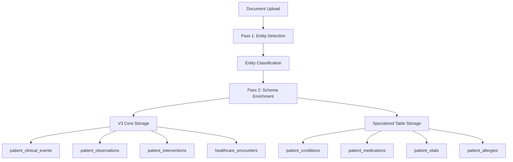

# V3 Core Integration Migration Plan

## Document Status
- **Created**: 2025-08-27
- **Purpose**: Detailed migration plan for integrating V3 core architecture with specialized clinical tables
- **Status**: Implementation-ready migration strategy
- **Dependencies**: Updated 03_clinical_core.sql and 04_ai_processing.sql

## Executive Summary

This migration plan details how the V3 core architecture (patient_clinical_events, patient_observations, patient_interventions, healthcare_encounters, healthcare_timeline_events) integrates with specialized clinical tables to support the AI Processing Pipeline while maintaining backward compatibility and providing enhanced clinical context.

## V3 Core Architecture Overview

### Central Hub: patient_clinical_events

The `patient_clinical_events` table serves as the **central hub** for all clinical activity using O3's two-axis classification:

```sql
patient_clinical_events
├── activity_type: 'observation' | 'intervention'
├── clinical_purposes: ['screening', 'diagnostic', 'therapeutic', 'monitoring', 'preventive']
├── event_name: Human-readable description
├── Healthcare coding: SNOMED, LOINC, CPT, ICD-10
└── AI Processing: confidence, entity_id, model_version
```

### Detail Tables: Specialized Clinical Context

Each clinical event can have **detailed context** stored in multiple specialized tables:

```
patient_clinical_events (Central)
├── patient_observations → Detailed measurement data
├── patient_interventions → Detailed treatment data  
├── healthcare_encounters → Visit/provider context
├── patient_conditions → Condition-specific details
├── patient_medications → Medication-specific details
├── patient_vitals → Vital sign-specific details
└── patient_allergies → Allergy-specific details
```

## Data Flow Architecture

### 1. AI Processing Pipeline Flow

**Document Upload → Pass 1 Entity Detection → Pass 2 Schema Enrichment → Database Storage**



### 2. Russian Babushka Doll Contextual Layering

Each data point provides multiple layers of context for comprehensive clinical understanding:

**Layer 1: Timeline Event** (healthcare_timeline_events)
- User-facing timeline display
- Hierarchical categorization
- Search optimization

**Layer 2: Clinical Event** (patient_clinical_events)  
- O3 two-axis classification
- Healthcare standards integration
- AI processing metadata

**Layer 3: Encounter Context** (healthcare_encounters)
- Provider information
- Visit details
- Administrative context

**Layer 4: Detailed Data** (patient_observations/interventions)
- Specific measurements
- Treatment details
- Outcomes

**Layer 5: Specialized Context** (patient_conditions/medications/etc.)
- Domain-specific information
- Historical tracking
- Clinical notes

## Migration Strategy: Hybrid Architecture

### Core Principle: V3 Central Hub + Specialized Details

**V3 Core Tables** serve as the primary data architecture for AI processing and timeline display.
**Specialized Tables** provide detailed clinical context and backward compatibility.

### Data Relationship Patterns

#### Pattern 1: Observation Data Flow
```sql
-- 1. Central clinical event (V3 Core)
INSERT INTO patient_clinical_events (
    activity_type = 'observation',
    clinical_purposes = ['monitoring'],
    event_name = 'Blood Pressure Measurement',
    snomed_code = '75367002',
    loinc_code = '8480-6'
);

-- 2. Detailed observation data (V3 Core)  
INSERT INTO patient_observations (
    event_id = clinical_event_id,
    observation_type = 'vital_sign',
    value_text = '140/90 mmHg',
    value_numeric = 140,
    value_secondary = 90,
    interpretation = 'high'
);

-- 3. Specialized vital sign details (Supplementary)
INSERT INTO patient_vitals (
    clinical_event_id = clinical_event_id, -- Link to V3 core
    vital_type = 'blood_pressure',
    measurement_value = '{"systolic": 140, "diastolic": 90}',
    unit = 'mmHg',
    is_abnormal = TRUE
);
```

#### Pattern 2: Intervention Data Flow
```sql
-- 1. Central clinical event (V3 Core)
INSERT INTO patient_clinical_events (
    activity_type = 'intervention',
    clinical_purposes = ['therapeutic'],
    event_name = 'Medication Prescription',
    snomed_code = '182836005',
    event_date = '2024-03-15'
);

-- 2. Detailed intervention data (V3 Core)
INSERT INTO patient_interventions (
    event_id = clinical_event_id,
    intervention_type = 'medication_admin',
    substance_name = 'Lisinopril',
    dose_amount = 10,
    dose_unit = 'mg',
    route = 'oral',
    frequency = 'daily'
);

-- 3. Specialized medication details (Supplementary)
INSERT INTO patient_medications (
    clinical_event_id = clinical_event_id, -- Link to V3 core
    medication_name = 'Lisinopril',
    strength = '10mg',
    prescribed_dose = '10mg daily',
    status = 'active',
    start_date = '2024-03-15'
);
```

### Timeline Display Integration

The `healthcare_timeline_events` table optimizes UI display while maintaining clinical context:

```sql
-- Timeline event for user interface
INSERT INTO healthcare_timeline_events (
    display_category = 'treatment',
    display_subcategory = 'medication',
    title = 'Started Lisinopril for Blood Pressure',
    summary = 'New medication prescribed during routine visit',
    icon = 'medication',
    color_code = '#10b981',
    
    -- Russian Babushka Doll Linking
    encounter_id = encounter_uuid,
    clinical_event_ids = [clinical_event_uuid],
    document_id = source_document_uuid,
    
    -- Search optimization
    searchable_content = 'Lisinopril blood pressure medication treatment hypertension',
    event_tags = ['medication', 'new_treatment', 'hypertension']
);
```

## Implementation Phases

### Phase 1: Database Schema Deployment (Current)

**✅ COMPLETED:** Updated 03_clinical_core.sql with V3 core architecture
- Added patient_clinical_events (central hub)
- Added patient_observations and patient_interventions (detail tables)
- Added healthcare_encounters and healthcare_timeline_events
- Maintained specialized tables with V3 linking

**✅ COMPLETED:** Updated 04_ai_processing.sql with V3 references
- Entity processing audit references V3 core tables
- AI processing pipeline supports V3 architecture
- Schema mapping functional for Pass 1 & Pass 2 processing

### Phase 2: AI Processing Integration (Next)

**READY FOR IMPLEMENTATION:** Pass 1 Entity Detection
- Entity classification using V3 categories
- Schema mapping to V3 core tables
- Entity-to-schema routing operational

**READY FOR IMPLEMENTATION:** Pass 2 Schema Enrichment  
- V3 core table population (patient_clinical_events primary)
- Detail table population (patient_observations/interventions)
- Specialized table population (conditions/medications/etc.)
- Timeline event generation for UI

### Phase 3: Application Integration (Future)

**Application Layer Updates:**
- Frontend components use V3 core tables as primary data source
- Timeline display uses healthcare_timeline_events
- Clinical detail views leverage specialized tables
- Search functionality uses optimized searchable_content

**API Endpoint Updates:**
- Patient timeline API uses healthcare_timeline_events
- Clinical data API uses patient_clinical_events as primary
- Detail APIs use appropriate specialized tables
- Audit APIs use entity_processing_audit_v2

## Data Migration Patterns

### Pattern 1: AI-Generated Clinical Events

AI processing creates hierarchical data records:

```typescript
// Pass 2 AI Processing Output
const aiProcessingResult = {
  // 1. Central clinical event
  clinical_event: {
    activity_type: 'observation',
    clinical_purposes: ['diagnostic'],
    event_name: 'Complete Blood Count',
    snomed_code: '26604007',
    loinc_code: '58410-2'
  },
  
  // 2. Detailed observation
  observation: {
    observation_type: 'lab_result',
    value_text: 'WBC: 7.2 K/uL, RBC: 4.8 M/uL',
    interpretation: 'normal'
  },
  
  // 3. Timeline event
  timeline_event: {
    display_category: 'test_result',
    title: 'Complete Blood Count Results',
    summary: 'Normal CBC results from routine lab work'
  }
};
```

### Pattern 2: Legacy Data Integration

Existing specialized table data can be promoted to V3 architecture:

```sql
-- Migration script example: Promote existing conditions to V3
INSERT INTO patient_clinical_events (
    patient_id,
    activity_type,
    clinical_purposes, 
    event_name,
    icd10_code,
    event_date,
    ai_extracted
)
SELECT 
    patient_id,
    'observation' as activity_type,
    ARRAY['diagnostic'] as clinical_purposes,
    condition_name as event_name,
    condition_code as icd10_code,
    diagnosed_date as event_date,
    FALSE as ai_extracted
FROM patient_conditions 
WHERE clinical_event_id IS NULL; -- Only promote records not yet linked
```

## Query Patterns and Performance

### Timeline Query (User Interface)

```sql
-- Optimized timeline query
SELECT 
    t.title,
    t.summary,
    t.event_date,
    t.icon,
    t.color_code,
    array_agg(ce.event_name) as related_events
FROM healthcare_timeline_events t
LEFT JOIN patient_clinical_events ce ON ce.id = ANY(t.clinical_event_ids)
WHERE t.patient_id = $1
AND t.archived = FALSE
ORDER BY t.event_date DESC, t.display_priority ASC;
```

### Clinical Detail Query (Russian Babushka Doll)

```sql
-- Get complete clinical context for a timeline event
WITH timeline_event AS (
    SELECT * FROM healthcare_timeline_events WHERE id = $1
),
clinical_events AS (
    SELECT ce.* 
    FROM patient_clinical_events ce, timeline_event t
    WHERE ce.id = ANY(t.clinical_event_ids)
),
encounter_context AS (
    SELECT e.*
    FROM healthcare_encounters e, timeline_event t
    WHERE e.id = t.encounter_id
)
SELECT 
    t.title,
    t.summary,
    json_agg(ce.*) as clinical_events,
    e.provider_name,
    e.encounter_type,
    e.facility_name
FROM timeline_event t
LEFT JOIN clinical_events ce ON true
LEFT JOIN encounter_context e ON true
GROUP BY t.title, t.summary, e.provider_name, e.encounter_type, e.facility_name;
```

### AI Processing Query (Entity Classification)

```sql
-- Get AI processing audit trail for clinical event
SELECT 
    ce.event_name,
    ce.confidence_score,
    ce.ai_model_version,
    ea.entity_category,
    ea.entity_subtype,
    ea.pass1_confidence,
    ea.validation_status
FROM patient_clinical_events ce
JOIN entity_processing_audit_v2 ea ON ea.linked_clinical_event_id = ce.id
WHERE ce.patient_id = $1
ORDER BY ce.event_date DESC;
```

## Success Metrics and Validation

### Implementation Success Criteria

**V3 Core Architecture:**
- [x] patient_clinical_events table operational
- [x] patient_observations and patient_interventions tables linked
- [x] healthcare_encounters context table functional
- [x] healthcare_timeline_events UI optimization ready
- [x] All tables use user_profiles(id) ID relationships

**AI Processing Pipeline:**
- [x] Entity-to-schema mapping supports V3 architecture
- [x] Pass 1 entity classification routes to correct tables
- [x] Pass 2 schema enrichment populates V3 core tables
- [x] Audit trail tracks processing through all layers

**Data Integration:**
- [x] Specialized tables linked to V3 core architecture
- [x] Russian Babushka Doll contextual layering operational
- [x] Timeline display optimization functional
- [x] Performance indexes support efficient queries

### Performance Validation

**Query Performance Targets:**
- Timeline queries: < 100ms for 1000+ events
- Clinical detail queries: < 200ms with full context
- AI processing queries: < 50ms for audit trails
- Search queries: < 300ms across all clinical data

**Data Integrity Validation:**
- All patient_id references use user_profiles(id)
- Foreign key constraints maintain referential integrity
- RLS policies prevent cross-profile data access
- Audit trails provide complete processing provenance

## Migration Rollback Strategy

### Rollback Capability

The hybrid architecture provides **zero-risk rollback** capability:

**Specialized Tables Preserved:** 
- All existing specialized tables (patient_conditions, patient_medications, etc.) remain functional
- Applications can continue using specialized tables if V3 core fails
- No data loss risk during migration

**Incremental Adoption:**
- AI processing can gradually populate V3 core tables
- Applications can adopt V3 queries incrementally
- Dual table approach allows A/B testing

### Rollback Process

```sql
-- If rollback needed, simply stop populating V3 core tables
-- Specialized tables continue to function independently
-- No data deletion required
```

## Future Enhancements

### V4 Evolution Path

The V3 core architecture provides foundation for future enhancements:

- **Advanced AI Models:** Support for multi-modal processing
- **Real-time Updates:** Streaming clinical data integration  
- **Predictive Analytics:** Risk scoring and outcome prediction
- **Interoperability:** FHIR integration for healthcare data exchange

### Scaling Considerations

- **Horizontal Scaling:** V3 core tables optimized for partitioning
- **Caching Strategy:** Timeline events optimized for CDN caching
- **API Evolution:** GraphQL support for complex clinical queries
- **Mobile Optimization:** Lightweight queries for mobile applications

## Conclusion

The V3 core integration provides a comprehensive solution that:

1. **Enables AI Processing Pipeline:** Full support for Pass 1 & Pass 2 AI processing
2. **Maintains Clinical Context:** Russian Babushka Doll layering for complete clinical understanding  
3. **Optimizes User Experience:** Timeline events optimized for UI performance
4. **Ensures Data Integrity:** Profile-based access control and comprehensive audit trails
5. **Provides Future Flexibility:** Extensible architecture for healthcare innovation

The migration strategy balances innovation with stability, ensuring both current functionality and future scalability for Exora's healthcare platform.