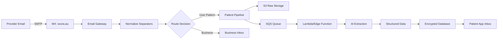

# Health Email Ingestion System

**Status:** Core Feature Specification  
**Date:** 2025-08-15  
**Feature:** Patient-owned health email addresses with AI extraction  

---

## Executive Summary

Every Exora user receives a permanent health email address (`X24-K57D1@exora.au`) that becomes their single point of contact for all health communications. This address follows them for life, automatically ingesting and structuring emails from providers, labs, and specialists into their unified health record.

---

## Email Address Specification

### Primary Format
```
X24-K57D1@exora.au
```

### Structure
- **X** - First initial of given name
- **24** - Day of birth (01-31)
- **-** - Primary separator (dash)
- **K57D1** - 5 character unique identifier
  - K57D - 4 random alphanumeric characters
  - 1 - Check digit (Luhn algorithm)

### Routing Flexibility
The system accepts multiple separator formats for user convenience:
- **Canonical:** `X24-K57D1@exora.au` (dash)
- **Alternative:** `X24.K57D1@exora.au` (dot)
- **Alternative:** `X24_K57D1@exora.au` (underscore)
- **All route to same inbox** via normalization rules

### Examples
- `J15-B92X3@exora.au` (John, born 15th)
- `S07-M41K8@exora.au` (Sarah, born 7th)  
- `A31-Z88P2@exora.au` (Alex, born 31st)

### Exora ID Derivation
The Exora ID is simply the email prefix:
- Email: `X24-K57D1@exora.au`
- Exora ID: `X24-K57D1`
- **Same identifier, two uses**

---

## Technical Architecture

### Email Routing Pipeline



### Separator Normalization
```javascript
// Email routing normalization
function normalizeExoraEmail(email) {
  const [localPart, domain] = email.split('@');
  if (domain !== 'exora.au') return email;
  
  // Normalize separators to canonical dash format
  const normalized = localPart
    .replace(/[._]/g, '-')  // Convert dots and underscores to dashes
    .toUpperCase();         // Ensure consistent casing
  
  return `${normalized}@${domain}`;
}

// X24.K57D1@exora.au → X24-K57D1@exora.au
// x24_k57d1@exora.au → X24-K57D1@exora.au
// X24-K57D1@exora.au → X24-K57D1@exora.au (unchanged)
```

---

## Frictionless Forwarding Methods

### 1. Smart Contact Card Integration
Users receive a personalized contact card containing:
```vcard
BEGIN:VCARD
VERSION:3.0
FN:My Exora Health
ORG:Exora Health
EMAIL:X24-K57D1@exora.au
TEL:+61XXXXXXXXX
NOTE:Forward health messages here
END:VCARD
```

### 2. One-Touch Forwarding

#### Email Forwarding
- Pre-configured mailto link: `mailto:X24-K57D1@exora.au?subject=Health%20Document`
- Browser bookmarklet for quick forwarding
- Email signature with "Forward to my Exora" button

#### Message Forwarding (iOS/Android)
```swift
// iOS Share Extension
class ExoraShareExtension: SLComposeServiceViewController {
    override func didSelectPost() {
        // Extract content
        let content = self.contentText
        let attachments = self.extractAttachments()
        
        // Forward to user's Exora email
        ExoraAPI.forward(
            content: content,
            attachments: attachments,
            to: getUserExoraEmail()
        )
    }
}
```

### 3. Auto-Sync Options
- Gmail/Outlook OAuth integration
- IMAP configuration for other providers
- Rule-based auto-forwarding setup wizard

### 4. Provider Education
Include in onboarding:
- "Ask providers to send to: **X24-K57D1@exora.au**"
- QR code for easy provider scanning
- Business card templates

---

## External Email Integration

### Multi-Tier Approach

#### Tier 1: OAuth Integration (Seamless)
| Provider | Coverage | Method | Experience |
|----------|----------|--------|------------|
| Gmail | ~40% | OAuth 2.0 | Auto-sync |
| Outlook | ~25% | Graph API | Auto-sync |
| Yahoo | ~5% | OAuth | Auto-sync |

#### Tier 2: Manual Forwarding (Universal)
- User sets up forwarding rule in their email
- One-click forward button in Exora app
- Drag-and-drop interface

#### Tier 3: Historical Import
- Bulk upload past emails
- Search and select relevant health emails
- AI-assisted filtering

---

## AI Processing Pipeline

### Three-Stage Extraction

#### Stage 1: Classification
```javascript
{
  "is_health_related": true,
  "confidence": 0.95,
  "document_type": "lab_result",
  "urgency": "routine",
  "provider_verified": true
}
```

#### Stage 2: Data Extraction
```javascript
{
  "patient": {
    "name": "John Smith",
    "dob": "1990-01-15",
    "id": "X24-K57D1"
  },
  "tests": [
    {
      "name": "Cholesterol",
      "value": "180",
      "unit": "mg/dL",
      "reference_range": "< 200"
    }
  ],
  "date": "2025-08-15",
  "provider": "PathLab Sydney"
}
```

#### Stage 3: Integration
- Link to patient timeline
- Update health metrics
- Trigger alerts if abnormal
- Create follow-up reminders

---

## Security & Privacy

### Zero-Knowledge Trajectory
- **Phase 1:** Standard encryption (AES-256)
- **Phase 2:** Per-user encryption keys
- **Phase 3:** Patient-controlled keys

### Provider Verification
- SPF/DKIM/DMARC validation
- Domain allowlisting
- First-sender review queue
- Confidence scoring

### Audit Trail
```sql
CREATE TABLE email_access_log (
  id UUID PRIMARY KEY,
  email_id UUID REFERENCES health_emails(id),
  accessed_by UUID REFERENCES users(id),
  access_type VARCHAR(50), -- 'view', 'forward', 'share'
  shared_with VARCHAR(255),
  ip_address INET,
  purpose TEXT,
  expires_at TIMESTAMP,
  created_at TIMESTAMP DEFAULT NOW()
);
```

---

## Implementation Roadmap

### Phase 1: Foundation (Weeks 1-4)
- [x] Domain setup (exora.au)
- [ ] Email routing with separator normalization
- [ ] Basic inbox UI
- [ ] Contact card generation

### Phase 2: Smart Processing (Months 2-3)
- [ ] AI classification pipeline
- [ ] Provider verification
- [ ] OAuth integrations
- [ ] Share extensions

### Phase 3: Scale (Months 4-6)
- [ ] Advanced extraction
- [ ] Bulk import tools
- [ ] Provider portal
- [ ] International domains

---

## Cost Structure

### Infrastructure Costs (per 10,000 users)
- Email receiving: ~$10/month
- Storage: ~$23/month (1TB)
- Processing: ~$5/month
- **Total: ~$0.004 per user/month**

### Why This is Revolutionary
- **No per-mailbox fees** - Using catch-all routing
- **Scales infinitely** - Marginal cost near zero
- **Patient-owned** - Portable between providers
- **Permanent** - Lifetime health communication archive

---

## Success Metrics

### Technical KPIs
- Email delivery: >99% success rate
- Processing time: <2 minutes (p95)
- Classification accuracy: >95%
- Zero security incidents

### User KPIs  
- Email adoption: >80% give to providers
- External email connections: >40%
- Monthly active usage: >60%
- Provider shares: >2 per month

---

## Key Differentiators

1. **Permanent Addresses** - Follow patient for life
2. **Zero Cost** - No per-user fees
3. **Flexible Routing** - Accept multiple formats
4. **Frictionless Forwarding** - Multiple easy methods
5. **Provider Friendly** - No behavior change needed

---

## See Also

- [Messaging Hub](./messaging-hub.md)
- [Unified Health Inbox](./unified-health-inbox.md)
- [Frictionless Forwarding](./frictionless-forwarding.md)