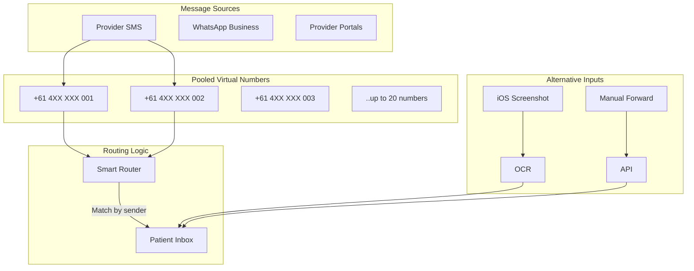

# Health Messaging Hub

**Status:** Feature Specification  
**Date:** 2025-08-15  
**Feature:** Unified messaging with pooled virtual numbers  

---

## Executive Summary

A unified communications hub that aggregates health-related messages from SMS, WhatsApp, and provider portals using a **pooled virtual number strategy** that makes the system financially viable at scale.

---

## Critical Update: Pooled Number Economics

### ❌ Previous Assumption (Not Viable)
- **Per-user virtual numbers:** $1.55/user/month
- **At 10k users:** $15,500/month
- **Reality:** Australian numbers cost $6-15/month EACH

### ✅ Pooled Number Strategy (Viable)
- **Shared pool:** 5-20 numbers for entire userbase
- **Infrastructure cost:** $30-300/month total
- **Per-user cost:** <$0.05/month at scale
- **Smart routing:** By sender verification

---

## Architecture Overview



---

## Implementation Strategy

### 1. Pooled Number System

#### Number Allocation
```javascript
// Pooled number assignment strategy
const POOL_SIZE = 10; // Start with 10 Australian numbers
const numbers = [
  '+61 400 000 001',
  '+61 400 000 002',
  // ... up to 010
];

// Assign number from pool for provider communication
function assignPooledNumber(patientId, providerId) {
  // Deterministic assignment based on provider
  const index = hashFunction(providerId) % POOL_SIZE;
  const number = numbers[index];
  
  // Store mapping
  await db.insert('number_mappings', {
    patient_id: patientId,
    provider_id: providerId,
    pooled_number: number,
    created_at: new Date()
  });
  
  return number;
}
```

#### Routing by Sender
```javascript
// Route incoming SMS to correct patient
async function routeIncomingSMS(from, to, body) {
  // First check if sender is verified provider
  const provider = await db.query(
    'SELECT * FROM verified_providers WHERE phone = ?',
    [from]
  );
  
  if (provider) {
    // Route based on provider-patient mapping
    const mapping = await db.query(
      'SELECT patient_id FROM number_mappings WHERE provider_id = ? AND pooled_number = ?',
      [provider.id, to]
    );
    
    if (mapping) {
      return storeMessage(mapping.patient_id, body, from);
    }
  }
  
  // Fallback: Check message content for patient identifier
  const patientId = extractPatientId(body);
  if (patientId) {
    return storeMessage(patientId, body, from);
  }
  
  // Queue for manual review
  return queueForReview(from, to, body);
}
```

---

## 2. Phone Number as Identifier (NOT Virtual Number)

### User's Actual Phone for Quick-Connect
```javascript
// Patient provides their real phone number
interface PatientPhone {
  patient_id: string;
  phone_e164: string;        // +61 4XX XXX XXX
  verified_at: Date;          // OTP verification
  is_primary: boolean;
  last_reverified: Date;
}

// Provider quick-connect flow
async function providerQuickConnect(providerPhone: string) {
  // Provider enters patient's phone
  const patient = await findPatientByPhone(providerPhone);
  
  if (!patient) {
    return { message: "If patient exists, they'll be notified" };
  }
  
  // Send approval request (NO PHI)
  await sendSMS(patient.phone, 
    "Dr Smith requests access to your Exora health record. " +
    "Approve in app or reply with 6-digit code shown in app."
  );
  
  // Create pending access request
  await createAccessRequest(patient.id, provider.id);
}
```

---

## 3. Platform-Specific Implementation

### iOS: Multiple Workarounds

#### Option A: Forward to Pooled Number
```
Provider SMS → Patient Phone → User forwards → Pooled Number → Exora
```

#### Option B: Screenshot OCR
```swift
// Process screenshot of Messages app
func processHealthScreenshot(image: UIImage) {
  let text = performOCR(image)
  let messages = extractMessages(text)
  
  for message in messages {
    if isHealthRelated(message) {
      uploadToExora(message)
    }
  }
}
```

#### Option C: Share Extension
```swift
// iOS Share Extension for Messages
class ExoraMessageShare: ShareViewController {
  func share() {
    // User selects messages and shares to Exora
    let content = getSharedContent()
    ExoraAPI.addMessage(content)
  }
}
```

### Android: Direct Access
```kotlin
// Read SMS with permission
class HealthSMSReader {
  fun syncHealthMessages() {
    if (!hasSMSPermission()) {
      requestPermission()
      return
    }
    
    val messages = readSMS()
      .filter { isHealthRelated(it) }
      .map { extractHealthData(it) }
    
    ExoraAPI.uploadMessages(messages)
  }
}
```

---

## 4. WhatsApp Business Integration

### Single Business Number (Not Per-User)
```javascript
// One WhatsApp Business number for all users
const WHATSAPP_BUSINESS = '+61 400 100 000';

// Users message this number with their Exora ID
// Example message: "X24-K57D1 requesting records"

async function handleWhatsAppMessage(from, body) {
  // Extract Exora ID from message
  const exoraId = extractExoraId(body);
  
  if (exoraId) {
    const patient = await findPatientByExoraId(exoraId);
    if (patient) {
      // Link WhatsApp number to patient
      await linkWhatsAppToPatient(from, patient.id);
      
      // Process message
      return processHealthMessage(patient.id, body);
    }
  }
  
  // Request identification
  return sendWhatsAppReply(from, 
    "Please include your Exora ID (e.g., X24-K57D1) to link your account"
  );
}
```

---

## 5. Frictionless Forwarding

### Smart Contact Card
```vcard
BEGIN:VCARD
VERSION:3.0
FN:My Exora Health
ORG:Exora Health
TEL:+61 400 000 001
EMAIL:X24-K57D1@exora.au
NOTE:Forward health SMS to number, health emails to address
END:VCARD
```

### One-Touch Actions
1. **iOS:** Share to Exora from Messages
2. **Android:** Long-press → Forward to Exora
3. **Email:** Forward to X24-K57D1@exora.au
4. **WhatsApp:** Forward to business number

---

## Cost Analysis (Corrected)

### Pooled Virtual Numbers
| Item | Cost | Notes |
|------|------|-------|
| 10 AU Numbers | $60-150/month | $6-15 per number |
| SMS Receiving | $0.0075/msg | ~1000 msgs = $7.50 |
| SMS Sending | $0.05/msg | ~200 replies = $10 |
| **Total Infrastructure** | **~$200/month** | For entire platform |

### At Scale (10,000 users)
- Infrastructure: $200/month
- Per user: **$0.02/month**
- Compare to email: $0.004/month
- **Combined: <$0.03/user/month**

### WhatsApp Business
- Single number: $10/month
- Messages: $0.005 each
- Total: ~$50/month at scale

---

## Security & Compliance

### No PHI Over SMS
```javascript
// CRITICAL: Never send PHI via SMS
const ALLOWED_SMS_CONTENT = [
  'appointment_reminder',    // "Appointment tomorrow at 2pm"
  'access_request',          // "Dr Smith requests access"
  'verification_code',       // "Your code: 123456"
  'result_notification'      // "New results available in app"
];

// All actual health data flows through secure app
```

### Audit Everything
```sql
CREATE TABLE message_audit (
  id UUID PRIMARY KEY,
  patient_id UUID,
  platform VARCHAR(50),
  direction VARCHAR(10), -- 'inbound' or 'outbound'
  from_number VARCHAR(50),
  to_number VARCHAR(50),
  content_type VARCHAR(50), -- 'notification' only for SMS
  has_phi BOOLEAN DEFAULT FALSE, -- Must be FALSE for SMS
  created_at TIMESTAMP DEFAULT NOW()
);
```

---

## Implementation Roadmap

### Phase 1: Foundation (Month 1)
- [ ] Provision 5-10 pooled numbers
- [ ] Basic routing by sender
- [ ] Android SMS reading
- [ ] iOS screenshot OCR

### Phase 2: Smart Features (Month 2-3)
- [ ] WhatsApp Business setup
- [ ] Provider verification system
- [ ] Share extensions
- [ ] Contact card generation

### Phase 3: Scale (Month 4-6)
- [ ] Expand pool as needed
- [ ] ML-based routing
- [ ] Provider portal
- [ ] Advanced OCR

---

## Key Insights

### Why Pooled Numbers Work
1. **Most SMS are automated** - From known provider numbers
2. **Providers can be verified** - Limited set of senders
3. **Fallback options exist** - Screenshot, forward, manual entry
4. **Cost-effective** - <$0.05/user vs $15/user

### Why Phone as Identifier Works
1. **Everyone has one** - Universal identifier
2. **Providers know it** - Already in their systems
3. **Quick-connect** - Instant patient lookup
4. **No PHI risk** - Just for identification

---

## Success Metrics

- Pool utilization: <80% (room for growth)
- Message routing accuracy: >95%
- Manual review queue: <5% of messages
- Cost per user: <$0.05/month
- Zero PHI over SMS: 100% compliance

---

## See Also

- [Email Ingestion](./email-ingestion.md)
- [Identification System](./identification-system.md)
- [Provider Connect](./provider-connect.md)