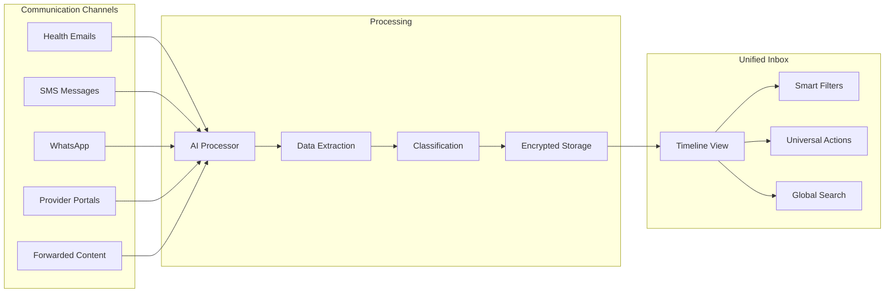

# Unified Health Inbox

**Status:** Core UX Feature  
**Date:** 2025-08-15  
**Feature:** Single timeline view for all health communications  

---

## Executive Summary

The Unified Health Inbox aggregates all health communications - emails, SMS, provider portal messages, and documents - into a single, chronological timeline that serves as the patient's complete communication history.

---

## The Vision

### One Place for Everything
```
┌─────────────────────────────────────────┐
│ Health Communications Timeline          │
│ [All] [Email] [Messages] [Documents]    │
├─────────────────────────────────────────┤
│ 📧 PathLab Results · 2 hours ago       │
│    Blood test results - Cholesterol OK  │
│    [View PDF] [Share] [Add Note]        │
├─────────────────────────────────────────┤
│ 💬 SMS · Dr Smith · 4 hours ago        │
│    "Appointment confirmed for Friday"   │
│    [Reply] [Add to Calendar]            │
├─────────────────────────────────────────┤
│ 🔔 Portal · Radiology · Yesterday      │
│    MRI scan report available            │
│    [Download] [Forward to GP]           │
├─────────────────────────────────────────┤
│ 📱 Forward · Mom · 2 days ago          │
│    Child's vaccination record           │
│    [Verify] [Accept] [Decline]          │
└─────────────────────────────────────────┘
```

### Unified Timeline Features
- **Chronological order** - All communications in time sequence
- **Smart filtering** - By type, provider, urgency, date range
- **Universal actions** - Reply, share, archive, note across all channels
- **Source attribution** - Clear indicators of origin and verification status
- **Cross-linking** - Related messages grouped together

---

## Architecture Integration

### Data Sources


### Message Types & Rendering
```typescript
interface UnifiedMessage {
  id: string;
  patient_id: string;
  
  // Source information
  channel: 'email' | 'sms' | 'whatsapp' | 'portal' | 'forwarded';
  source_id: string; // Reference to original message
  
  // Content
  subject?: string;
  body: string;
  attachments: Attachment[];
  
  // Sender verification
  from_address: string;
  from_name: string;
  verified_sender: boolean;
  sender_type: 'provider' | 'lab' | 'pharmacy' | 'family' | 'unknown';
  
  // AI processing
  classification: MessageClassification;
  extracted_data?: HealthData;
  confidence_score: number;
  
  // Timeline metadata
  received_at: Date;
  read_at?: Date;
  archived_at?: Date;
  created_at: Date;
}
```

---

## Smart Features

### 1. Intelligent Grouping
```typescript
// Group related messages into conversations
interface MessageThread {
  id: string;
  subject: string;
  participants: string[];
  message_count: number;
  latest_message: Date;
  messages: UnifiedMessage[];
  thread_type: 'results' | 'appointment' | 'referral' | 'prescription';
}

// Example: Lab results thread
{
  "subject": "Blood Test Results - August 2025",
  "participants": ["PathLab Sydney", "Dr Smith"],
  "messages": [
    { "from": "PathLab", "body": "Results ready for collection" },
    { "from": "Dr Smith", "body": "Please review attached results" },
    { "from": "PathLab", "body": "Follow-up required for cholesterol" }
  ]
}
```

### 2. Cross-Channel Actions
```typescript
// Universal actions that work across all message types
interface UniversalActions {
  reply(messageId: string, content: string): Promise<void>;
  forward(messageId: string, recipients: string[]): Promise<void>;
  share(messageId: string, providerId: string, scope: string[]): Promise<void>;
  addNote(messageId: string, note: string): Promise<void>;
  archive(messageId: string): Promise<void>;
  addToCalendar(messageId: string): Promise<CalendarEvent>;
  extractToTimeline(messageId: string): Promise<HealthEvent>;
}
```

### 3. Smart Filters & Search
```typescript
interface InboxFilters {
  // Time-based
  dateRange?: [Date, Date];
  last24Hours?: boolean;
  thisWeek?: boolean;
  
  // Source-based
  channels?: ('email' | 'sms' | 'whatsapp' | 'portal')[];
  verified?: boolean;
  
  // Content-based
  messageTypes?: ('results' | 'appointment' | 'prescription' | 'referral')[];
  hasAttachments?: boolean;
  urgencyLevel?: ('normal' | 'urgent' | 'critical');
  
  // Status-based
  unread?: boolean;
  needsReview?: boolean;
  archived?: boolean;
}

// Advanced search
interface SearchQuery {
  text?: string;              // Full-text search across all content
  sender?: string;            // Filter by sender
  attachmentType?: string;    // 'pdf', 'image', 'document'
  extractedData?: any;        // Search within AI-extracted structured data
  confidence?: number;        // Minimum AI confidence score
}
```

---

## User Experience

### Timeline Navigation
```typescript
// Infinite scroll with smart loading
interface TimelineView {
  loadMode: 'recent' | 'date_range' | 'infinite';
  groupBy: 'none' | 'day' | 'thread' | 'sender';
  sortOrder: 'newest_first' | 'oldest_first';
  
  // Performance optimization
  virtualScroll: boolean;
  lazyLoadAttachments: boolean;
  preloadNext: number; // Number of messages to preload
}
```

### Quick Actions Bar
```
┌─────────────────────────────────────────┐
│ [📥 All] [🔴 Urgent] [📄 Results]      │
│ [📅 This Week] [❓ Needs Review]        │
└─────────────────────────────────────────┘
```

### Message Detail View
```
┌─────────────────────────────────────────┐
│ From: PathLab Sydney ✅                 │
│ To: X24-K57D1@exora.au                  │
│ Subject: Blood Test Results              │
│ Received: Aug 15, 2025 at 2:30 PM      │
├─────────────────────────────────────────┤
│ Your recent blood test results are      │
│ ready for review. Please see attached.  │
│                                         │
│ 📎 BloodResults_Aug2025.pdf             │
│                                         │
│ [AI Extracted Data - 95% confidence]   │
│ • Cholesterol: 180 mg/dL (Normal)      │
│ • Blood Sugar: 95 mg/dL (Normal)       │
│ • White Blood Cells: 6,500 (Normal)    │
├─────────────────────────────────────────┤
│ [Reply] [Forward] [Share] [Archive]     │
│ [Add Note] [Add to Timeline]            │
└─────────────────────────────────────────┘
```

---

## Integration Points

### With Health Timeline
```typescript
// Link messages to health events
interface MessageTimelineLink {
  message_id: string;
  timeline_event_id: string;
  relationship: 'source' | 'follow_up' | 'related';
  created_at: Date;
}

// Example: Lab result message creates timeline event
const message = await getUnifiedMessage(messageId);
if (message.classification.type === 'lab_result') {
  const timelineEvent = await createHealthEvent({
    type: 'test_result',
    date: message.received_at,
    data: message.extracted_data,
    source_message_id: message.id
  });
}
```

### With Provider Sharing
```typescript
// Share message threads with providers
async function shareMessageThread(threadId: string, providerId: string) {
  const thread = await getMessageThread(threadId);
  
  // Create time-limited share link
  const shareToken = await createShareToken({
    thread_id: threadId,
    provider_id: providerId,
    expires_at: new Date(Date.now() + 24 * 60 * 60 * 1000), // 24 hours
    permissions: ['read', 'download_attachments']
  });
  
  // Send secure link to provider
  await sendProviderNotification(providerId, {
    type: 'message_thread_shared',
    patient_name: await getPatientName(thread.patient_id),
    share_link: `https://providers.exora.au/shared/${shareToken}`,
    expires_at: shareToken.expires_at
  });
}
```

---

## Performance Optimization

### Lazy Loading Strategy
```typescript
// Load messages incrementally
interface MessageLoadStrategy {
  initial_load: 50;        // First batch
  scroll_threshold: 0.8;   // When to load more (80% scrolled)
  batch_size: 25;          // Subsequent batches
  max_loaded: 500;         // Memory limit
  
  // Preload attachments for visible messages only
  attachment_lazy_load: boolean;
  
  // Cache strategies
  message_cache_ttl: 300;  // 5 minutes
  attachment_cache_ttl: 3600; // 1 hour
}
```

### Database Optimization
```sql
-- Optimized message queries
CREATE INDEX idx_unified_messages_timeline 
ON unified_messages (patient_id, received_at DESC, archived_at);

CREATE INDEX idx_unified_messages_channel 
ON unified_messages (patient_id, channel, received_at DESC);

CREATE INDEX idx_unified_messages_classification 
ON unified_messages (patient_id, classification->>'type', received_at DESC);

-- Full-text search
CREATE INDEX idx_unified_messages_search 
ON unified_messages USING gin(to_tsvector('english', subject || ' ' || body));
```

---

## Success Metrics

### User Engagement
- **Daily active inbox users:** >70%
- **Messages read within 1 hour:** >80%
- **Search usage:** >40% of users search weekly
- **Cross-channel actions:** >2 per user per week

### Performance
- **Initial load time:** <2 seconds
- **Scroll performance:** 60fps maintained
- **Search response time:** <500ms
- **Attachment load time:** <3 seconds

### User Satisfaction  
- **Inbox usability:** >4.5/5 rating
- **Search effectiveness:** >4.0/5 rating
- **Cross-channel experience:** >4.2/5 rating
- **Overall communication management:** >4.6/5 rating

---

## Implementation Roadmap

### Phase 1: Basic Timeline (Month 1)
- [ ] Message aggregation from all channels
- [ ] Chronological timeline view
- [ ] Basic filtering (date, channel, read status)
- [ ] Message detail modal

### Phase 2: Smart Features (Month 2)
- [ ] Thread grouping
- [ ] Cross-channel actions
- [ ] AI-powered classification display
- [ ] Advanced search

### Phase 3: Advanced UX (Month 3)
- [ ] Infinite scroll with virtualization
- [ ] Bulk actions
- [ ] Provider sharing from inbox
- [ ] Timeline integration
- [ ] Mobile optimization

---

## See Also

- [Email Ingestion System](./email-ingestion.md)
- [Messaging Hub](./messaging-hub.md)
- [Frictionless Forwarding](./frictionless-forwarding.md)
- [Healthcare Journey Timeline](../database-foundation/features/healthcare-journey.md)